# TEMEL ELEKTRONİK VE ROBOTİĞE GİRİŞ

# 1. ROBOTİK
## 1.1 Robotik Nedir?

Robotik, Yapay Zekanın (AI) bir dalıdır, esas olarak inşaat, tasarım ve tasarım için elektrik mühendisliği,
makine mühendisliği ve bilgisayar bilimi mühendisliğinden oluşur.

Robotik, robotların bir uygulamasını inşa etme veya tasarlama bilimidir. Robotiğin amacı verimli bir robot
tasarlamaktır.

**Robotiğin Yönleri**

 * Robotlar, güç sağlamak ve makineyi kontrol etmek için elektrikli bileşenlere sahiptir.
 * Belirli bir görevi yerine getirmek için tasarlanmış mekanik yapıya, şekle veya forma sahiptirler .
 * Bir robotun neyi, ne zaman ve nasıl yapacağını belirleyen bir tür bilgisayar programı içerir .

## 1.2.Robotik Tarihi

**Robotik kelimesinin ilk kullanımı:**
Robot kelimesi ilk olarak Çek yazar Karel Çapek tarafından 1920 yılında yayınlanan Rossum'un Evrensel
Robotları (RUR) adlı oyunuyla kamuoyuna tanıtıldı. Oyun, robot olarak bilinen yapay insanları yapan bir
fabrika ile başlar.

"Robotik" kelimesi, 1940'lı yıllarda Rus asıllı Amerikalı bilim adamı Issac Asimov tarafından tesadüfen icat
edildi.

**Robotiğin üç yasası:**

Issac Asimov ayrıca üç "Robot Yasasını" önerdi ve daha sonra bir "sıfırcı yasa" ekledi.

**Sıfırıncı Yasa** - Bir robot insanlığa zarar veremez ya da zarar görmesine seyirci kalamaz.

**Birinci Yasa** - Bir robot, sıfırıncı yasayla çelişmediği sürece bir insana zarar veremez ya da zarar görmesine seyirci kalamaz.

**İkinci Yasa** - Bir robot, birinci kuralla çelişmediği sürece bir insanın emirlerine uymak zorundadır.

**Üçüncü Yasa** - Bir robot, birinci ve ikinci kuralla çelişmediği sürece kendi varlığını korumakla mükelleftir.

**İlk endüstriyel robot: UNIMATE**
1954'te ilk programlanabilir robot, Evrensel Otomasyon terimini icat eden George Devol tarafından tasarlandı.
Daha sonra bu terimi 1962'de ilk robot şirketinin adı haline gelen Unimation olarak kısaltır.

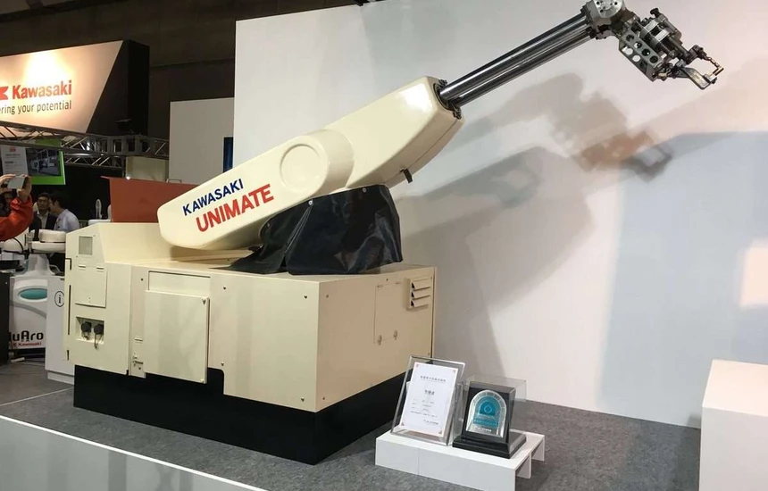

## 1.3.Roboton Bileşenleri
Bir robot elektrik, elektronik, mekanik parçalar ve yazılımın sistemli ve düzenli bir şekilde bir araya getirilmesiyle oluşturulmaktadır. Aşağıda bir robota ait bileşenler gösterilmektedir.

Şematik olarak gösterilirse bir robotun anatomisi (yapısı)aşağıdaki gibidir:

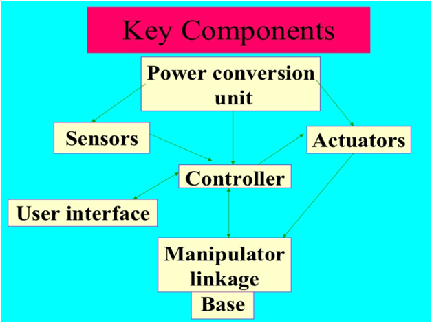

 * **Güç Kaynağı** - Robotun çalışma gücü piller, hidrolik, güneş enerjisi veya pnömatik güç kaynakları
tarafından sağlanır.

 * **Aktüatörler** - Aktüatörler, bir robotun içinde kullanılan enerji dönüştürme cihazıdır. Aktüatörlerin ana
işlevi, enerjiyi harekete dönüştürmektir.

 * **Elektrik motorları (DC/AC)**- Motorlar, elektrik enerjisini eşdeğer mekanik enerjiye dönüştürmek için
kullanılan elektromekanik bileşenlerdir. Robotlarda dönme hareketini sağlamak için motorlar kullanılmaktadır.

 * **Sensörler** - Sensörler, görev ortamı hakkında gerçek zamanlı bilgi sağlar. Robotlar, insan parmak
izlerinin dokunma reseptörlerinin mekanik özelliklerini taklit eden dokunsal sensörle donatılmıştır ve
ortamdaki derinliği hesaplamak için bir görüş sensörü kullanılır.

## 1.4.Robot Türleri

### 1.4.1. Mobil Robotlar

Mobil robotlar, hareket kabiliyetini kullanarak bir konumdan başka bir konuma hareket edebilir. Herhangi bir
fiziksel ve elektromekanik yönlendirme cihazına ihtiyaç duymadan kontrolsüz bir ortamda seyir yapabilen
otomatik bir makinedir. Mobil Robotlar iki tiptir:

 **Yuvarlanan robotlar** - Yuvarlanan robotların hareket etmesi için tekerleklere ihtiyacı vardır. Kolay ve
hızlı arama yapabilirler. Ancak yalnızca düz alanlarda kullanışlıdırlar.

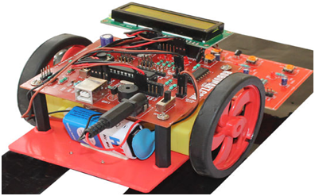

 **Yürüyen robotlar** - Ayaklı robotlar genellikle arazinin kayalık olduğu durumlarda kullanılır. Çoğu
yürüyen robotun en az 4 ayağı vardır.

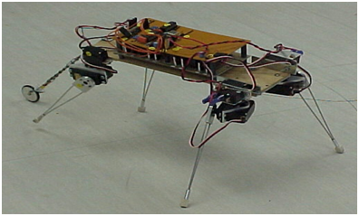

### 1.4.2. Endüstriyel Robotlar

Endüstriyel robotlar, hiç hareket etmeden aynı görevleri tekrar tekrar gerçekleştirir. Bu robotlar, robota uygun
sıkıcı ve tekrarlanan görevlerin yapılmasının gerekli olduğu endüstrilerde çalışmaktadır.
Bir endüstriyel robot asla yorulmaz, gece gündüz hiç şikayet etmeden işlerini yapar.

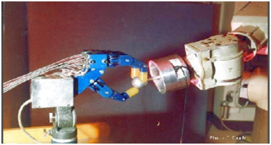

### 1.4.3. Ontonom Robotlar

Otonom robotlar kendi kendini destekler. Çevrelerine bağlı olarak gerçekleştirecekleri eyleme karar verme
fırsatı sağlayan bir program kullanırlar.

Yapay zekayı kullanan bu robotlar genellikle yeni davranışlar öğrenir. Kısa bir rutinle başlarlar ve
gerçekleştirdikleri bir görevde daha başarılı olmak için bu rutini adapte ederler. Bu nedenle, en başarılı rutin
tekrarlanacaktır.

### 1.4.4. Uzaktan Kumandalı Robotlar

Uzaktan kumandalı robot, operasyon belirsizliği nedeniyle otonom robotun yapamadığı karmaşık ve belirsiz
görevleri gerçekleştirmek için kullanılır.

Karmaşık görevler, gerçek beyin gücüne sahip insanlar tarafından en iyi şekilde gerçekleştirilir. Bu nedenle,
bir kişi uzaktan kumandayı kullanarak bir robotu yönlendirebilir. İnsan, uzaktan kumandalı çalışmayı
kullanarak, görevlerin gerçekleştirildiği noktada bulunmadan tehlikeli görevleri gerçekleştirebilir.

Uzaktan kumandayla tasarlanmış bir NASA robotu görelim:

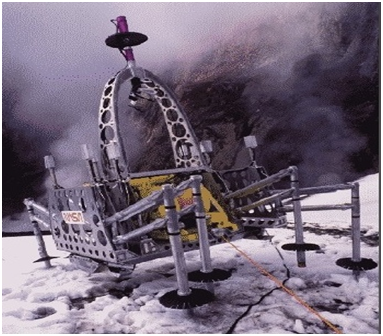

# 2. ELEKTRİK VE ELEKTRONİK

Arduino, yazılım ve elektroniğin bir araya getirildiği ortamdır. Bu yüzden Arduino kullanmaya başlamadan önce temel elektronik bilgilerimizi tazelemeliyiz. Bu bölümde temel elektronik devre elemanlarını tanıyacağız ve bu elemanların nasıl kullanıldığını öğreneceğiz.

Elektronik elektriğe yön verme sanatıdır.Bu yönde oluşturulan devreler örnek vermek gerekirse harekete
duyarlı bir lamba için kullanılabilmektedir.

Diğer bir örnek ise otomatik açılan kapıları verebiliriz.Bu yapının oluşması için elektrik, devre, sensör,
elektronik, elektronik malzeme ve cihazlar kullanılmaktadır.

## 2.1. Elektrik Nedir?

Elektrik, elektrik yüklerinin akışına dayanan bir dizi fiziksel olaya verilen isimdir. Elektrik sözcüğü Türkçeye
Fransızcadan geçmiştir. Elektriğin Türkçe eş anlamlısı **çıngı** sözcüğüdür. Ayrıca Anadolu'da **ceryan** olarak
söylenmektedir.

Elektrik gözle görünmez, ama etki ettiği cihazlar üzerinden görme şansımız vardır.Bunlara örnek vermemiz
gerekirse, lamba yanması, evimizde çalışan beyaz eşyalar ve küçük ev aletleri elektriğin varlığını bize
göstermektedir.

Yukarıdaki örnekler elektriğin neden olduğu, ışık, ısı, ses ve hareket gibi fiziksel etkenleri görmekteyiz.Aynı
zamanda elektrik elde etmek içinde su ve güneş gibi unsurlarıda kullanmaktayız.

|                                                   |                                                                                                                                                                                                                                                                                                                                                                                                                                                                                                                                      |
|---------------------------------------------------|--------------------------------------------------------------------------------------------------------------------------------------------------------------------------------------------------------------------------------------------------------------------------------------------------------------------------------------------------------------------------------------------------------------------------------------------------------------------------------------------------------------------------------------|
|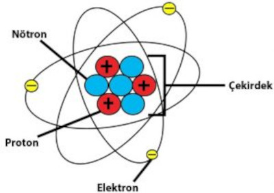|Elektiğin ne olduğunu daha iyi anlamak için biraz detaylandıralım, maddenin yapı taşı olan **atom** boyutuna bakmamız gerekiyor, atom kendinden daha küçük üç yapı taşından oluşur, bunlar; nötron, proton ve elektron'dur.Bu yapı taşları atom çekirdeğinde bulunur. Elektronlar (- eksi) yük, protonlar ise (+ artı) yüklü iken, **nötronlar** ise yüksüzdür.Zıt yükler birbirini çekerler. Buradan yola çıkarak yüklü elektron parçacıklarının hareketlerine **elektrik** diyoruz.Elektiriği ise kablolar yardımı ile taşımaktayız.|

Elektiriği daha iyi anlamak için **gerilim** ve **akım** kavramlarını anlamak gerekiyor.
Gerilim ya da voltaj elektronları maruz kaldıkları elektrostatik alan kuvvetine karşı hareket ettiren kuvvettir. Bir elektrik alanı içindeki iki nokta arasındaki potansiyel fark olarak da tarif edilir.Gerilimin birimi Volt, sembolü V dir.

Elektrik akımı, elektriksel akım veya cereyan, en kısa tanımıyla elektriksel yük taşıyan parçacıkların
hareketidir. Bu yük genellikle elektrik devrelerindeki kabloların içerisinde hareket eden elektronlar tarafından
taşınmaktadır. Akımın birimi **Amper**, sembolü **A** dır.

Alternatif akım, genliği ve yönü periyodik olarak değişen elektriksel akımdır. **AC** (Alternating current) olarak kısaltılır. +330 ile 0 arası ve 0 ile -330 volt arasında değişim olur, ölçü aletleri yapılan ölçümlerde 220V ölçülür. Evimizdeki elektrik alternatif akımdır.

Doğru akım elektrik yüklerinin yüksek potansiyelden alçak olana doğru sabit olarak akmasıdır. Tipik olarak
kablo gibi bir iletkende ya da yarı iletkenler ve yalıtkanlardan akabilir. Doğru akımda, elektrik yüklerinin aynı yönde akışı, doğru akımı alternatif akımdan ayırır. **DC** (Direct current) olarak kısaltılır. Batarya ve Pil buna örnektir.

## 2.2. İletken ve Yalıtkan

Maddeler elektrik akımını iletme durumlarına göre (Elektron hareketine göre) sınıflandırılır. Elektrik yüklerini iletebilen maddeler **iletken**, iletemeyen maddeler ise **yalıtkan** olarak adlandırılabilir.

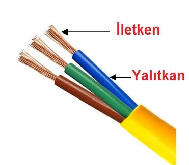

**İletkenlerin başlıca özellikleri:**

 - Atomların dış yörüngede bulunan elektronları atoma zayıf şekilde bağlıdır.

 - Isıda, ışıkta ve elektriksel etki olduğunda, kolay bir şekilde atomdan ayrılır.

 - Dış yörüngede bulunan elektronlar valans elektron olarak adlandırılır.

 - Sıvı ve gazlardan bazılarının, metallerin iletkenlik özelliği vardır.

 - Metallerin sıvı ve gazlara göre daha iyi iletkenliği bulunmaktadır.

 - Metaller iletkenlik durumuna göre iyi iletken ve kötü iletken olarak ayrılmaktadır. Atomlarında bir valans elektron bulunduran metaller iyi iletken özelliğine sahiptir.

 - Saf madde olarak elde edilemeyen bakır, altın ve gümüşe nispeten biraz daha kötü iletkendir. Ancak maliyetinin ucuz ve bol bulunmasından dolayı çok kullanılmaktadır.

**Bağlantı Kabloları:**

Bağlantı ve aktarma kabloları elektronikte önemli bir bileşendir.Kartlar ve bilgisayarlar arasındaki kablolu
bağlantıları sağlamak için kullanılır.

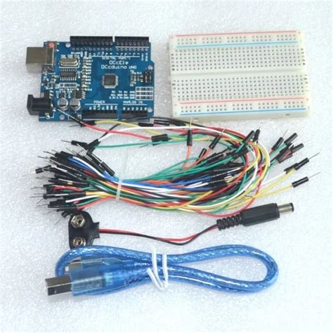

## 2.3. Dijital ve analog sinyaller

Sinyaller analog ve dijital olmak üzere ikiye ayrılır. Analog sinyaller devamlı sinyallerdir ve her değeri alabilirler. Örnek olarak Sinüs sinyali verilebilir. Dijital sinyaller ise devamlı değildir ve adım adım değişir. Örnek olarak PWM, kare dalgalar verilebilir. Arduino analog sinyalleri işleyemez, fakat doğadaki etkiler ve sensörler analog sinyal ile çalışır. Bu sinyallerin Arduino'da işlenebilmesi için dijital sinyale çevrilmesi gerekir. Bu çevirme işlemine analog dijital çevrim (ADC) denir.

Arduino'nun çıkış pinleri sadece 0 veya 5 volt verebilmektedir. Eğer bu pinlerden analog çıkış almak isterseniz, yani 0 veya 5 volt arasında, dijital analog çevrim (DAC) yapmalısınız. Bu özellikleri daha sonraki konularımızda daha detaylı olarak işleyeceğiz.

## 1.2. Breadboard

Breadboard, kullanacağımız elektronik elemanları bir arada tutmak ve gerekli kablo bağlantılarını gerçekleştirmek için kullanılır. Breadboard üzerinde iki çeşit yol vardır. Bunlardan ilki güç yollarıdır. Güç yolları, yani beslememizin artı ve eksi uçlarını taktığımız yer, resimde görülen kırmızı ve mavi şeritlerdir. Aşağıya doğru inen çizgilere karşılık gelen delikler kısa devre durumundadır. Bir başka deyişle, sol üstteki kırmızıdan bağlanan bir kablo aynı çizgi üzerinden bağlanacak kablolar ile birleşiktir. Aynı durum mavi çizgiler için de geçerlidir. Diğer elektronikçilerin de devrenizi anlayabilmesi için standartlara uygun olarak pilin artı ucu kırmızı çizgiye, eksi ucu ise mavi çizgiye takılmalıdır.

Diğer bir hatırlatma olarak da şunu belirtmekte fayda var. Bazı breadboardlarda yanlarda bulunan besleme hatları ikiye bölünmüş olduğu gibi, bazı breadboardlarda ise güç hatları tüm hat boyunca (yukarıdan aşağıya kadar) birbirine bağlıdır. Breadboard üzerindeki diğer yollar, güç hatlarının arasında bulunan yatay hatlardır. Bu hatlar yatay olarak birbirine bağlanmıştır. Fakat iki yatay hattı birbirinden ayırmak için arada bir boşluk vardır. Kısacası bu hatlar boşluğa kadar yatayda birbirine bağlıdır. Bu boşluğun amacı, elektronik entegrelerin takılabilmesini sağlamaktır.

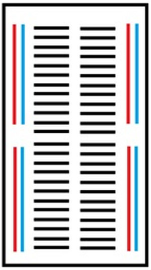

Yukarıdaki görselde bir Breadboard'un iç yapısını görmektesiniz. Böylece Breadboard'daki deliklerin hangilerinin birbirine bağlı olduğunu anlayabilirsiniz.

## 1.3. Dirençler

Daha önce elektronikle çok az ilgilenmiş birinin bile bildiği direnç elemanı, hat üzerinden geçen akımı ayarlamak için kullanılır. V = İ * R formülünden de anlaşıldığı gibi sabit bir gerilime sahip hat üzerinden geçen akım azaltılmak isteniyorsa, direncin değeri yani R değeri artırılmalıdır. Aynı hat üzerinde bulunan elektronik elemanlar üzerinden geçen akımların birbirine eşit olmasından dolayı bu hat üzerinden geçen akımı kontrol etmek için uygun direnci kullanırız.

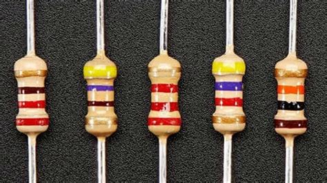

Örneğin, LED dediğimiz lambaların üzerinden fazla akım geçmesi bu lambalara zarar vermektedir. Bu lambaların fazla akım çekmesini engellemek için LED'in bağlantısından önce 220 ohm değerinde bir direnç takılır. Böylece LED üzerinden geçen akım azaltılmış olur. Eğer 220 ohm yerine daha büyük bir direnç bağlanırsa LED'in parlaklığında azalma olduğu görülür.

Direncin değeri ne yazık ki direnç üzerinde sayısal olarak yazmamaktadır. Fakat direncin değerinin anlaşılması için, direnç üzerinde renkli şeritler vardır. İlk iki şeritin değerleri ile iki haneli sayı oluşturulur. Bu iki haneli sayının da üçüncü şeridin değeri ile çarpılmasıyla direncin değeri bulunmuş olur.

Formül şu şekilde özetlenebilir:
**Direncin değeri = ( 10x(ilk şeritin değeri) + 1x(ikinci şeritin değeri) ) x 10 x Üçüncü şeridin değeri**

** Renklerin Değerleri:**

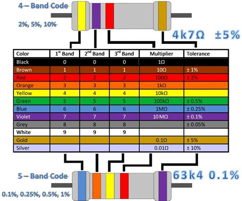

Üst kısımdaki direncin (4 bandlı) hesaplaması:

 * Birinci band yani sarı 4 değerini
 * İkinci band yani mor 7 değerini
 * Üçüncü band kırmızı yani 100 ohm çarpan
 * Dördüncü band altın rengi +-%5 tolerans değerini göstermektedir

**Sonuç : 47 X 100 = 4700 ohm = 4,7 kohm +-%5**

Alt kısımdaki direncin (5 bandlı) hesaplaması:

 * Birinci band yani mavi 6 değerini
 * İkinci band yani turuncu 3 değerini
 * Üçüncü band sarı yani 4 değerini
 * Dördüncü band kırmızı 100 ohm çarpan
 * Beşinci band mor rengi +-%0,1 tolerans değerini göstermektedir

**Sonuç : 634 X 100 = 63400 ohm = 63,4kohm +-%0,1**

Renklerin değerlerini aşağıdaki gibi kodlayıp öğrenebiliriz.

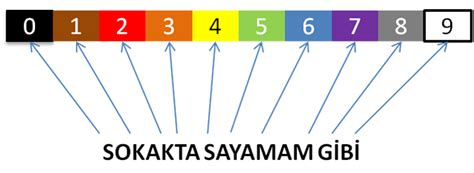

## 1.4. Voltaj Bölücü ve Potansiyometre

Voltaj Bölücü: Hattaki gerilimi daha düşük bir gerilime çevirmek için voltaj bölücü devresini kullanılır. Bu devrede iki tane direnç vardır. Kullanılan dirençlerin değerine göre çıkış gerilimi değişir. Voltaj bölücünün çıkışı besleme kaynağı olarak kullanılmamalıdır. Çünkü çıkıştaki elemanların iç direnci, voltaj bölücünün çıkış gerilimini de değiştirmektedir.

|  Devre görünümü                              |Gerçek cihaz görünümü                       |
|----------------------------------------------|--------------------------------------------|
|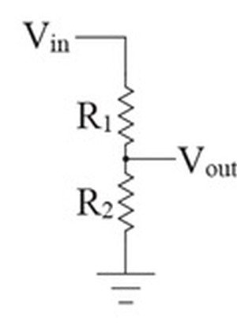|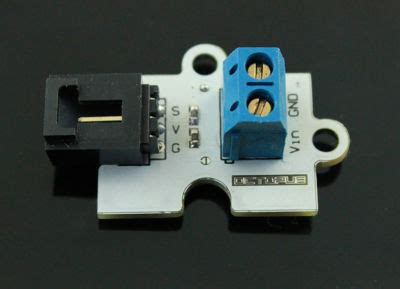|

Resimde voltaj bölücü devresinin şeması gösterilmiştir. Çıkış gerilimi R1 ve R2 dirençlerine bağlıdır. Vout = Vin*R2/(R1+R2) şeklinde yazılır.

**Örneğin:** _R1=4.7k R2= 10k ohm_ olarak seçilir ve giriş voltajımız da 5 volt olursa, _çıkış voltajımız = 5*10K/(4,7K+10K) = 3,4 Volt_ olarak bulunur.

**Potansiyemetre**

|  Devre görünümü                               |Gerçek cihaz görünümü                          |
|-----------------------------------------------|-----------------------------------------------|
|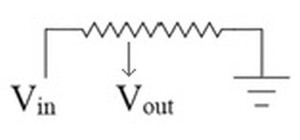|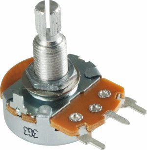|

Voltaj bölücünün çalışma prensibine bağlı devre elemanıdır. Besleme, toprak ve çıkış olmak üzere üç pini bulunur. 2. (ortadaki) pin genellikle çıkış pini olmaktadır. Geriye kalan pinler sırası önemli olmaksızın besleme ve toprak pinleridir. Potansiyometrenin başlığı çevrilerek çıkış gerilimi değiştirilebilir.  Potansiyometrelerin
daha güçlülerine ve daha yüksek akım değerine sahip devrelerde kullanılanlarına ise reosta denir.

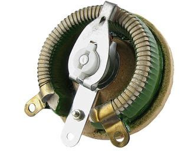

## 1.5. Diğer Elektronik Elemanlar

### 1.5.1. Diyot

Tek yönde akım geçiren devre elemanıdır. Çeşitli amaçları yerine getirmesi için farklı diyotlar bulunmaktadır. Klasik diyotların kullanım amacı, akımın tek yönde akmasını sağlamaktır. Eğer akımın istenmeyen bir yönde akma ihtimali varsa, burada diyot kullanılır.

> **Not:** Diyot üzerinde yaklaşık 0,7 Voltluk bir harcama olur. Yani hattımızda 5 volt var ise diyot kullandığımızda diyotun diğer ucunda 4,3 Voltluk bir gerilim kalır. Bu 0,7 Volt diyotun üzerinde kalmıştır.

Başka amaçlarda kullanılmak için geliştirilmiş özel diyotlar vardır:

**LED:** Normal bir diyot gibi üzerinden tek yönde akım geçmektedir. Normal bir diyottan farkı, üzerinden akım geçtiğinde akımın değerine göre ortama ışık vermesidir.

**Zener Diyot:** Bu diyot devreye ters (tıkama) yönde bağlanır. Bağlandığı İki hat arasındaki gerilim farkını sabit tutmak için kullanılır. Örneğin hattımızın en fazla 5 volt gerilime sahip olmasını istiyorsak, hat ile toprak arasına zener diyot bağlamalıyız.

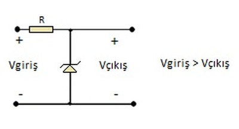

Böylece 5 voltun üzerinde bir gerilim oluşursa zener diyot bunu toprağa aktaracaktır.

### 1.5.2. Transistör

Girişine uygulanan sinyali kuvvetlendiren devre elemanıdır. Aynı zamanda anahtarlama elemanı olarak da kullanılmaktadır.

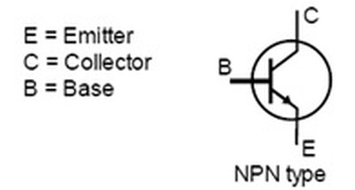

NPN ve PNP olmak üzere iki tip transistör bulunmaktadır. NPN tipi transistörlerde Kollektör'den (C) gelen akımın Emetör'e (E) geçebilmesi için Base'e (B) gerilim uygulanmalıdır. PNP tipi transistörler ise bunun tam tersi çalışmaktadır.

### 1.5.3. LDR

Üzerine düşen ışık miktarına göre direnç değeri değişen elektronik devre elemanıdır. Ortam ışığının ölçülmesi gereken projelerde kullanılır. LDR'nin direnci eğer üzerine fazla ışık düşüyorsa sıfıra yakın, az ışık düşüyor vaya karanlık ortamda ise sonsuza yakın olmaktadır.

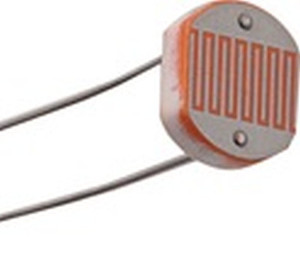

Yapacağımız projelerde sıklıkla kullanacağımız devre elemanlarını ve bu elemanların kullanım nedenini öğrendik.

Bu bölümde öğrenilen bilgiler, Arduino projelerinde kurulan devreleri anlamaya yardımcı olacaktır. Bu nedenle yeni başlayanlar için, bu bölümün zaman zaman tekrar edilmesi yararlı olacaktır.

## 1.6.Elektrik ve Elekronik Sembolleri

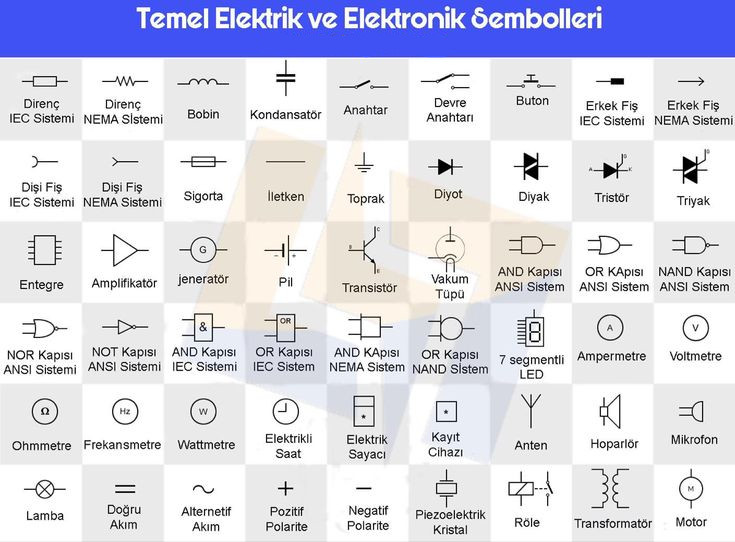

# 3. ÖLÇME

## 3.1. Ölçü Aleti

Ölçü aleti, bilim ve teknolojide çeşitli nicelikleri (büyüklük, quantity) ölçmek için kullanılan alet ve araçlara
verilen genel bir addır.

Ölçü aleti örnekleri evde duvar saati ve termometre, okulda cetvel ve iletki, tıpta tansiyon aleti, iş yerinde
bakkal terazisi, terzi mezürü ve duvarcı çekülü, taşıt aracında da hız göstergesidir. Bilimde ise sıvıların asit
baz oranını ölçen pH metrelerden, radyoaktif bozunum ölçen Geiger sayacına kadar yüzlerce örnek
sayılabilir. Ama burada sadece elektrik ve elektronik devrelerinde kullanılan ölçü aletlerinden bahsedilecektir.

Elektrik devrelerinde kullanılan ölçü aletleri bir ekranda dalga şekli gösteren ya da sayısal değer gösteren
ölçü aletleri olarak sınıflandırılabilir. Dalga şekli gösteren ölçü aletlerine osiloskop denilir. Osilaskopların (filtre karakteristiği vb. için geliştirilmiş) özel türleri de vardır. Sayısal değer gösteren geleneksel ölçü aletleri ise bir skala ve bu skala üzerinde hareket eden ibreden oluşur. Bu tür ölçü aletlerine analog ölçü aleti denilir. Analog ölçü aletleri ibreyi çalıştıran mekanizmaya bağlı olarak, döner demirli, döner mıknatıslı, döner bobinli, elektrostatik, elektrodinamik gibi adlarla bilinir. Ancak günümüzde analog ölçü aletleri yerlerini sayısal ölçü aletlerine bırakmışlardır. Sayısal ölçü aletlerinde değerler bir LED ekranda gösterilmektedir.

Multimetre (avometre) çok amaçlı bir ölçü aleti türüdür. Bu aletler akım (amper), gerilim (volt) ve direnç (ohm)
gibi nicelikleri ölçebilirler. Aletin esas ismi multimetre olup, avometre adı bir firma tarafından, amper, volt ve ohm kelimelerinin baş harflerinden yararlanılarak oluşturulmuştur. Multimetreler, elektrik ve elektronik
sektöründe kullanılırlar, analog ve dijital olarak imal edilirler. Üzerindeki komutatörle istenilen ölçme değeri
seçilip ölçme yapılır. Günümüzde avometreler oldukça gelişmiş ve birçok yeni özellik eklenmiştir. Standart parametreler olan akım gerilim ve direnç dışında, frekans, sıcaklık, kapasitans, duty cycle, buzzer, hfe ve birçok parametrenin daha ölçümünü yapabilmektedir.

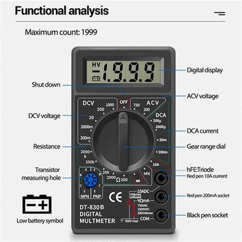

### 3.1.1. İletkenlik Testi

İletkenlik testinde özellikle kabloların sağlamlıkları test edilmektedir. Avometre buzzer konumuna alınır ve avometrenin uçları iletkenlik testi yapılacak olan kablonun uçlarına bağlanır. Kabloda herhangi bir sorun yoksa avometre ses çıkaracaktır.

### 3.1.2. Direnç Ölçme

Direnç ölçümünde direncin renk kodları üzerinden mevcut değeri hesaplanır. Avometre konum anahtarı direncin değerinden bir büyük olan değer konumuna alınır. Daha sonra avometrenin uçları direncin uçlarına değdirilir. Ekrandan direncin değeri okunur. Tolerans değerine göre hesaplanan değerden az bir miktar fazla veya eksik olabilir. _Direnç ölçümünde dikkat edilecek konu ölçüm yapılacak olan devrenin güç kaynağının kapalı olmasıdır._

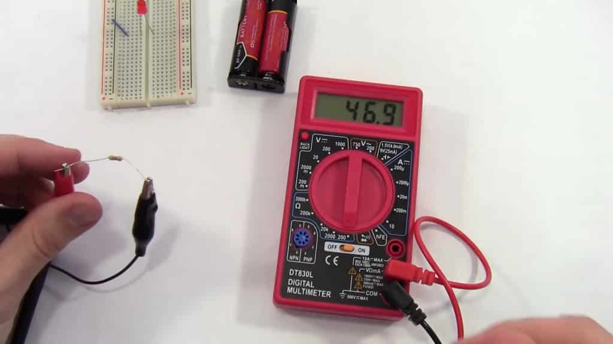

### 3.1.3. Gerilim Ölçme

Avometre ile gerilim ölçümü yapılırken ilk önemli adım ölçme yapacağımız gerilimin türünü belirlemektir. Örneğin bir pil/batarya ölçümü yapılacaksa DCV bölümüne, şebeke elektriği ölçümü yapılacaksa ACV bölümüne alınır. Daha sonra ölçümü yapılacak gerimin tahmini değeri biliniyorsa konum anahtarı Avometre üzerindeki kendisinden en yakın büyük değere ayarlanır. Bu şekilde daha hassas bir ölçüm yapılmış olur.

Dilerseniz bir de Arduino devre kartımızın verdiği voltajı ölçelim :

Tıpkı pillerde yaptığımız gibi probları doğru noktalara dokundurmamız gerekiyor. Arduino’nun 5V çıkışını kırmızı proba, GND çıkışını ise siyah proba dokunduruyorum.

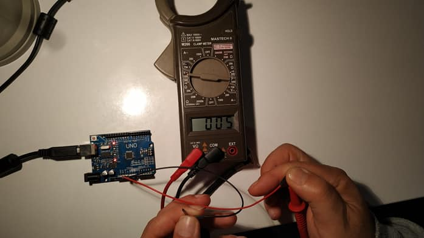

## 3.1.4. Akım Ölçme

Akım ölçümü yapılırken, avometrenin doğru bir şekilde bağlanması gerekmektedir. Öncelikle, avometrenin düğmelerini kontrol ederek doğru ölçüm aralığını seçmelisiniz. Ardından, ölçüm yapacağınız devre üzerindeki akımı kesmek için gereken önlemleri almalısınız. Akım ölçümü genellikle devreye seri olarak bağlanan bir ampermetre kullanılarak yapılır. Ampermetre, devre üzerindeki akımın doğrudan geçtiği bir ölçüm aracıdır. Avometre ile akım ölçümü yaparken, öncelikle ampermetreyi doğru bir şekilde devreye bağlamalısınız.

Voltajdan ve dirençlerden farklı olarak akım ölçümü yapmak için diğer prob girişini kullanmamız gerekebilir. Örneğin benim multimetremde sağ alt köşede “**EXT**” yazan giriş, akım ölçmek içindir.

Avometre ile Akım Ölçümü Adımları:

1. Avometrenin düğmelerini kontrol ederek doğru ölçüm aralığını seçin.
2. Ölçüm yapacağınız devre üzerindeki akımı kesmek için gereken önlemleri alın.
3. Ampermetreyi devreye seri olarak bağlayın.
4. Devre üzerinden geçen akımı doğru bir şekilde okuyun.

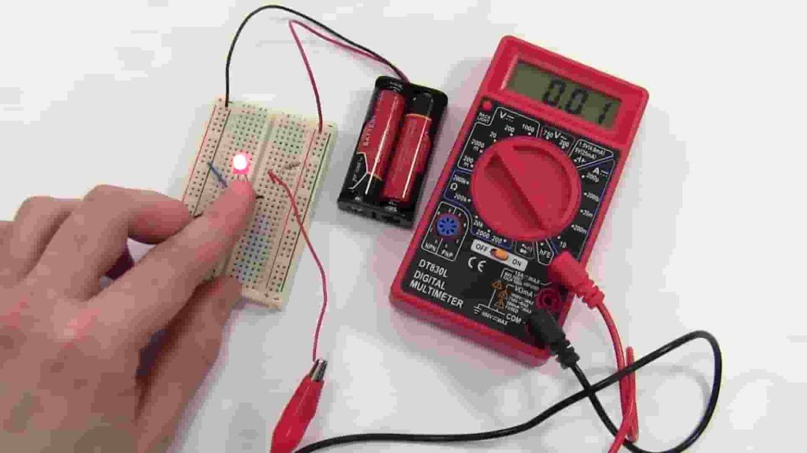

