# 2. Yazılıma Giriş

Temel elektronik bilgilerimizi tazeledikten sonra, sıra temel yazılım bilgilerimizi de gözden geçirmeye geldi. Bu bölümde diğer programlama dillerinde de benzerlik gösteren, projelerimizde kullanacağımız temel yazılım bilgilerini göreceğiz.

***Arduino ile gömülü sistem geliştirme için normal prosedür aşağıdaki adımları içerir:***

 * Amaçlanan devrenin elektrik şemasının çizilmesi
 * Elektrik bileşenlerinin şemaya uyacak şekilde bağlanması
 * Devreyi istenildiği gibi kontrol etmek için program mantığının yazılması
 * Mikrodenetleyicinin USB kablosuyla bilgisayara bağlanması
 * Programın bilgisayardan kartın flash belleğine aktarılması(veya yüklenmesi)

## 2.1. Gerekli Araçlar:
Burada anlatılanları yapabilmek için bir Arduino kartına ve aşağıdaki yazılım önkoşullarına ihtiyacınız olacak:

 * Program yazma, derleme ve yazılan programı arduino karta aktarmak için bir bilgisayar
 * Cargo yazılımı
 * Rust gecelik derleyici sürümü

## 2.2. Neden Rust?

Gömülü sistemler teknolojisi onlarca yıldır yenilikten yoksundu. Yıldırım hızında, gömülü cihazları programlamak için tercih edilen dil uzun zamandır C/C++ olmuştur, ancak Rust daha da hızlı geliştirme desteği sağlar. Rust gömülü sistem geliştirme için mükemmel bir seçimdir çünkü:

* C kod tabanlarıyla yüksek oranda birlikte çalışabilir
* Taşınabilir ve hafiftir
* Güçlü bir eşzamanlılık modelidir
* Farklı mikrodenetleyiciler için sağlam destek sunar
* Bellek güvenlidir

Arduino'ları zaten C++ ile programladıysanız, temelleri öğrendikten sonra bunu Rust ile yapmaya geçmek nispeten kolay olacaktır.

## 2.3. Kurulum ve Ayarlar

### 2.3.1. avrdude

avrdude, avr-hal projeleri için cargo tarafından oluşturulan bir şablondur. Şu anda aşağıdaki donanımları desteklemektedir:

 * Arduino Leonardo
 * Arduino Mega 2560
 * Arduino Mega 1280
 * Arduino Nano
 * Arduino Nano New Bootloader (Ocak 2018'den sonra üretildi)
 * Arduino Uno
 * SparkFun ProMicro
 * SpartFun ProMini 3.3V
 * SpartFun ProMini 5v
 * Adafruit Trinket
 * Adafruit Trinket Pro

AVR mikrodenetleyicileri ve diğer yaygın kartlarda Rust çalıştırmak için bir Donanım Soyutlama Katmanı (HAL) gereklidir. Bunu elde etmek için, makinenizde Rust kodunu AVR'ye derleyen gecelik Rust derleyicisine ihtiyacınız vardır.

### 2.3.2. Pardus

Pardus gibi bir Linux dağıtımı kullanıyorsanız aşağıdaki komut ile gerekli paketler yüklenir:

`sudo apt install avrdude avr-libc build-essential curl gcc-avr libssl-dev libudev-dev pkg-config`

Aşağıdaki komut ile rustup araç zinciri olmadan (toolchain) sisteme kurulur.

`curl --proto '=https' --tlsv1.2 -sSf https://sh.rustup.rs | sh -s -- --default-toolchain none -y`

Daha sonra gecelik yayımlanan araç zinciri (toolchain) aşağıdaki komut ile sisteme kurulur.

`rustup toolchain install nightly --allow-downgrade --profile minimal --component clippy`

Kurulum tamamlandıktan sonra Bash **env** ortamının yeniden başlatılmasını isteyen bir uyarı görünecektir. Bash **env** ortamını yeniden başlatmak için aşağıdaki komutu kullanın:

`exec bash`

_rustup_ için Tab (Sekme) ile otomatik tamamlama özelliğini etkinleştirmek isterseniz aşağıdaki komutu kullanabilirsiniz:

`rustup completions bash > ~/.local/share/bash-completion/completions/rustup`

Sisteminiz rust ile kodlamak için hazır. Mikrodenetleyici kartı bulma, yazılan kodu karta aktarma ve bağlantıları dinleme işlemlerini yerine getirmek için **ravedude** yazılımını yüklemeniz gerekmektedir. Bunun için aşağıdaki komutu kullanın:

`cargo install ravedude`

 Artık hazırız. Tek yapmanız gereken kodunuzu yazdıktan sonra `cargo run` komutunu çalıştırmak.


## 2.4. Rust Dili

Rust dili ile program yazabilmek için bilgisayarımıza gerekli kurulumları yapmış bulunuyoruz. Şimdi aşağıdaki komutu kullanarak ilk projemizi oluşturalım.

`cargo new hello-world`

`cargo` Rust dilinin derleme ve paket yöneticisidir. Cargo'ya `new` parametresi ile _hello-world_ isimli bir proje oluşturmasını söylemiş olduk. Ev dizini içerisine baktığımızda **hello-world** isimli bir dizin oluştuğunu görüyoruz. Projemize ait tüm dosyalar bu dizin içerisinde barındırılmaktadır. Şimdi bu _hello-world_ isimli dizin içine bir bakalım.

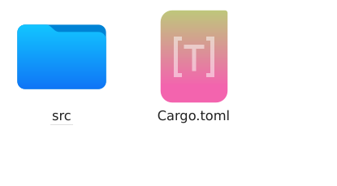

Görüldüğü üzere burada bir _src_ dizini ve bir adet _Cargo.toml_ dosyası oluştu. Öncelikle _Cargo.toml_ dosyasına bir inceleyelim:

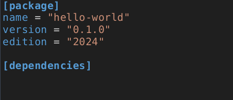

Bu dosyanın birinci satırı `[Package]` program derlenirken Cargo tarafından kullanılacak olan bilgileri içerir. Bu proje için bunlar; projenin adı, sürümü ve kullanılan Rust dilinin sürüm numarasıdır. `[Dependencies]` satırı ise projemizin bağımlılıklarının listelendiği bölümdür. Mevcut projemizin herhangi bir bağımlılığı olmadığından burası boştur.

Şimdi _src_ dizini altına bir bakalım. Burada _main.rs_ adında bir dosya görüyoruz. Dosya içeriği aşağıda gösterilmiştir.

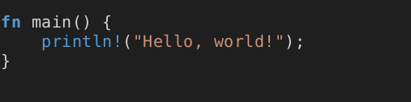

İlk satır `main` adında bir fonksiyon tanımlar. `main` fonksiyonu rust'ın her çalışmasında ilk çalışan özel bir fonksiyondur. Mevcut projemizde main fonksiyonu bir parametre içermediği için parantezler `()` arası boş bırakılmıştır. Fonksiyon içerisinde kullanılacak bir parametre olsaysı bu parantez içine yazılacaktı. Süslü parantezler `{}` fonksiyonun gövdesini oluştururlar. Fonksiyonun yapacağı işlemler bu süslü parantezler arasında yazılır. Mevcut projemizde ise fonksiyon gövdesi aşağıdaki koddan oluşmaktadır.

`println!("Hello, world!");`

Şimdi fonksiyon kavramını ele alalım.

## 2.4.1. Fonksiyonlar

Fonksiyonlar Rust kodunda yaygındır. Dildeki en önemli fonksiyonlardan birini zaten gördünüz: birçok programın giriş noktası olan main fonksiyonu. Ayrıca yeni fonksiyonlar bildirmenizi sağlayan fn anahtar sözcüğünü de gördünüz.

Rust kodu, fonksiyon ve değişken adları için tüm harflerin küçük olduğu ve alt çizgilerin kelimeleri ayırdığı geleneksel bir yönteml kullanır. İşte örnek bir fonksiyon tanımı içeren bir program:

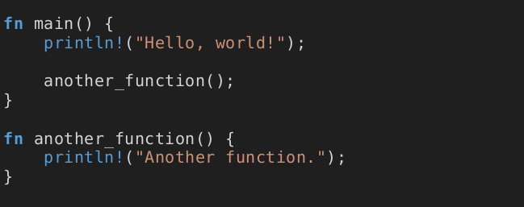

Rust'ta bir fonksiyonu `fn` ve ardından bir fonksiyon adı ve bir parantez `()` girerek tanımlarız. Süslü parantezleri `{}` derleyiciye fonksiyon gövdesinin nerede başlayıp nerede bittiğini söyler. Tanımladığımız herhangi bir fonksiyonu, adını ve ardından bir parantez girerek çağırabiliriz. `another_function` program içinde tanımlandığı için, `main` fonksiyonun içinden çağrılabilir. `another_function` fonksiyonunu kaynak kodda `main` fonksiyonundan sonra tanımladığımıza dikkat edin; daha önce de tanımlayabilirdik. Rust, fonksiyonlarınızı nerede tanımladığınızla ilgilenmez, sadece çağıran tarafından görülebilecek bir kapsamda bir yerde tanımlanmış olmaları yeterlidir.

Fonksiyonları daha fazla keşfetmek için functions adında yeni bir ikili proje başlatalım. `another_function` örneğini src/main.rs dosyasına yerleştirin ve çalıştırın. Aşağıdaki çıktıyı görmelisiniz:


```bash
$ cargo run
   Compiling functions v0.1.0 (file:///projects/functions)
    Finished `dev` profile [unoptimized + debuginfo] target(s) in 0.28s
     Running `target/debug/functions`
Hello, world!
Another function.
```
Satırlar `main` fonksiyonda göründükleri sırayla çalıştırılır. Önce "**Hello, world!**" mesajı yazdırılır, ardından `another_function` çağrılır ve onun mesajı yazdırılır.

### 2.4.1.1. Parametreler

Fonksiyonları, fonksiyon imzasının bir parçası olan özel değişkenler olan parametrelere sahip olacak şekilde tanımlayabiliriz. Bir fonksiyonun parametreleri olduğunda, bu parametreler için somut değerler sağlayabilirsiniz. Teknik olarak, somut değerlere **argüman** denir, ancak günlük konuşmalarda insanlar parametre ve argüman kelimelerini ya bir fonksiyonun tanımındaki değişkenler ya da bir fonksiyonu çağırdığınızda aktarılan somut değerler için birbirinin yerine kullanma eğilimindedir. `another_function`'un bu versiyonunda bir parametre ekliyoruz:

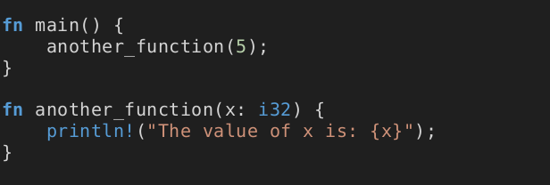

Bu programı çalıştırmayı deneyin; aşağıdaki çıktıyı almalısınız:


```bash
$ cargo run
   Compiling functions v0.1.0 (file:///projects/functions)
    Finished `dev` profile [unoptimized + debuginfo] target(s) in 1.21s
     Running `target/debug/functions`
The value of x is: 5
```

`another_function` bildiriminde `x` adında bir parametre vardır. `x`'in türü `i32` olarak belirtilmiştir. `5` değerini `another_function` ögesine aktardığımızda, `println!` makrosu `5` değerini `x` içeren küme parantezi çiftinin biçim dizesinde bulunduğu yere yerleştirir.

Fonksiyon tanımlamalarında, her parametrenin türünü bildirmeniz gerekir. Birden fazla parametre tanımlarken, parametre bildirimlerini aşağıdaki gibi virgülle ayırın:

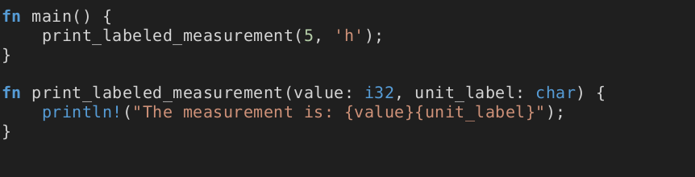

Bu örnek, `print_labeled_measurement` adında iki parametreli bir fonksiyon oluşturur. İlk parametre value olarak adlandırılır ve bir `i32`'dir. İkincisi `unit_label` olarak adlandırılır ve `char` türündedir. Fonksiyon daha sonra hem değeri hem de `unit_label`'ı içeren metni yazdırır.

Bu kodu çalıştırmayı deneyelim. Şu anda functions projenizin **src/main.rs** dosyasında bulunan programı yukarıdaki örnekle değiştirin ve `cargo run` kullanarak çalıştırın:

```bash
$ cargo run
   Compiling functions v0.1.0 (file:///projects/functions)
    Finished `dev` profile [unoptimized + debuginfo] target(s) in 0.31s
     Running `target/debug/functions`
The measurement is: 5h
```
Fonksiyonu `value` değeri olarak `5` ve `unit_label` değeri olarak `'h'` ile çağırdığımız için, program çıktısı bu değerleri içerir.

## 2.4.2. Değişkenler

Bir değeri veya karakteri daha sonra tekrardan kullanmak/değiştirmek için hafızada tutabilirsiniz. Bu değerler değişkenlerde tutulur. Hafızada tutacağınız değerin türüne göre değişken tanımlanması gerekir. Rust'ta değişkenler varsayılan olarak değişmezdir, yani değişkene bir değer verdiğimizde bu değer değişmez.

Aşağıdaki tabloda, Rust dilinde kullanılan değişken türlerini ve tutabilecekleri değerleri görebilirsiniz.

|Değişken|Boyut     |Açıklama                                                         |
|--------|----------|-----------------------------------------------------------------|
|i8      |8 bit     |-128 – 127 arası işaretli sayılar.                               |
|i16     |16 bit    |-32.768 – 32.767 arası işaretli sayılar.                         |
|i32     |32 bit    |-2.147.483.648 – 2.147.483.647 arası işaretli sayılar            |
|i64     |64 bit    |-9,22337203685e+18 – 9,22337203685e+18 arası işaretli sayılar    |
|i128    |128 bit   |-1,7014118346e+38 – 1,7014118346e+38 arası işaretli sayılar      |
|isize   |mimari    |32/64 bit işlemci türüne göre işaretli sayıları barındırır       |
|u8      |8 bit     |0 – 255 arası işaretsiz sayılar.                                 |
|u16     |16 bit    |0 – 65.536 arası işaretsiz sayılar.                              |
|u32     |32 bit    |0 – 4.294.967.296 arası işaretsiz sayılar                        |
|u64     |64 bit    |0 – 1,84467440737e+19 arası işaretsiz sayılar                    |
|u128    |128 bit   |0 – 3,40282366921e+38 arası işaretsiz sayılar                    |
|usize   |mimari    |32/64 bit işlemci türüne göre işaretsiz sayıları barındırır      |
|f32     |32 bit    |Tek hassaiyetli ondalık sayılar barındırır                       |
|f64     |64 bit    |Çift hassaiyetli ondalık sayılar barındırır                      |
|bool    |true/false|doğru/yanlış değerini barındırır                                 |
|char    |karakter  |karakter veya karakterler barındırır                             |


Aşağıdaki görselde veri türlerine ait örnekler bulunmaktadır. Eğer tamsayı ve ondalık sayı türleri için boyut belirtilmez ise Rust, varsayılan olarak tamsayılar için `i32`, ondalık sayılar için ise `f64` değerlerini kabul eder. Örnekte de görüldüğü gibi Rust hem normal karakter türünü hem de unicode karakterleri desteklemektedir.

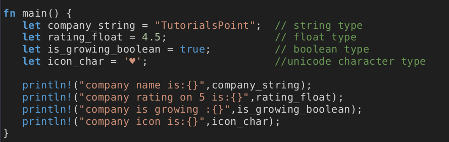

Örnek incelendiğinde `company_string` isminde **string** türünde bir değişken, `rating_float` isminde **float** (ondalık sayı) türünde bir değişken, `is_growing_boolean` isminde **boolean** türünde bir değişken ve `icon_char` isminde yine **char** türünde bir değişken tanımlanmıştır.

Rust dilinde oluşturulan değişkenler varsayılan olarak değiştirilemez demiştik ancak yazdığımız programda değişkenin değerinin değişmesi gerekiyorsa Rust bunun içinde bir çözüm sunar. Aşağıdaki örnekte `let mut x = 5;` ifadesinde geçen `mut` sözcüğü x değişkenini değiştirilebilir yapmaktadır. Program çalıştırıldığından ekrana `Value of x is: 6` yazdırılacaktır.

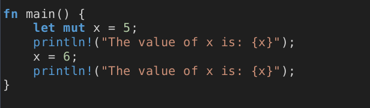

## 2.4.3. Koşul yapıları

Hemen hemen her yazılım dilinde bulunan temel kod yapılarından birisidir. Koşul yapıları ile bir durumun sonucu doğrultusunda yapılacak işi belirtebiliriz. Eğer bu durum istediğimiz gibi sonuçlanmadıysa da yapılacak görevi belirleyebiliriz.

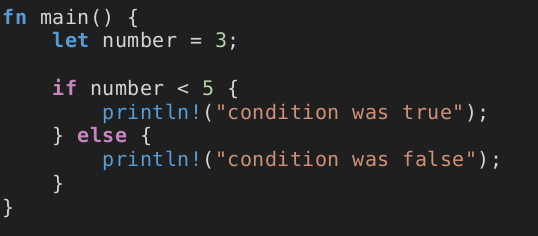

Yukarıdaki örnekte `number` değişkenine `3` değeri atanmış. `if` koşulu ile sayı değişkeni değerinin `5`'ten küçük olup olmadığını kontrol ediyoruz. Koşul doğru ise ekrana _"condition was true"_ ifadesini yazacaktır. Değilse koşulun `else` kısmı çalışacak ve _"condition was false"_ ifadesi ekrana yazdırılacaktır.

Birden fazla koşulun kontrol edilmesi gereken durumlarda ise `else if` ifadesi kullanılır. Aşağıdaki örnekte `if` ifadelerinin herbiri sırasıyla kontrol edilir. Bulunan ilk doğru koşul çalıştırılır. `6` sayısının `2`'ye kalansız bölünüyor olmasına rağmen, çıktıda `Sayı 2'ye kalansız bölünebilir.` mesajını veya `else` bloğunda yer alan `Sayı 4, 3 veya 2'ye kalansız bölünemez!` mesajını görmediğimize dikkat edin. Bunun nedeni Rust'ın kontrol sırasındaki ilk doğru koşulu bularak onu işletmesi ve diğer koşulların doğu olup olmamasıyla ilgilenmemesidir.

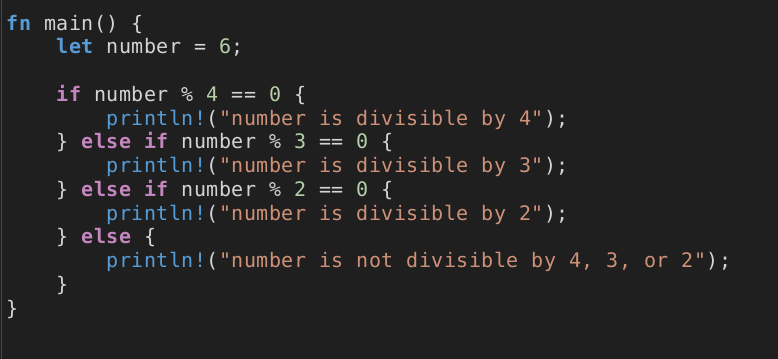


Fark ettiyseniz `number` değişkeninin 4, 3 ve 2'ye bölümünden kalanın 0(sıfır)'a eşitlik durumunu  '==' ile kontrol ettik. Bu işaret aslında denklik anlamına gelmektedir. Bir sayının diğer sayıya eşitliğini kontrol ettiğimiz gibi, büyüklüğü küçüklüğünü de test edebiliriz.

Koşul olarak kullanılabilen ifadeler:

| İfade             |Anlamı             |İfade              |Anlamı             |
|-------------------|-------------------|-------------------|-------------------|
| ==                | Denkse            | !=                | Denk değilse      |
| >                 | Büyüktür          | <                 | Küçüktür          |
| >=                | Büyük veya eşitse | <=                | Küçük veya eşitse |
| Koşul1 && Koşul 2 | ve                | Koşul1 ll Koşul 2 | veya              |

## 2.4.4. Döngüler

Yazılan kodlarda belirli satırların birden fazla tekrar edilmesi istenebilir. Böyle durumlarda döngü yapıları kullanılır. Döngü yapılarında, döngünün kaç kere tekrar edeceği dinamik olarak belirlenebilir. Hatta döngünün tekrarlaması bir koşula bağlanabilir.

### 2.4.4.1. loop Döngüsü

Bir anahtar sözcük olan `loop` Rust'a, ait olduğu kod bloğunu sonsuza dek ya da siz onu açıkça durdurana kadar tekrar tekrar çalıştırmasını söyler. Programı çalıştırdığınızda terminalinizi elle kapatana kadar `Tekrar!` mesajının yazdırıldığını göreceksiniz. Pekçok terminal sonsuz döngüye kapılan programların sonlandırılmasını sağlayan `Ctrl + c` klavye kısa yolunu destekler.

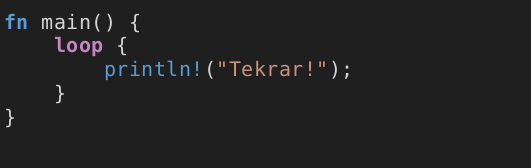

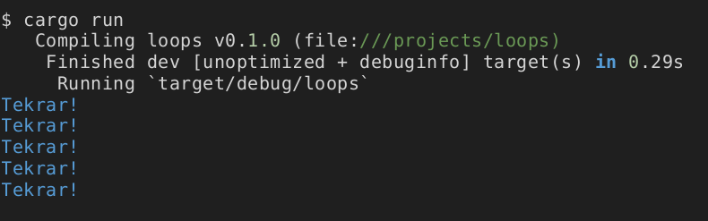

Döngünün kullanım alanlarından biri, bir iş parçacığının işini tamamlayıp tamamlamadığını kontrol etmek gibi başarısız olabileceğini bildiğiniz bir işlemi yeniden denemektir. Ayrıca bu işlemin sonucunu döngüden kodunuzun geri kalanına aktarmanız gerekebilir. Bunu yapmak için, döngüyü durdurmak için kullandığınız `break` ifadesinden sonra döndürülmesini istediğiniz değeri ekleyebilirsiniz; bu değer, burada gösterildiği gibi kullanabilmeniz için döngü dışında döndürülecektir:


Döngüden önce, `counter` adında bir değişken tanımlıyoruz ve `0` olarak başlatıyoruz. Ardından, döngüden dönen değeri tutmak için `result` adında bir değişken tanımlıyoruz. Döngünün her yinelemesinde, `counter` değişkenine `1` ekliyoruz ve ardından sayacın `10`'a eşit olup olmadığını kontrol ediyoruz. Eşit olduğunda, `counter * 2` değeriyle `break` anahtar sözcüğünü kullanırız. Döngüden sonra, değeri sonuca atayan ifadeyi sonlandırmak için noktalı virgül kullanırız. Son olarak, bu durumda `20` olan `result` değerini yazdırıyoruz.

Bir döngünün içinden de geri dönebilirsiniz. `break` yalnızca geçerli döngüden çıkarken, `return` her zaman geçerli işlevden çıkar.


### 2.4.4.2. while Döngüsü

Programların genellikle döngü içinde bulunan koşulları değerlendirmeleri gerekir. Koşul doğru olduğu sürece çalışan döngü, koşulun yanlış olması durumunda programın break çağrısı sonucunda durdurulur. Bu tür bir davranışı `if` , `else` ve `break` kombinasyonlarını kullanarak uygulamak mümkündür. Eğer isterseniz bunu bir programla hemen şimdi deneyebilirsiniz. Fakat bu model o kadar yaygın biçimde kullanılmaktadır ki, Rust bunun için `while` döngüsü adında yerleşik bir dil yapısı sunar. Aşağıdaki örnekte geriye doğru 3 tur dönen ve her dönüşünde döngünün bulunduğu turu yazdıran, son olarak bir mesaj yazdırarak döngüden çıkan program için `while` döngüsünden yararlanıyoruz.

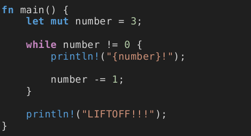


Bu yapı, `loop` , `if` , `else` ve `break` kullanarak yazacağınız bir programda gerekli olacak çok sayıda içiçe yuvalanmayı ortadan kaldıracağı için oldukça nettir. Ve bu kod, koşul doğru olduğu sürece çalışacak aksi halde döngüden çıkacaktır.

### 2.4.4.3. for Döngüsü

Belli sayıda tekrarlanacak kodlar için for döngüsünden yararlanılır. Geliştiriciler bunu yaparken, belli bir başlangıç ve bitiş sayısı arasında kalan tüm sayıları sırayla üreten ve standart kitaplık tarafından sağlanan bir Range aralığı kullanırlar. Aşağıdaki örnekte 1'den 6'ya kadar (6 hariç) x değeri olarak ekrana yazdırılır.

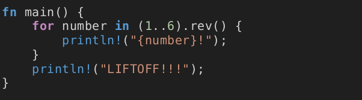

`for` döngü yapısını, dizi (array) gibi bir koleksiyonun ögeleri üzerinde döngü yapmak için de kullanabilirsiniz. Örneğin bir a dizisindeki her bir ögeyi sırasıyla ekrana yazdırmak için aşağıdaki kodu yazıp çalıştıralım.

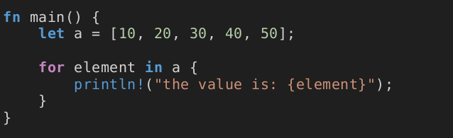

