# 3. Arduino'ya Giriş

Arduino, üzerinde bulundurduğu özel giriş ve çıkış portları yardımıyla, programcının yazdığı özel kodları fiziksel etkiye çeviren elektronik devre kartıdır. Yazılımsal ve donanımsal olarak tamamen açık kaynaklı ve özgür olmasından dolayı, isteyen herkes Arduino'nun gelişmesine katkı sağlayabilmektedir. Diğer programcılar tarafından hazırlanmış geniş kütüphaneler ve örnek projeler sayesinde Arduino, Dünya üzerinde en çok kullanılan elektronik devre kartlarındandır.

Arduino ile proje ve prototip hazırlama diğer mikroişlemcilere göre daha hızlı olmaktadır. Bu yüzden Arduino prototip hazırlamada ve elektronik programlamaya girişte yaygın olarak kullanılmaktadır.

Arduino üzerinde bulunan donanımlar ve pinler, Arduino'ya yüklenen kodlar tarafından kolaylıkla kontrol edilebilmektedir. Programcı tarafından yazılan bu kodların işlenmesi için Arduino üzerinde Atmel marka mikroişlemciler bulunmaktadır. Bu mikroişlemcilerin türüne göre de Arduino türleri belli olmaktadır. Arduino'nun bir türü için yazılmış bir kod, eğer o türe has özel donanımlar kullanmıyorsa diğer Arduino türleri üzerinde de sorunsuz çalışmaktadır. Bu yüzden çoğu Arduino projesi hemen hemen her Arduino türünde çalışmaktadır.

**Yaygın olarak kullanılan Arduino türleri ve özellikleri:**

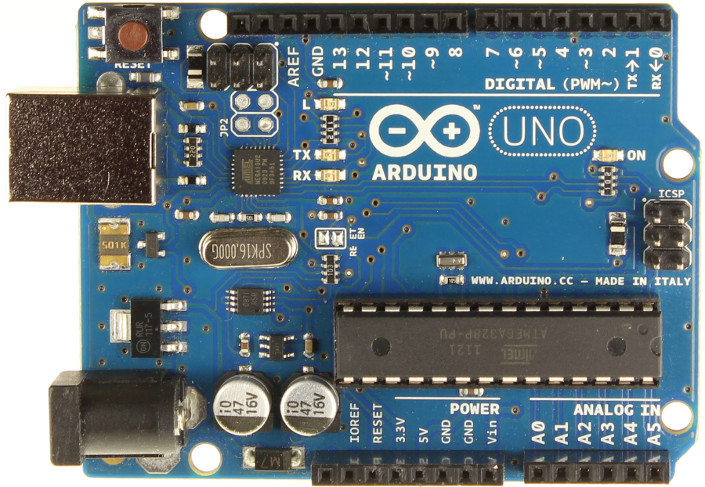

***Arduino UNO***

|Bileşen                |Değer        |
|-----------------------|-------------|
|Mikrokontrolcü         | ATmega328   |
|Çalışma gerilimi       | 5 Volt      |
|Önerilen giriş voltajı | 7 – 12 Volt |
|I/O (giriş/çıkış) sayısı| 14 (6 PWM) |
|I/O çıkış akımı         | 40 mA      |
|Analog giriş            | 6          |
|Flash bellek            | 32 KB      |
|SRAM                    | 2 KB       |
|EEPROM                  | 1 KB       |


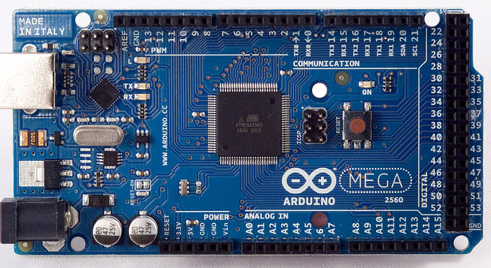

***Arduino MEGA***

|Bileşen                 |Değer        |
|------------------------|-------------|
|Mikrokontrolcü          | ATmega2560  |
|Çalışma gerilimi        | 5 Volt      |
|Önerilen giriş voltajı  | 7 – 12 Volt |
|I/O (giriş/çıkış) sayısı| 54 (15 PWM) |
|I/O çıkış akımı         | 40 mA       |
|Analog giriş            | 16          |
|Flash bellek            | 256 KB      |
|SRAM                    | 8 KB        |
|EEPROM                  | 4 KB        |

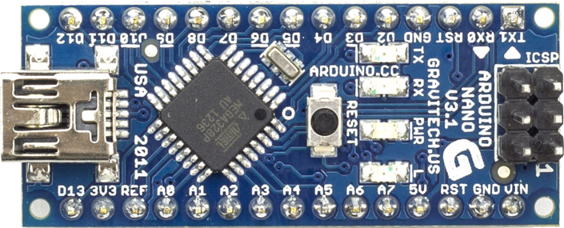

***Arduino NANO***

|Bileşen                  |Değer                       |
|-------------------------|----------------------------|
|Mikrokontrolcü           | ATmega168 ya da ATmega328  |
|Çalışma gerilimi         | 5 Volt                     |
|Önerilen giriş voltajı   | 7 – 12 Volt                |
|I/O (giriş/çıkış) sayısı | 14 (6 PWM)                 |
|I/O çıkış akımı          | 40 mA                      |
|Analog giriş             | 8                          |
|Flash bellek             | 16 KB                      |


***Not:*** Arduino seçimi yapılacak projeye göre seçilmektedir. Projede kullanılacak giriş çıkış pinleri, analog girişler, program/EEPROM hafızası gibi değişkenler kullanılacak Arduino türünü belirlemektedir. Genel amaçlı projelerde kullanmak için genellikle Arduino Uno veya Mega seçilmektedir. Arduino için ayrılan yerin az olduğu projelerde Arduino Nano kullanılmaktadır.

Eğitim sırasında Arduino UNO kullanılacaktır. Uygulamalarda yazılan kodların diğer Arduino türlerinde de çalışması için özen gösterilmiştir. Arduino IDE üzerinde yazılan Arduino kodları, yine bu yazılımla Arduino kartına yüklenecektir.

## 3.1. Linux İçin Arduino Kurulumu

Rust ile Arduino programlama yapılırken Arduino IDE kurulumuna ihtiyaç yoktur. Daha önce yapmış olduğumuz rustup kurulumu ile bilgisayarımızda Rust ile Arduino programlama yapabiliriz.

## 3.2. Arduino'nun Besleme Kaynakları

Arduino'nun çalışması için gerekli olan enerji, Arduino'nun farklı besleme girişlerinden sağlanabilmektedir. Arduino'nun farklı besleme girişleri kullanılırken, bu girişe uygulanacak maksimum gerilimin bilinmesi gerekir. Eğer girişe uygulanması gereken gerilimden fazla bir gerilim uygulanırsa, Arduino zarar görebilir.

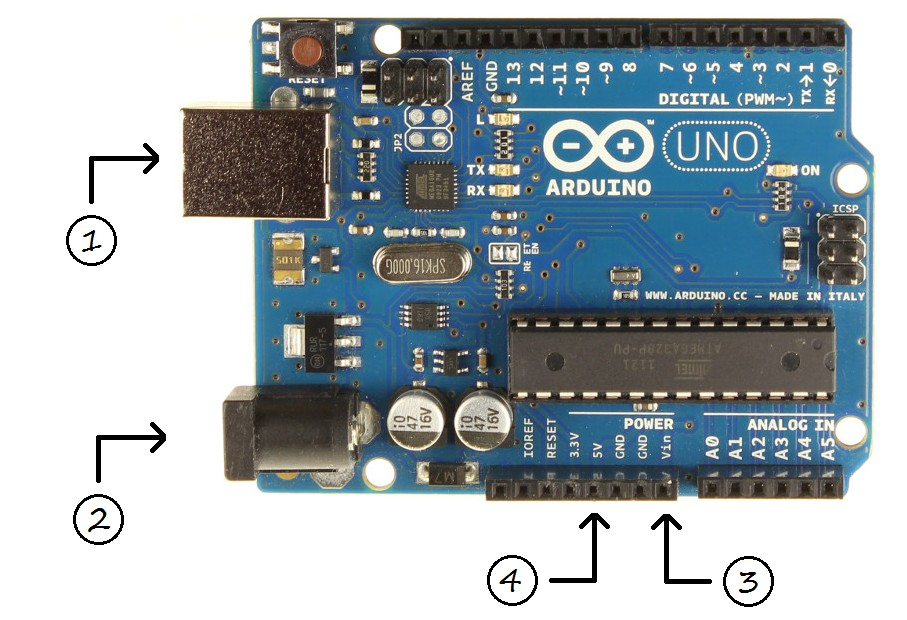

### 3.2.1. Arduino'nun USB ile beslenmesi

Arduino'nun USB kablosunu bilgisayarınıza bağladığınızda, Arduino çalışması için gerekli enerjiyi bilgisayarınızdan almaktadır. Bu giriş, Arduino için gerekli enerjiyi sağlarken, aynı zamanda Arduino'nun bilgisayarla haberleşmesini, Arduino'ya yeni kod atılmasını da sağlar.

Yukarıdaki görselde 1 numaralı giriş Arduino'nun USB girişidir. Görselde de görüldüğü gibi bu giriş, yazıcı kablosu olarak tarif edilen USB B girişidir. USB standartlarına uygun olarak tasarlanan bu girişe en fazla 5 Volt gerilim uygulanmalıdır. Eğer bu girişe 5 Volt üzeri bir gerilim uygulanırsa, Arduino zarar görebilir.


### 3.2.2. Arduino'nun pille çalıştırılması

Arduino harici besleme kaynaklarıyla da çalıştırılabilir. Bunun için Arduino üzerinde birbirine bağlı iki farklı giriş bulunmaktadır. Bu girişlerden ilki, yukarıdaki görselde 2 numara ile gösterilen jack girişidir. Bu girişe 7 ile 12 Volt (önerilen) arasındaki gerilimler uygulanabilir. Bu girişe bağlı regülatör (gerilim düzenleyicisi) ile girişe uygulanan gerilim, Arduino'nun çalışma gerilimine düşürülür.

Arduino üzerinde bulunan 'Vin' pini, Arduino'nun jack girişine bağlı bir pindir. Bu pine uygulanan gerilim, Arduino'ya ulaşmadan önce bu pine bağlı regülatör yardımıyla Arduino için uygun gerilime düşürülür. 'Vin' girişine 7 ile 12 Volt arasındaki gerilimler uygulanmalıdır. Pilin artı (+) ucu 'Vin' pinine bağlandıktan sonra, pilin eksi (-) ucu Arduino'nun 'GND' yani toprak ucuna bağlanmalıdır. 'Vin' pini yukarıdaki görselde 3 numara ile gösterilmiştir.

Eğer bu girişlere uygulanması gereken gerilimden fazla bir gerilim uygulanırsa, Arduino zarar görebilir.


### 3.2.3. Arduino'nun 5 Volt pininden beslenmesi

Arduino üzerinde bulunan 5 Volt pini de Arduino'yu beslemek için kullanılabilir. Arduino yaygın olarak bu pinden beslenmese bile, buraya 5 Volt gerilim uygulandığında, Arduino'nun çalıştığı görülmektedir. Bu pine 5 Volt geriliminden fazla bir gerilim uygulanması, Arduino'nun bozulmasına neden olacaktır. Pek tercih edilmese bile, eğer elinizde düzenli olarak 5 Volt gerilim veren bir kaynak varsa, kaynağın artı (+) ucunu Arduino'nun 5 Volt, eksi (-) ucunu da Arduino'nun 'GND' yani toprak pinine bağlayarak kullanabilirsiniz.

Bu pin yukarıdaki görselde 4 numara olarak gösterilmiştir.

## 3.3. Temel Arduino Uygulamaları

Yeni bir programlama dili öğrendiğimizde ilk başta nasıl "Merhaba Dünya" yazıyorsak, Arduino programlamanın da giriş uygulaması LED (lamba) yakıp söndürmektir. Daha önce LED'in ne olduğundan bahsetmiştik. Şimdi de LED'in nasıl kullanıldığından bahsedelim. LED bilindiği gibi bir çeşit diyottur, akım sadece bir yönde akmaktadır. Bu yüzden LED'in devreye bağlanma yönü önemlidir.

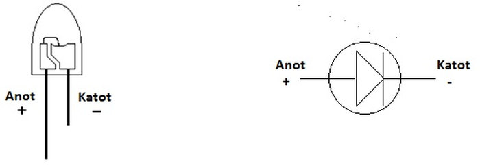

LED'in yönünü iki şekilde anlayabiliriz. İlk yöntemimiz LED'in ayak uzunluklarıdır. LED'in iki ayağından uzun olanı + (anot), kısa olan – (katot) ucunu göstermektedir. Böylece Arduino'dan gelen kabloyu LED'in uzun ayağına, kısa ayağını da toprağa (GND) bağlayacağız. Bu yöntem ile anot ve katot uçlarını ayırmak kolay olsa da güvenilir değildir. Eğer LED daha önce kullanılmış ise ayak uzunlukları değiştirilmiş olabilir.

Diğer ve daha güvenilir olan ikinci yöntemle LED'in anot ve katot uçlarını daha kolay anlayabiliriz. LED'in içine bakıldığında, arası açık bir köprü görülür. Bu köprünün kısa yolu + (anot), uzun yolu ise –  (katot) ucu göstermektedir.

LED'in bağlantısının nasıl yapılacağını öğrendik. Fakat LED'i devreye doğrudan bağlama pek önerilen bir yöntem değildir.  LED'in bağlı olduğu hatta akımı azaltmak için direnç bağlanmalıdır. Genellikle 220 veya 330 ohm değerinde direnç bağlanır. Bu değerlerden daha büyük bir direnç hatta bağlanırsa, LED'in parlaklığı azalır.

Bu uygulamayı yapmak için ihtiyacınız olan malzemeler:

 * 1 x Arduino
 * 1 x LED (rengi farketmez)
 * 1 x 220 ohm direnç (220 ile 10k arasında bir direnç de olur)
 * 1 x Breadboard

### 3.3.1. Led Yakma Projesi

Öncelikle bu projemizi yukarıdaki malzemeleri kullanarak **fritzing** uygulaması üzerinde resimdeki gibi hazırlayalım. Devrede LED’e seri olarak bir direnç bağlanır. Böylelikle LED üzerinden yüksek akım geçmesi ve LED’in zarar görmesi engellenir. Örnek devrede LED’in (+) bacağı Arduino’nun 5.pinine bağlıdır. LED’in (-) bacağını dirence seri bağlayarak direncin diğer bacağından da Arduino’nun GND pinine bağlantı yapılmıştır. Böylelikle devre hazır hale gelmiş olur.

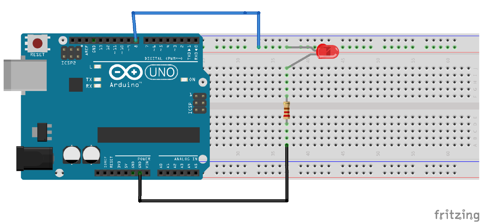

Resimde görüldüğü gibi devrenizi kurunuz. Uygun bir şekilde kurulmuş olan bu devrenin kodlamak istediğimiz gibi çalışıp çalışmadığını anlamak için **SimulIDE** isimli uygulamayı kullanacağız. Bu uygulamada fritzing uygulamasında yaptığımız gibi gerekli malzemeleri uygun şekilde birleştirip promemizi hazır hale getiriyoruz.

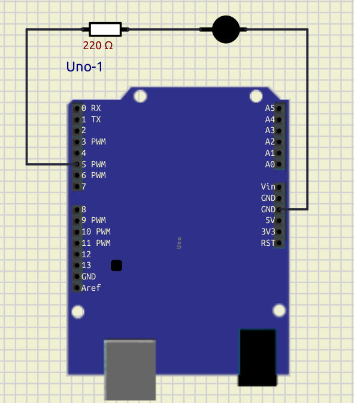

SimulIDE uygulaması gerçek bir cihaza bağlantı yapmadan yazmış olduğumuz kodların çalışıp çalışmadığını test etme imkanı vermektedir. Bu uygulama sayesinde gerçek cihazlarımıza zarar vermeden kodlama yapabiliyor olacağız. Yazdığımız kod uygun bir şekilde SimulIDE uygulamasında çalıştıktan sonra gerçek cihaza aktarıp çalıştıracağız.

LED yakma projemizin kodunu yazmaya geçmeden önce gerçek cihaz için de bağlantıları yapalım. Breadboar üzerine bir adet LED ve bir adet 220 ohm direnci uygun şekilde yerleştirelim. Sonra Arduino'nun 5 numaralı pininden bir kablo ile çıkış alıp breadboard üzerindeki direncin boşta kalan ucuna bağlayalım. Daha sonra Arduino'nun GND pinini bir kablo ile LED'in katot (-) ucuna bağlayalım. Artık gerçek cihazımız da hazır olduğuna göre kodumuzu yazmaya başlayalım.

## 3.3.1.1. Avrdude ile yeni bir Arduino projesi oluşturma

Amacımız 1 saniye boyunca yanan ve sonra 1 saniye boyunca sönük kalan LED yapmaktır. Rust dilinde yeni bir proje başlatmak cargo-generate sandığı ile daha basit hale getirilmiştir. Yeni bir proje oluşturmak için aşağıdaki komutları art arda çalıştırmanız yeterlidir:

`cargo install cargo-generate`

Şimdi, şablonu oluşturmak ve örneklemek için bu komutu çalıştırın. Şu anda bir proje oluşturmadınız, ancak araç bunu halledecektir:

`cargo generate --git https://github.com/Rahix/avr-hal-template.git`

Komutu çalıştırdıktan sonra, projeniz için bir ad belirtmek üzere bir giriş alanı görmelisiniz. Bu eğitimde proje adı olarak **"arduino-blink"** kullanılacaktır.

Tercih ettiğiniz adı girdikten sonra Enter tuşuna tıklayın.

Derlemeden sonra projeye gidin ve klasörü tercih ettiğiniz kod düzenleyicide bir proje olarak açın. Proje yapısı aşağıdaki resimdeki gibi görünmelidir:

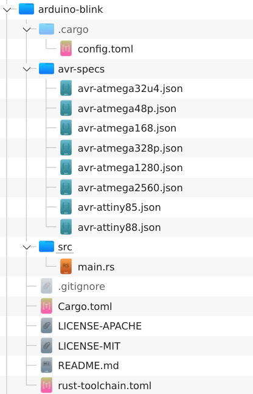

Not: libudev-sys crate'i yüklerken bir hata oluşursa, bunu bağımlılıklar altındaki cargo.toml dosyanıza eklemeniz gerekecektir:

`[dependencies]`

`libudev-sys = "0.1"`

**libudev** Rust binding, libudev C kütüphanesi için bildirimler ve bağlantı sağlayan bir sandıktır. Linux'a özgüdür. Alternatif olarak, libudev-sys crate'ini yüklemek için aşağıdaki komutu çalıştırabilirsiniz:

`sudo apt-get install libudev-dev`

**pkg-config**'den kaynaklanan başka sorunlar olması durumunda libudev-sys deposuna başvurun.

Kendi programınızı çalıştırmak için, temel bir LED Yanıp Sönme programı için örnek bir kod içeren main.rs dosyasını aşağıdaki gibi düzenleyebilirsiniz:


### 3.3.1.2. Gömülü Rust Kodunu Anlamak
Kodun ilk iki satırında geçen `no_std` ve `no_main` ifadeleri derleyiciye, işletim sistemi olmayan gömülü bir proje olduğundan standart bir kütüphane (std) ve main olmadığını söylemektedir.

`panic_halt as_;` panikleri işlemek için kullanılırken `#[arduino_hal::entry]` ifadesi programdaki giriş noktasını belirtmek için kullanılmıştır.

**main** fonksiyonunda, Çevre Birimleri çözülür. Gömülü Rust'ta Çevre Birimleri, çevrelerini anlamlandıran ve insanlarla etkileşime giren bileşenleri ifade eder. **Sensörler**, **aktüatörler** ve **motor kontrolörlerinin** yanı sıra **CPU**, **RAM** veya **flash bellek** gibi mikrodenetleyicinin temel parçalarını da içerirler. Gömülü Rust kitabında Çevre Birimleri hakkında daha fazla bilgi edinebilirsiniz.

Ardından, varsayılan pinin (_d5_) dijital çıkışına elektrik göndermek için Arduino kartının pinlerine erişim sağlıyoruz.

`loop` döngüsünde `led.set_high();` ile LED'i yakıyoruz ve `arduino_hal::delay_ms(500);` ile 500 ms bekletiyoruz. Daha sonra `led.set_low();` ile LED'i söndürüyoruz ve `arduino_hal::delay_ms(500);` ile 500 ms bekletiyoruz. LED lambamız durdurulmadığı sürece bu şekilde sonsuza kadar çalışacaktır.

Şimdi, build komutu ile projeyi derleyebilirsiniz:

`cargo build`

Bu işlem CPU yoğun bir görev olduğu için biraz zaman alabilir. Daha sonra, `target/avr-atmega328p/debug/` altında bir `.elf` dosyası bulacaksınız. Aynı zamanda bir de `.hex` dosyası bulacaksınız. Hex uzantılı dosya simulIDE ile projemizi çalıştırmak için kullanacağımız dosyadır. Eğer .hex uzantılı dosya oluşmaz ise aşağıdaki komutu kullanarak `.elf` dosyasından bir `.hex` dosyası elde edebilirsiniz.

**`avr-objcopy -O ihex target/avr-atmega328p/debug/arduino-blink.elf target/avr-atmega328p/debug/arduino-blink.hex`**

Şimdi SimulIDE'de oluşturduğumuz projeyi açalım ve Arduino üzerinde sağ tıklayıp **mega328-109 > Firmware Yükleyi** seçelim. Açılan pencerede `.hex` uzantılı dosyamızın oluğu yere gidip onu seçelim.


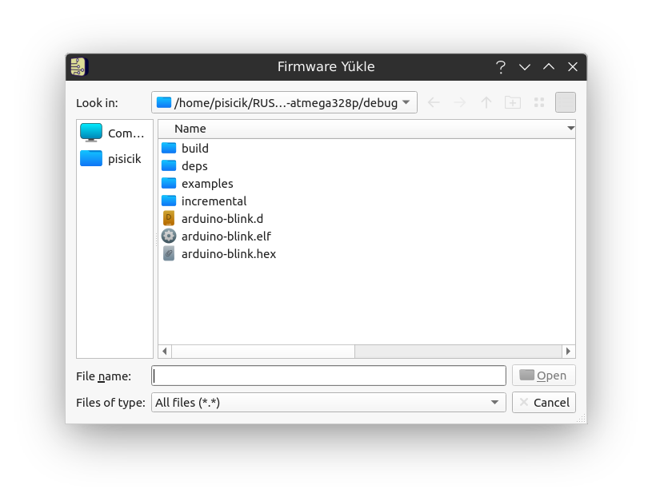

Firmware yüklemesi yapıldıktan sonra **Start Simulation** (Kırmızı Düğme) düğmesine tıkladığımızda eğer kodlama doğru yapılmış ise LED lambası yanıp söndemeye başlayacaktır.

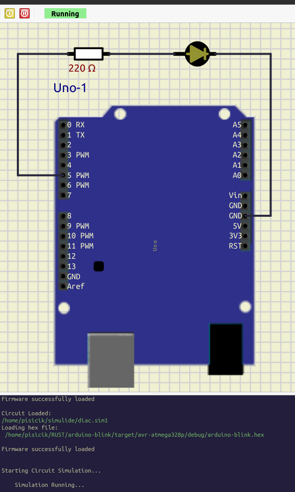

Kodumuz başarılı bir şekilde çalıştığına göre artık Arduino'ya aktarabiliriz.

## 3.3.1.3. Kod yükleme için Mikrodenetleyiciyi yapılandırma
Yazdığımız ve SimulIDE ile kontrol ettiğimiz kodu Arduino karta aktarmak için aşağıdaki adımları takip edelim.

Öncelikle `lsusb` komutu ile makinenizdeki açık USB portlarını listeleyerek başlayın:

`lsusb`

Arduino kartınız USB üzerinden cihazınıza takılıysa, aşağıdaki görüntüdeki gibi Arduino kartına bağlı USB'nin adını görmelisiniz:


Daha sonra, aşağıdaki betik ile ravedude için seri com portunu ayarlayacağız:

**`export RAVEDUDE_PORT=/dev/ttyUSB0`**

Bu, ravedude'a Arduino'nun hangi porta bağlı olduğunu söyler. Aşağıdaki komutu çalıştırdığımızda, program Arduino'ya yüklenecektir:

`cargo run`


## 3.3.1.4. Mikro denetleyici üzerindeki çıktı

Program mikrodenetleyiciye yüklendiğinde Arduino programlandığı gibi davranacaktır. Bu durumda kart üzerindeki LED ışıklar programda belirtilen zaman aralıklarına göre yanıp sönecektir:

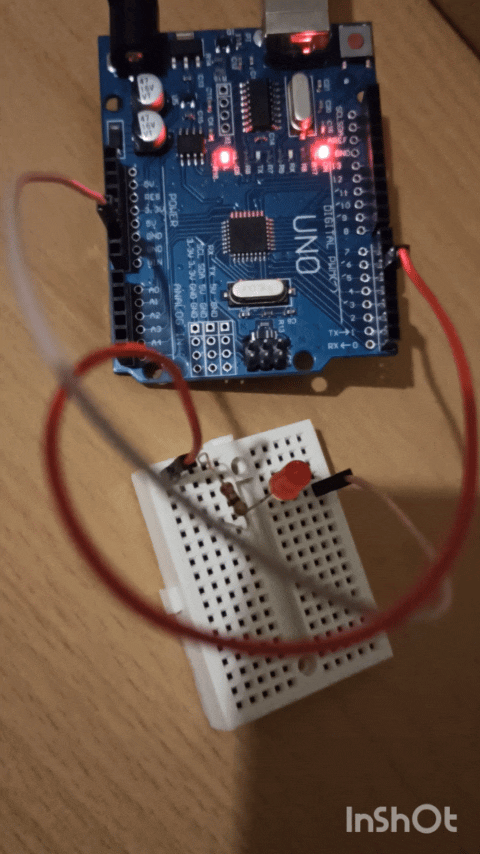

Yazdığımız program çalıştı. Şimdi zaman aralığını değiştirip yeniden `cargo run` komutunu verin. Gördüğünüz gibi yaptığınız değişiklik doğrudan Arduino kartına yüklendi ve LED'in yanıp sönme aralığı değişti.

Böylece Arduino'da yapılabilecek en temel işlerinden biri olan LED yakıp söndürmeyi öğrendik. Burada kullanılan fonksiyonlar çoğu projede de kullanılır. Örneğin LED yerine çıkış veren başka bir elektronik eleman (örn: buzzer) konulduğunda, aynı Arduino programı ile o eleman da çalışabilir. Kapsamlı projelerde LED genellikle Arduino'nun durumunu göstermek için kullanılır. Örneğin Arduino bir işlem yaparken kırmızı ışık yanık tutulursa, Arduino'nun o sürede meşgul olduğu kullanıcı tarafından anlaşılabilir.

Aşağıdaki uygulama ile öğrendiklerimizi pekiştirelim:

## 3.3.2. Bazı Arduino Uygulamaları

### 3.3.2.1. Çakar Devresi

***Bu uygulamayı yapmak için ihtiyacınız olan malzemeler:***

 * 1 x Arduino
 * 1 x LED Kırmızı
 * 1 x LED Mavi
 * 2 x 220 Ohm Direnç
 * 1 x Breadboard

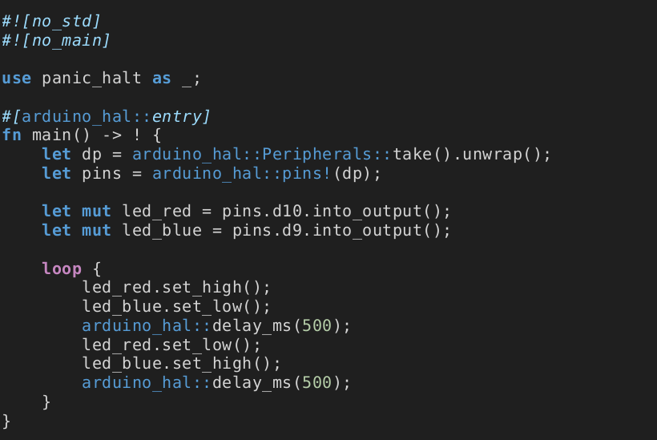


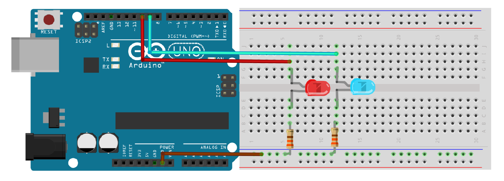


### 3.3.2.2. Trafik Lambası

***Bu uygulamayı yapmak için ihtiyacınız olan malzemeler:***

 * 1 x Arduino
 * 1 x LED Sarı
 * 2 x LED Yeşil
 * 2 x LED Kırmızı
 * 5 x 220 Ohm Direnç
 * 1 x Breadboard

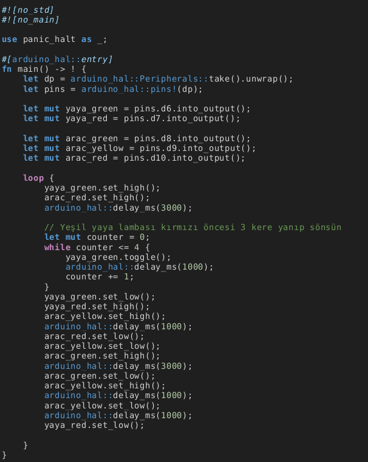


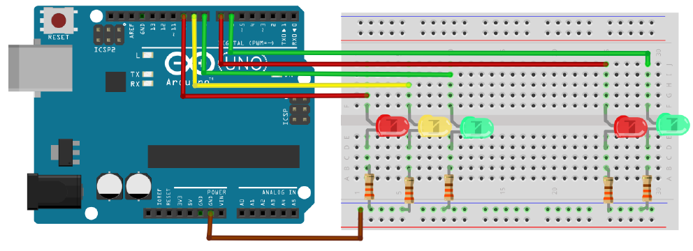

### 3.3.2.3. Kara Şimşek (Yürüyen Işık)

Arduino ile LED nasıl yakılıp söndürüldüğünü öğrendiğimize göre, artık biraz daha karmaşık bir uygulama yapabiliriz. Bu uygulamamızda kara şimşek yani sırayla yanıp sönen LED'ler yapacağız. LED bağlantılarını resimdeki gibi yapabilirsiniz. Her LED'in bağlantısına ayrı ayrı 220 Ohm'luk dirençler koymayı unutmayın. LED'lerin Breadboard'a eşit uzaklıklarda takılması, projenin daha güzel görünmesini sağlayacaktır.

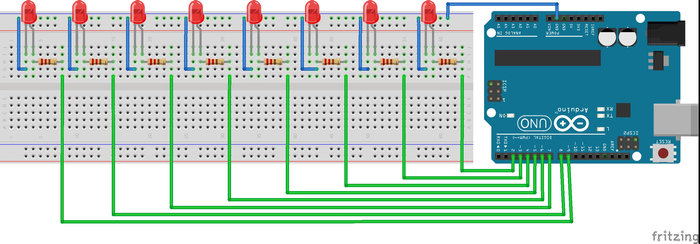

***Bu uygulamayı yapmak için ihtiyacınız olan malzemeler:***

 * 1 x Arduino
 * 8 x LED
 * 8 x 220 Ohm Direnç
 * 1 x Breadboard

Kara şimşek programı iki şekilde yazılabilir. Birinci yöntemde her LED için ayrı bir değişken tanımlanmış olup, bütün LED'ler tek tek kontrol edilir. Bu yöntem kod kalabalığı yarattığı için pek tercih edilmemektedir. Bu yüzden projeyi daha profesyonelce olan ikinci yöntem ile yazacağız.

İkinci yöntem için, LED'leri 2'den 9'a pinlere sırası ile takalım. Bu pinleri bir diziye kaydederek LED'leri daha kolay kontrol edeceğiz. Dizi kullanılmasının nedeni, program içerisinde for döngüsünün kullanılacak olmasıdır. Her bir for döngüsünde bir sonraki LED'e kolayca geçiş yapılabilir.

***Not:*** LED geçişlerinin daha yumuşak olması için her LED'in artı ve eksi pinlerine kondansatör konulabilir.

```cpp
const int LEDdizisi[] = {2,3,4,5,6,7,8,9};

void setup () {

  for(int i=0; i<8 ;i++)
  { /* For dongusuyle LEDdizisi elemanlarina ulasiyoruz */
    pinMode(LEDdizisi[i], OUTPUT); /* LED pinleri cikis olarak ayarlandi */
  }

}

void loop() {
  for(int i=0; i<8; i++){ /* Tum LEDleri sirayla 50 milisaniye yakip sonduruyoruz */
    digitalWrite(LEDdizisi[i],HIGH);
    delay(50);
    digitalWrite(LEDdizisi[i],LOW);
  }
 
  for(int j=7;j>-1; j--)
  { /* LEDleri geri yonde 50 milisaniye yakip sonduruyoruz */
    digitalWrite(LEDdizisi[j],HIGH);
    delay(50);
    digitalWrite(LEDdizisi[j], LOW);
  }
}
```

### 3.3.2.4. RGB LED Devresi


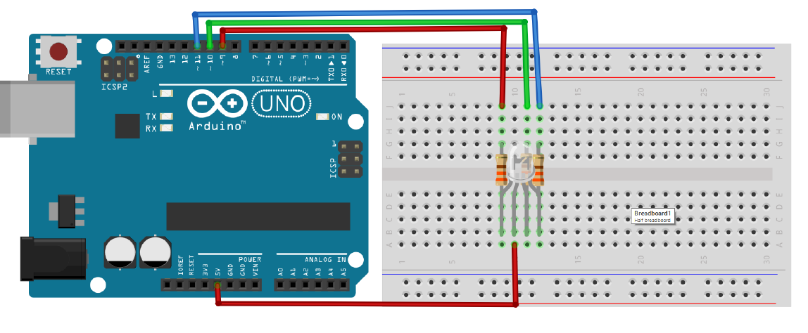


### 3.3.2.5. Düğme (Button) ile LED Yakma

Kullanıcıyla etkileşim halinde olan birçok projede düğme kullanılmaktadır. Düğme, arasında az bir boşluk bulunan iki tel gibi düşünülebilir. Kullanıcı düğmeye bastığında bu boşluk kapanır ve düğme iletken duruma geçer, üzerinden akım akar. Kullanıcı düğmedan elini çektiğinde devrenin eski konumuna dönmesi için, pull up ve pull down denilen direnç bağlantıları kullanılır. Pull up ve pull down direnç ismi değil, dirençlerin bağlanma şeklidir. Genellikle 10K ohm direnç kullanılır.

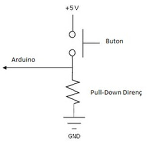

**Pull Down Direnç:** Düğmeye basıldığında gerilim kaynağıyla Arduino'nun girişi kısa devre olur. Elinizi düğmeden çektiğinizde hat üzerinde hâlâ enerji kalır. Bu enerji düğmeye basılmadığı durumunda bile Arduino'nun düğmeye basılmış gibi davranmasına neden olur. Bu enerjinin yok edilmesi için hat genellikle 10K ohm'luk bir direnç ile toprağa bağlanır. Bu dirence pull down direnç denir.

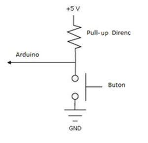

**Pull Up Direnç:** Düğmeye basılmadığı durumlarda Arduino'nun giriş pini 5 volt düzeyindedir. Düğmeye basıldığında akım, Arduino'nun giriş pini yerine doğrudan toprağa ulaşmaktadır. Böylece pull-down direnç sistemini tam tersi çalışmaktadır. Arduino düğmeye basıldığında 0, düğmeye basılmadığında 1 değerini görmektedir. Pull-up direnci kullanma amacımız ise, düğmeye basıldığında toprak ve besleme hattının direkt olarak kısa devre olmasını engellemektir. Pull-down dirençte olduğu gibi pull-up dirençlerde genellikle 10K ohm olur.

Düğmelerin Arduino'ya nasıl bağlanacağını öğrendik. Resimde breadboard (Eskiden elektronikçiler buna gofret derlerdi) üzerine düğme ve LED devresi kurulmuştur. Siz de resimdeki devreyi kurabilirsiniz.

***Bu uygulamayı yapmak için ihtiyacınız olan malzemeler:***

 *   1 x Arduino
 *   1 x düğme
 *   1 x 10K ohm direnç
 *   1 x LED
 *   1 x 220 ohm direnç
 *   1 x breadboard (gofret)

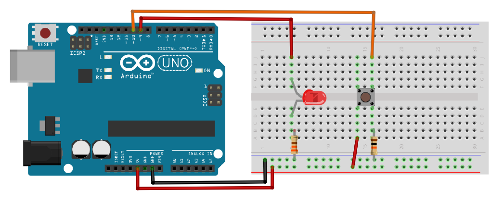

Bu devredeki düğmenin amacı LED'i kontrol etmek olacaktır. Kullanıcı düğmeye bastığında LED yanıyorsa sönecek, sönük ise de yanacaktır. Burada bilmemiz gereken bir diğer nokta ARK olaylarıdır. Düğmeye basıldığı anda oluşan atlamalardan dolayı Arduino çok kısa zamanda yüzlerce kere düğmeye basıldığını sanmaktadır. Bu istenmeyen durumdan kurtulmak için basıldığı anda Arduino'yu biraz bekleteceğiz (delay fonksiyonu ile). Böylece devremiz, düğmeye basıldığında oluşan istenmeyen dalgalanmalardan korunmuş olacaktır. Delay fonksiyonuna yazılan bekleme zamanı insanın fark edemeyeceği kadar kısa bir süredir.

Düğmeye her basıldığında yeni bir işlem yapılmasını istiyoruz. Bunu sağlamak için düğmeye basıldığında yapılması gereken işlem yapıldıktan sonra, kişinin düğmeden elini çekmesi beklenmelidir. Eğer bunu yapmazsak kişi, düğmeye bastığında LED'i sürekli yanıp sönecektir. Bu işlem o kadar hızlı olacaktır ki insan gözü bunu algılayamaz.

Düğmenin durumu digitalRead fonksiyonu ile kontrol edilecektir. Okunan düğme değeri 'dugmeDurumu' değişkenine yüklenecektir. Eğer düğmeye basılmışsa LED'in durumunu değiştireceğiz. LED'in düğmeye her basıldığında konumunun değişmesi için, LED durumu bir değişkene atanır ve LED'in eski durumuna göre LED farklı konuma getirilir.


**Arduino kodu:**
```rust
const int Dugme = 6; /* düğmenin bağlı olduğu pin */
const int LED =  5; /* LEDin bağlı olduğu pin */

int dugmeDurumu = 0; /* düğmenin durumu */
int LEDDurumu = 0; /* birinci yöntem için LED durumu */

void setup() {
  pinMode(LED, OUTPUT); /* LED pini çıkış olarak ayarlandı */
  pinMode(Dugme, INPUT); /* düğme pini giriş olarak ayarlandı */
}

void loop(){
  dugmeDurumu = digitalRead(Dugme); /* düğmenin durumu okundu ve değişkene aktarıldı */
  if(dugmeDurumu == HIGH) { /* düğmeye basılmış ise */
    delay(10); /* dalgalanmalar için biraz bekleyelim */
    if(LEDDurumu == 0){ /* LED yanmıyorsa */
      digitalWrite(LED, HIGH); /* LEDi yak */
      LEDDurumu = 1;
    }else { /* LED yanıyorsa */
      digitalWrite(LED, LOW); /* LEDi sondur */
      LEDDurumu = 0;
    }

    while(dugmeDurumu == HIGH){ /* düğmeye basili olduğu surece bekle */
      dugmeDurumu = digitalRead(Dugme); /* düğmenin durumunu kontrol et */
    }
    delay(10); /* dalgalanmalar için biraz bekleyelim */
  }
}
```

