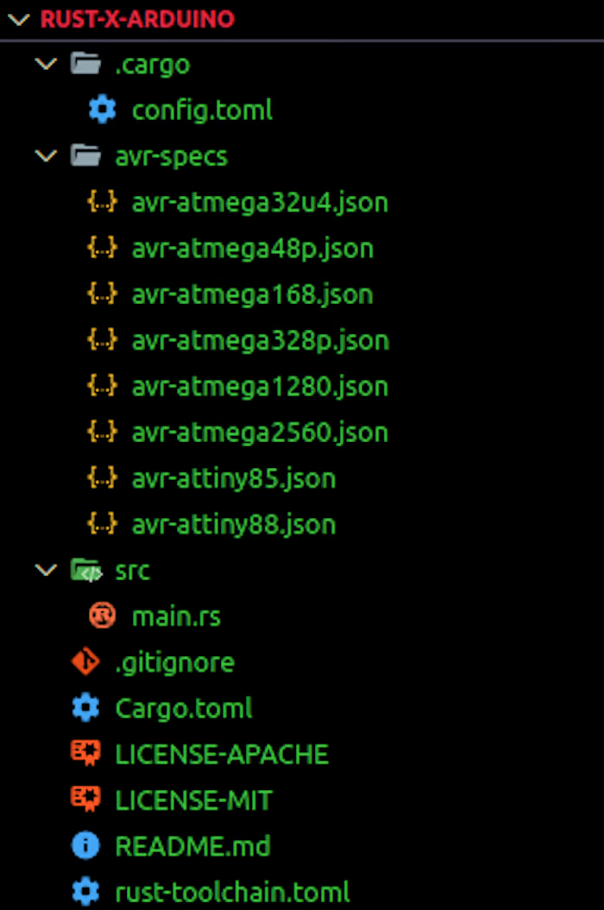
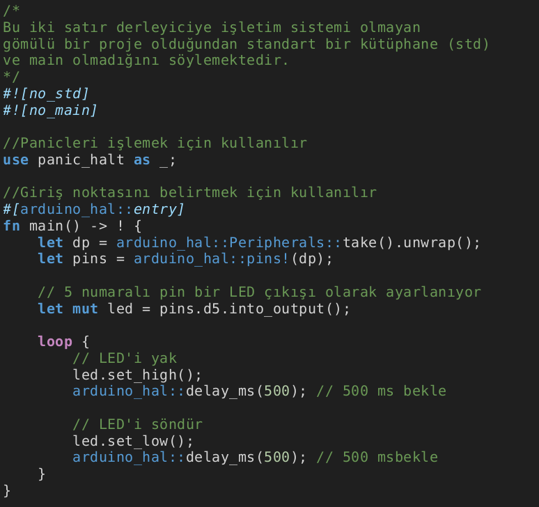
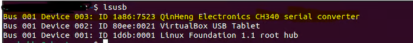

# 2. Yazılıma Giriş

Temel elektronik bilgilerimizi tazeledikten sonra, sıra temel yazılım bilgilerimizi de gözden geçirmeye geldi. Bu bölümde diğer programlama dillerinde de benzerlik gösteren, projelerimizde kullanacağımız temel yazılım bilgilerini göreceğiz.

***Arduino ile gömülü sistem geliştirme için normal prosedür aşağıdaki adımları içerir:***

 * Amaçlanan devrenin elektrik şemasının çizilmesi 
 * Elektrik bileşenlerinin şemaya uyacak şekilde bağlanması 
 * Devreyi istenildiği gibi kontrol etmek için program mantığının yazılması 
 * Mikrodenetleyicinin USB kablosuyla bilgisayara bağlanması 
 * Programın bilgisayardan kartın flash belleğine aktarılması(veya yüklenmesi) 

### Gerekli Araçlar:
Burada anlatılanları yapabilmek için bir Arduino kartına ve aşağıdaki yazılım önkoşullarına ihtiyacınız olacak:

 * Program yazma, derleme ve yazılan programı arduino karta aktarmak için bir bilgisayar
 * Cargo yazılımı
 * Rust gecelik derleyici sürümü

## Kurulum ve Ayarlar

### avrdude kullanmak
 
avrdude, avr-hal projeleri için kargo tarafından oluşturulan bir şablondur. Şu anda aşağıdaki donanımları desteklemektedir:

 * Arduino Leonardo
 * Arduino Mega 2560
 * Arduino Mega 1280
 * Arduino Nano
 * Arduino Nano New Bootloader (Ocak 2018'den sonra üretildi)
 * Arduino Uno
 * SparkFun ProMicro
 * SpartFun ProMini 3.3V
 * SpartFun ProMini 5v
 * Adafruit Trinket
 * Adafruit Trinket Pro

AVR mikrodenetleyicileri ve diğer yaygın kartlarda Rust çalıştırmak için bir Donanım Soyutlama Katmanı (HAL) gereklidir. Bunu elde etmek için, makinenizde Rust kodunu AVR'ye derleyen gecelik Rust derleyicisine ihtiyacınız vardır. 

### Pardus

Pardus gibi bir Linux dağıtımı kullanıyorsanız aşağıdaki komut ile gerekli paketler yüklenir: 

`sudo apt install avrdude avr-libc build-essential curl gcc-avr libssl-dev libudev-dev pkg-config`

Aşağıdaki komut ile rustup araç zinciri olmadan (toolchain) sisteme kurulur.

`curl --proto '=https' --tlsv1.2 -sSf https://sh.rustup.rs | sh -s -- --default-toolchain none -y`

Daha sonra gecelik yayımlanan araç zinciri (toolchain) aşağıdaki komut ile sisteme kurulur.

`rustup toolchain install nightly --allow-downgrade --profile minimal --component clippy`

Kurulum tamamlandıktan sonra Bash **env** ortamının yeniden başlatılmasını isteyen bir uyarı görünecektir. Bash **env** ortamını yeniden başlatmak için aşağıdaki komutu kullanın:

`exec bash`

_rustup_ için Tab (Sekme) ile otomatik tamamlama özelliğini etkinleştirmek isterseniz aşağıdaki komutu kullanabilirsiniz:

`rustup completions bash > ~/.local/share/bash-completion/completions/rustup`

Sisteminiz rust ile kodlamak için hazır. Mikrodenetleyici kartı bulma, yazılan kodu karta aktarma ve bağlantıları dinleme işlemlerini yerine getirmek için **ravedude** yazılımını yüklemeniz gerekmektedir. Bunun için aşağıdaki komutu kullanın:

`cargo install ravedude`

 Artık hazırız. Tek yapmanız gereken kodunuzu yazdıktan sonra **cargo run** komutunu çalıştırmak.


# Neden Rust?

Gömülü sistemler teknolojisi onlarca yıldır yenilikten yoksundu. Yıldırım hızında, gömülü cihazları programlamak için tercih edilen dil uzun zamandır C/C++ olmuştur, ancak Rust daha da hızlı geliştirme desteği sağlar. Rust gömülü sistem geliştirme için mükemmel bir seçimdir çünkü:

* C kod tabanlarıyla yüksek oranda birlikte çalışabilir
* Taşınabilir ve hafiftir
* Güçlü bir eşzamanlılık modelidir
* Farklı mikrodenetleyiciler için sağlam destek sunar
* Bellek güvenlidir

Arduino'ları zaten C++ ile programladıysanız, temelleri öğrendikten sonra bunu Rust ile yapmaya geçmek nispeten kolay olacaktır.

## 2.1. Değişkenler

Bir değeri veya karakteri daha sonra tekrardan kullanmak/değiştirmek için hafızada tutabilirsiniz. Bu değerler değişkenlerde tutulur. Hafızada tutacağınız değerin türüne göre değişken tanımlanması gerekir.

Aşağıdaki tabloda, Arduino'da kullanılan değişken türlerini ve tutabilecekleri değerleri görebilirsiniz.

|Değişken|Boyut     |Açıklama                                                                                     |
|--------|----------|---------------------------------------------------------------------------------------------|
|i8      |8 bit     |-128 – 127 arası işaretli sayılar.                                                           |
|i16     |16 bit    |                                                                                             |
|i32     |32 bit    |                                                                                             |
|i64     |64 bit    |                                                                                             |
|i128    |128 bit   |                                                                                             |
|isize   |mimari    | 32/64 bit işlemci türüne göre işaretli sayıları barındırır                                  |
|u8      |8 bit     |0 – 255 arası işaretsiz sayılar.                                                             |
|u16     |16 bit    |                                                                                             |
|u32     |32 bit    |                                                                                             |
|u64     |64 bit    |                                                                                             |
|u128    |128 bit   |                                                                                             |
|usize   |mimari    | 32/64 bit işlemci türüne göre işaretsiz sayıları barındırır                                 |
|f32     |32 bit    |Tek hassaiyetli ondalık sayılar barındırır                                                   |
|f64     |64 bit    |Çift hassaiyetli ondalık sayılar barındırır                                                  |
|bool    |true/false|doğru/yanlış değerini barındırır                                                             |
|char    |karakter  |karakter veya karakterler barındırır                                                         |

Örneğin sayi adında bir değişken tanımlayalım. Bu değişkenin içerisine sadece tamsayılar yazılır. Bu değişkeni tanımlamak için aşağıdaki komut kullanılabilir.

```rust
let sayi:u8 = 255;
let sayi:u16 = 256;
```

Bu satırda tamsayı tutabilen (integer) 'sayi' değişkeni oluşturulmuştur. Oluşturma esnasında 'sayi' değişkeninin değeri 5 olarak belirlenmiştir. Değişken, değer ataması yapmadan da oluşturulabilirdi.

Eğer değişken bir fonksiyonun içerisinde oluşturulursa, sadece o fonksiyonun içerisinde geçerlidir. Bir başka deyişle fonksiyonun dışarısında o değişken kullanılamaz. Her yerde kullanılabilecek bir değişken tanımlanacaksa o değişken, tüm fonksiyonların dışında, programın başında oluşturulmalıdır. Bu değişkenlere '**global**' adı verilir.

## 2.2. Fonksiyonlar ve Koşul Yapıları

### 2.2.1. Fonksiyonlar

Bir görevi yerine getirmesi için yazdığınız kodları başka bir yerde de kullanmanız gerekirse, o kod satırlarını kopyalayıp yeni kodların arasına yapıştırmanız gerekir. Bu yöntemle programınız gereksiz olarak uzar. Ayrıca kopyaladığınız satırlarda yapacağınız en küçük bir değişimi bile, programın ilgili yerlerinde tek tek değiştirmeniz gerekir. Bu sorunu çözmek için fonksiyonlar kullanılır. Gerekli görev için yazılacak tek bir fonksiyon, istenen yerlerde kolayca kullanılabilir. Kullanıcı kendi fonksiyonlarını yazabileceği gibi, daha önce başkaları tarafından yazılmış fonksiyonları da kullanabilir.

Fonksiyon yazarken, fonksiyonda kullanılacak değişkenlerin alınmasına ve fonksiyonda yapılacak işlem sonucunun hangi türde olacağına dikkat edilmelidir. Fonksiyonun türü, işlem sonucunda döndürülecek değişken ile aynı tipte olmalıdır. Eğer fonksiyon, hiçbir değer döndürmeyecekse fonksiyon 'void' türünde tanımlanmalıdır.

Örneğin toplama işlemi yapan ve sonucu geri döndüren bir fonksiyon yazalım. Fonksiyon a ve b olmak üzere iki sayı almaktadır. Bunları toplayıp sonucu geri döndürmektedir.
#FIXME: ANLAT
```rust
fn main() {
    let y = {
        let x = 3;
        x + 1
    };

    println!("The value of y is: {y}");
}
```

Burada oluşturulan sonuç değişkeni sadece fonksiyon içerisinde geçerlidir. Fonksiyonun görevi bittikten sonra sonuç değişkeni kaybolur. Bu fonksiyonu programınızın gerekli yerinde kullanmak isterseniz;

```Rust
let islemSonucu;
islemSonucu = toplama(2 + 3);
```
şeklinde fonksiyonu çağırmanız yeterli olacaktır.

### 2.2.2. Koşul yapıları (if-else-else if)

Hemen hemen her yazılım dilinde bulunan temel kod yapılarından birisidir. Koşul yapıları ile bir durumun sonucu doğrultusunda yapılacak işi belirtebiliriz. Eğer bu durum istediğimiz gibi sonuçlanmadıysa da yapılacak görevi belirleyebiliriz. 

```rust
fn main() {
    let sayı = 3;

    if sayı < 5 {
       println!("Koşul doğru.");
    } else {
       println!("Koşul yanlış!");
    }
}
```
Yukarıdaki örnekte **sayı** değişkenine 3 değeri atanmış. **İf** koşulu ile sayı değişkeni değerinin 5'ten küçük olup olmadığını kontrol ediyoruz. Koşul doğru ise ekrana _"Koşul doğru"_ ifadesini yazacaktır. Değilse koşulun **else** kısmı çalışacak ve _"Koşul yanlış!"_ ifadesi ekrana yazdırılacaktır.

Birden fazla koşulun kontrol edilmesi gereken durumlarda ise **else if** ifadesi kullanılır. Aşağıdaki örnekte **if** ifadelerinin herbiri sırasıyla kontrol edilir. Bulunan ilk doğru koşul çalıştırılır. 6 sayısının 2'ye kalansız bölünüyor olmasına rağmen, çıktıda "**Sayı 2'ye kalansız bölünebilir.**" mesajını veya **else** bloğunda yer alan "**Sayı 4, 3 veya 2'ye kalansız bölünemez!**" mesajını görmediğimize dikkat edin. Bunun nedeni Rust'ın kontrol sırasındaki ilk doğru koşulu bularak onu işletmesi ve diğer koşulların doğu olup olmamasıyla ilgilenmemesidir.

```rust
fn main() {
    let sayı = 6;

    if sayı % 4 == 0 {
        println!("Sayı 4' e kalansız bölünebilir.");
    } else if sayı % 3 == 0 {
        println!("Sayı 3' e kalansız bölünebilir.");
    } else if sayı % 2 == 0 {
        println!("Sayı 2' ye kalansız bölünebilir.");
    } else {
        println!("Sayı 4, 3 veya 2'ye kalansız bölünemez!");
    }
}
```

Fark ettiyseniz **sayı**'nın 4, 3 ve 2'ye bölümünden kalanın 0(sıfır)'a eşitlik durumunu  '==' ile kontrol ettik. Bu işaret aslında denklik anlamına gelmektedir. Bir sayının diğer sayıya eşitliğini kontrol ettiğimiz gibi, büyüklüğü küçüklüğünü de test edebiliriz.

Koşul olarak kullanılabilen ifadeler:

| İfade             |Anlamı             |İfade              |Anlamı             |
|-------------------|-------------------|-------------------|-------------------|
| ==                | Denkse            | !=                | Denk değilse      |
| >                 | Büyüktür          | <                 | Küçüktür          |
| >=                | Büyük veya eşitse | <=                | Küçük veya eşitse |
| Koşul1 && Koşul 2 | ve                | Koşul1 ll Koşul 2 | veya              |

## 2.3. Döngüler

Yazılan kodlarda belirli satırların birden fazla tekrar edilmesi istenebilir. Böyle durumlarda döngü yapıları kullanılır. Döngü yapılarında, döngünün kaç kere tekrar edeceği dinamik olarak belirlenebilir. Hatta döngünün tekrarlaması bir koşula bağlanabilir.

**loop döngüsü:** Bir anahtar sözcük olan loop Rust'a, ait olduğu kod bloğunu sonsuza dek ya da siz onu açıkça durdurana kadar tekrar tekrar çalıştırmasını söyler. Programı çalıştırdığınızda terminalinizi elle kapatana kadar Tekrar! mesajının yazdırıldığını göreceksiniz. Pekçok terminal sonsuz döngüye kapılan programların sonlandırılmasını sağlayan ctrl+c klavye kısa yolunu destekler.

```rust
fn main() {
    loop {
        println!("Tekrar!");
    }
}
```

**While döngüsü:** Programların genellikle döngü içinde bulunan koşulları değerlendirmeleri gerekir. Koşul doğru olduğu sürece çalışan döngü, koşulun yanlış olması durumunda programın break çağrısı sonucunda durdurulur. Bu tür bir davranışı if , else ve break kombinasyonlarını kullanarak uygulamak mümkündür. Eğer isterseniz bunu bir programla hemen şimdi deneyebilirsiniz. Fakat bu model o kadar yaygın biçimde kullanılmaktadır ki, Rust bunun için while döngüsü adında yerleşik bir dil yapısı sunar. Aşağıdaki örnekte geriye doğru 3 tur dönen ve her dönüşünde döngünün bulunduğu turu yazdıran, son olarak bir mesaj yazdırarak döngüden çıkan program için while döngüsünden yararlanıyoruz.


```rust
fn main() {
    let mut sayı = 3;
    while sayı != 0 {
        println!("{}!", sayı);

        sayı -= 1;
    }
    println!("Görev Tamamlandı!");
}
```
Bu yapı, loop , if , else ve break kullanarak yazacağınız bir programda gerekli olacak çok sayıda içiçe yuvalanmayı ortadan kaldıracağı için oldukça nettir. Ve bu kod, koşul doğru olduğu sürece çalışacak aksi halde döngüden çıkacaktır.

**For döngüsü:**  Belli sayıda tekrarlanacak kodlar için for döngüsünden yararlanılır. Geliştiriciler bunu yaparken, belli bir başlangıç ve bitiş sayısı arasında kalan tüm sayıları sırayla üreten ve standart kitaplık tarafından sağlanan bir Range aralığı kullanırlar. Aşağıdaki örnekte 1'den 6'ya kadar (6 hariç) x değeri olarak ekrana yazdırılır.

```rust
fn main(){
    for x in 1..6{ // 6 hariç
        println!("x = {}",x);
    }
}
```

## Avrdude ile yeni bir Arduino projesi oluşturma

Yeni bir proje başlatmak cargo-generate sandığı ile daha basit hale getirilmiştir. Yeni bir proje oluşturmak için aşağıdaki komutları art arda çalıştırmanız yeterlidir:

`cargo install cargo-generate`

Şimdi, şablonu oluşturmak ve örneklemek için bu komutu çalıştırın. Şu anda bir proje oluşturmadınız, ancak araç bunu halledecektir:

`cargo generate --git https://github.com/Rahix/avr-hal-template.git`

Komutu çalıştırdıktan sonra, projeniz için bir ad belirtmek üzere bir giriş alanı görmelisiniz. Bu eğitimde proje adı olarak **"rust-x-arduino"** kullanılacaktır. 

Tercih ettiğiniz adı girdikten sonra Enter tuşuna tıklayın. Bir sonraki günlük, avrdude şablonu altında bulunan mikrodenetleyicilerin bir listesini gösterir. Bu makale, herkesin kolayca kullanabileceği bir varyant olan Arduino UNO'yu kullanmaktadır. 

Derlemeden sonra projeye gidin ve klasörü tercih ettiğiniz kod düzenleyicide bir proje olarak açın. Proje yapısı aşağıdaki resimdeki gibi görünmelidir:



Not: libudev-sys crate'i yüklerken bir hata oluşursa, bunu bağımlılıklar altındaki cargo.toml dosyanıza eklemeniz gerekecektir:

`[dependencies]`

`libudev-sys = "0.1"`

**libudev** Rust binding, libudev C kütüphanesi için bildirimler ve bağlantı sağlayan bir sandıktır. Linux'a özgüdür, bu nedenle Windows veya OSX işletim sistemleri için mevcut değildir. Alternatif olarak, libudev-sys crate'ini yüklemek için aşağıdaki komutu çalıştırabilirsiniz:

`sudo apt-get install libudev-dev`

**pkg-config**'den kaynaklanan başka sorunlar olması durumunda libudev-sys deposuna başvurun. Şimdi, build komutu ile projeyi derleyebilirsiniz:

`cargo build`

Bu işlem CPU yoğun bir görev olduğu için biraz zaman alabilir. Daha sonra, `target/avr-atmega328p/debug/` altında bir .elf dosyası bulacaksınız. Aynı zamanda bir de .hex dosyası bulacaksınız. Hex uzantılı dosya simulIDE ile projemizi çalıştırmak için kullanacağımız dosyadır. Eğer .hex uzantılı dosya oluşmaz ise aşağıdaki komutu kullanarak .elf dosyasından bir .hex dosyası elde edebilirsiniz.

`avr-objcopy -O ihex target/avr-atmega328p/debug/rust-x-arduino.elf target/avr-atmega328p/debug/rust-x-arduino.hex`

Kendi programınızı çalıştırmak için, temel bir LED Yanıp Sönme programı için örnek bir kod içeren main.rs dosyasını aşağıdaki gibi düzenleyebilirsiniz:



### Gömülü Rust Kodunu Anlamak
Kodun ilk iki satırından, işletim sistemi olmayan gömülü bir proje olduğu için standart bir kütüphane ve main olmadığı açıktır.
 
`#[arduino_hal::entry]` satırı programdaki giriş noktasını belirtir.  `panic_halt as_;` panikleri işlemek için kullanılır. 

**main** fonksiyonunda, Çevre Birimleri çözülür. Gömülü Rust'ta Çevre Birimleri, çevrelerini anlamlandıran ve insanlarla etkileşime giren bileşenleri ifade eder. Sensörler, aktüatörler ve motor kontrolörlerinin yanı sıra CPU, RAM veya flash bellek gibi mikrodenetleyicinin temel parçalarını da içerirler. Gömülü Rust kitabında Çevre Birimleri hakkında daha fazla bilgi edinebilirsiniz. 

Ardından, varsayılan pinin (_D13_) dijital çıkışını yükseğe ayarlamak için Arduino kartının pinlerine erişim sağlıyoruz. 

Döngüdeki **toggle** yöntemi LED'i açıp kapatmak için kullanılırken, **delay_ms** yöntemi döngüyü belirtilen milisaniye kadar geciktirmek için kullanılır.

## Kod yükleme için Mikrodenetleyiciyi yapılandırma
Resmi Arduino IDE'sinde Arduino mikrodenetleyicisi ile çalışırken, programı C++ tabanlı olan Arduino'da yazmanız ve program kaynak dosyasını USB portu üzerinden karta yüklemeniz yeterlidir. Rust ile daha uzun ama benzer bir prosedür izleyeceğiz. Linux komutu ile makinenizdeki açık USB portlarını listeleyerek başlayın: 

`lsusb`

Arduino kartınız USB üzerinden cihazınıza takılıysa, aşağıdaki görüntüdeki gibi Arduino kartına bağlı USB'nin adını görmelisiniz:



Daha sonra, bu betik ile ravedude için seri com portunu ayarlayacağız:

`export RAVEDUDE_PORT=/dev/ttyUSB0`

Bu, ravedude'a Arduino'nun hangi porta bağlı olduğunu söyler. Aşağıdaki komutu çalıştırmak, programı Arduino'ya yükleyecektir:

`cargo run`

## Mikro denetleyici üzerindeki çıktı

Program mikrodenetleyiciye yüklendiğinde Arduino programlandığı gibi davranacaktır. Bu durumda kart üzerindeki LED ışıklar programda belirtilen zaman aralıklarına göre yanıp sönecektir:


