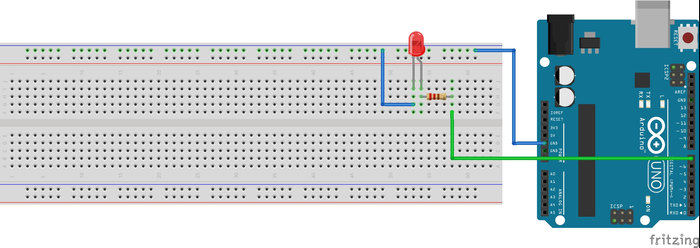
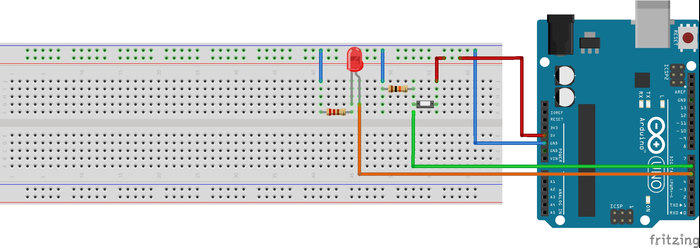

# 3. Arduino'ya Giriş

Arduino, üzerinde bulundurduğu özel giriş ve çıkış portları yardımıyla, programcının yazdığı özel kodları fiziksel etkiye çeviren elektronik devre kartıdır. Yazılımsal ve donanımsal olarak tamamen açık kaynaklı ve özgür olmasından dolayı, isteyen herkes Arduino'nun gelişmesine katkı sağlayabilmektedir. Diğer programcılar tarafından hazırlanmış geniş kütüphaneler ve örnek projeler sayesinde Arduino, Dünya üzerinde en çok kullanılan elektronik devre kartlarındandır.

Arduino ile proje ve prototip hazırlama diğer mikroişlemcilere göre daha hızlı olmaktadır. Bu yüzden Arduino prototip hazırlamada ve elektronik programlamaya girişte yaygın olarak kullanılmaktadır.

Arduino üzerinde bulunan donanımlar ve pinler, Arduino'ya yüklenen kodlar tarafından kolaylıkla kontrol edilebilmektedir. Programcı tarafından yazılan bu kodların işlenmesi için Arduino üzerinde Atmel marka mikroişlemciler bulunmaktadır. Bu mikroişlemcilerin türüne göre de Arduino türleri belli olmaktadır. Arduino'nun bir türü için yazılmış bir kod, eğer o türe has özel donanımlar kullanmıyorsa diğer Arduino türleri üzerinde de sorunsuz çalışmaktadır. Bu yüzden çoğu Arduino projesi hemen hemen her Arduino türünde çalışmaktadır.

**Yaygın olarak kullanılan Arduino türleri ve özellikleri:**


***Arduino UNO***

|Bileşen                |Değer        |
|-----------------------|-------------|
|Mikrokontrolcü         | ATmega328   |
|Çalışma gerilimi       | 5 Volt      |
|Önerilen giriş voltajı | 7 – 12 Volt |
|I/O (giriş/çıkış) sayısı| 14 (6 PWM) |
|I/O çıkış akımı         | 40 mA      |
|Analog giriş            | 6          |
|Flash bellek            | 32 KB      |
|SRAM                    | 2 KB       |
|EEPROM                  | 1 KB       |


***Arduino MEGA***

|Bileşen                 |Değer        |
|------------------------|-------------|
|Mikrokontrolcü          | ATmega2560  |
|Çalışma gerilimi        | 5 Volt      |
|Önerilen giriş voltajı  | 7 – 12 Volt |
|I/O (giriş/çıkış) sayısı| 54 (15 PWM) |
|I/O çıkış akımı         | 40 mA       |
|Analog giriş            | 16          |
|Flash bellek            | 256 KB      |
|SRAM                    | 8 KB        |
|EEPROM                  | 4 KB        |


***Arduino NANO***

|Bileşen                  |Değer                       |
|-------------------------|----------------------------|
|Mikrokontrolcü           | ATmega168 ya da ATmega328  |
|Çalışma gerilimi         | 5 Volt                     |
|Önerilen giriş voltajı   | 7 – 12 Volt                |
|I/O (giriş/çıkış) sayısı | 14 (6 PWM)                 |
|I/O çıkış akımı          | 40 mA                      |
|Analog giriş             | 8                          |
|Flash bellek             | 16 KB                      |


***Not:*** Arduino seçimi yapılacak projeye göre seçilmektedir. Projede kullanılacak giriş çıkış pinleri, analog girişler, program/EEPROM hafızası gibi değişkenler kullanılacak Arduino türünü belirlemektedir. Genel amaçlı projelerde kullanmak için genellikle Arduino Uno veya Mega seçilmektedir. Arduino için ayrılan yerin az olduğu projelerde Arduino Nano kullanılmaktadır.

Eğitim sırasında Arduino UNO kullanılacaktır. Uygulamalarda yazılan kodların diğer Arduino türlerinde de çalışması için özen gösterilmiştir. Arduino IDE üzerinde yazılan Arduino kodları, yine bu yazılımla Arduino kartına yüklenecektir.

## 3.1. Linux İçin Arduino Kurulumu

## 3.2. Arduino'nun Besleme Kaynakları

Arduino'nun çalışması için gerekli olan enerji, Arduino'nun farklı besleme girişlerinden sağlanabilmektedir. Arduino'nun farklı besleme girişleri kullanılırken, bu girişe uygulanacak maksimum gerilimin bilinmesi gerekir. Eğer girişe uygulanması gereken gerilimden fazla bir gerilim uygulanırsa, Arduino zarar görebilir.


### 3.2.1. Arduino'nun USB ile beslenmesi

Arduino'nun USB kablosunu bilgisayarınıza bağladığınızda, Arduino çalışması için gerekli enerjiyi bilgisayarınızdan almaktadır. Bu giriş, Arduino için gerekli enerjiyi sağlarken, aynı zamanda Arduino'nun bilgisayarla haberleşmesini, Arduino'ya yeni kod atılmasını da sağlar.

Yukarıdaki görselde 1 numaralı giriş Arduino'nun USB girişidir. Görselde de görüldüğü gibi bu giriş, yazıcı kablosu olarak tarif edilen USB B girişidir. USB standartlarına uygun olarak tasarlanan bu girişe en fazla 5 Volt gerilim uygulanmalıdır. Eğer bu girişe 5 Volt üzeri bir gerilim uygulanırsa, Arduino zarar görebilir.


### 3.2.2. Arduino'nun pille çalıştırılması

Arduino harici besleme kaynaklarıyla da çalıştırılabilir. Bunun için Arduino üzerinde birbirine bağlı iki farklı giriş bulunmaktadır. Bu girişlerden ilki, yukarıdaki görselde 2 numara ile gösterilen jack girişidir. Bu girişe 7 ile 12 Volt (önerilen) arasındaki gerilimler uygulanabilir. Bu girişe bağlı regülatör (gerilim düzenleyicisi) ile girişe uygulanan gerilim, Arduino'nun çalışma gerilimine düşürülür.

Arduino üzerinde bulunan 'Vin' pini, Arduino'nun jack girişine bağlı bir pindir. Bu pine uygulanan gerilim, Arduino'ya ulaşmadan önce bu pine bağlı regülatör yardımıyla Arduino için uygun gerilime düşürülür. 'Vin' girişine 7 ile 12 Volt arasındaki gerilimler uygulanmalıdır. Pilin artı (+) ucu 'Vin' pinine bağlandıktan sonra, pilin eksi (-) ucu Arduino'nun 'GND' yani toprak ucuna bağlanmalıdır. 'Vin' pini yukarıdaki görselde 3 numara ile gösterilmiştir.

Eğer bu girişlere uygulanması gereken gerilimden fazla bir gerilim uygulanırsa, Arduino zarar görebilir.


### 3.2.3. Arduino'nun 5 Volt pininden beslenmesi

Arduino üzerinde bulunan 5 Volt pini de Arduino'yu beslemek için kullanılabilir. Arduino yaygın olarak bu pinden beslenmese bile, buraya 5 Volt gerilim uygulandığında, Arduino'nun çalıştığı görülmektedir. Bu pine 5 Volt geriliminden fazla bir gerilim uygulanması, Arduino'nun bozulmasına neden olacaktır. Pek tercih edilmese bile, eğer elinizde düzenli olarak 5 Volt gerilim veren bir kaynak varsa, kaynağın artı (+) ucunu Arduino'nun 5 Volt, eksi (-) ucunu da Arduino'nun 'GND' yani toprak pinine bağlayarak kullanabilirsiniz.

Bu pin yukarıdaki görselde 4 numara olarak gösterilmiştir.

## 3.3. Temel Arduino Fonksiyonları

Fonksiyonların ne olduğunu daha önce öğrenmiştik. Arduino geliştiricileri tarafından yazılmış bazı hazır fonksiyonlar vardır. Bu fonksiyonların yardımıyla yapmak istediğimiz işlemleri daha kolay yapabiliriz. Bazı genel fonksiyonlar için herhangi bir kütüphaneye ihtiyaç yoktur. Daha özel görevler için yazılmış fonksiyonları kullanmak için, o fonksiyonun kütüphanesini dosyanıza eklemeniz gerekir.


### 3.3.1. Kütüphane ekleme

Yeni bir kütüphane eklemek için kütüphane dosyalarını Arduino programını kurduğunuz dizinin altında bulunan 'libraries' klasörüne taşıyın. Eğer bu sırada Arduino programı açıksa, taşıma işlemi bittikten sonra, kapatıp yeniden açın. Dosyanın en başında kütüphaneyi projenize ekleyin. Bunun için aşağıdaki kodu kullanabilirsiniz.

```rust
#include <kutuphaneadi.h>
```

Artık kütüphanenin içerisinde bulunan fonksiyonları kullanabilirsiniz.


### 3.3.2.Setup ve Loop fonksiyonları

Arduino projenizi ilk açtığınızda karşınıza iki fonksiyon çıkar. Bunlar setup ve loop fonksiyonlarıdır.

Setup fonksiyonu, kod çalışmaya başladığında Arduino'nun ilk olarak okuduğu yerdir. Arduino bu kısmı okuduktan sonra diğer kısımları okumaya başlar. Bu kısım sadece bir kere okunur ve program esnasında yeniden okunmaz. Bu alanda, pinlerin çalışma modları gibi önemli ve bir kere yapılması yeterli olacak ayarlamalar yapılır.

Loop fonksiyonu, setup fonksiyonu okunduktan sonra okunur. Bu bir ana fonksiyondur ve yapılmasını istediğiniz görevler buraya yazılır. Loop fonksiyonu, sonsuz döngü şeklindedir, yani buradaki görevler tamamlandığında, program tekrar başa dönerek işlemleri yeniden yapar. Bu döngü, Arduino çalıştığı sürece devam eder.

Arduino programlamadan önce kodlarınız ilk başta aşağıdaki gibi olmalıdır.
```rust
void setup(){
    /*
        Burası sadece bir kere çalışır
        Genel ayarlar buradan yapılır
    */
}
void loop(){
    /*
        Bu fonksiyon sonsuza kadar çalışır
        Arduino'nun yapması gereken işlemler buraya yazılır
    */
}
```

### 3.3.3. PinMode

Arduino kartı üzerinde bulunan pinleri çıkış veya giriş olarak tanımlayabilirsiniz. Giriş olarak tanımlanmış pinler düğme gibi elemanlar için kullanılırken, çıkış olarak tanımlanmış pinler ise LED gibi elemanlar için kullanılır. Programın en başında (Setup içerisinde), kullanılacak pinler ayarlanmalıdır. Bunun için aşağıdaki kod kullanılır:

`pinMode(13,OUTPUT);`

Böylece 13. Pin çıkış olarak tanımlanır. Giriş olarak tanımlanması için OUTPUT yerine INPUT yazılması gerekir.

DigitalWrite: Çıkış olarak tanımlanmış pinlerden enerji vermek için veya enerji vermeyi durdurmak için kullanılır. Örneğin:

`digitalWrite(13,HIGH);`

Böylece, daha önce çıkış olarak tanımlanmış 13 numaralı pinden enerji çıkışı sağlanır. Enerji çıkışı durdurulmak istenildiğinde HIGH yerine LOW yazılması yeterlidir.
AnalogWrite: Seçilen pinde PWM sinyalinin üretilmesini sağlar. PWM sinyalinin görev zamanı (Duty cycle) fonksiyona verilen değer ile belirlenir. Örneğin bu pine bağlanan bir LED ışığının parlaklığı verilen PWM sinyali ile ayarlanabilir.

`analogWrite(LEDPin, 175);`

Seçilen pinlerde PWM desteği bulunmasına dikkat edilmelidir. Bu konu ilerleyen konularda daha detaylı olarak incelenecektir.

DigitalRead: Daha önce giriş olarak tanımlanmış bir pinin girişindeki gerilimin yüksek (5 volta yakın) veya düşük (0 volta yakın) olduğu anlaşılır. Örneğin daha önceden giriş olarak tanımlanmış 13 nolu pindeki durumu daha önceden tanımlanmış 'durum' değişkenine yazdıralım

`durum = digitalRead(13);`

13 numaralı pindeki gerilim 5 volta yakın ise 'durum' değişkeni 1 (HIGH), 0 volta yakın ise 0 (LOW) olmuştur.

AnalogRead: Bir önceki fonksiyon ile 13 numaralı pindeki gerilimin 5 veya 0 olmasını ölçtük. digitalRead fonksiyonu, 0 ve 5 volt arasındaki gerilimlerin tam değerini ölçemez. 0 ve 5 volt arasındaki gerilimin tam değerinin ölçülmesi için analogRead fonksiyonu kullanılmalıdır. Fakat bu fonksiyon, tüm pinler için kullanılamaz. Bu fonksiyonun kullanılabileceği özel pinler vardır. Bunlara analog pinler denir ve genellikle A harfi ile başlarlar: A0, A1, A2… gibi. Kullanılan Arduino türüne göre bu pinlerin sayısı değişiklik gösterir.

Arduino Uno'da 6, Arduino Mega'da 16 tane analog giriş bulunur. Kullanılacak analog pin, öncelikle giriş olarak tanımlanmalıdır:

`pinMode(A0,INPUT)`

Örneğin A0'daki değeri 'analogDeger' değişkenine kaydedelim. A0'daki gerilim 10 bit olarak kaydedilecektir. Bu durumu ilerleyen bölümlerde daha detaylı olarak göreceğiz.

`analogDeger = AnalogRead(A0);`


### 3.3.4. Delay

İki kod arasında bir süre beklenmesi istenirse, delay fonksiyonu kullanılır. Örneğin yanıp sönen lamba uygulaması yapılmak istenirse, lamba yakıp söndürme kodları arasında bekleme amacıyla delay fonksiyonu kullanılır. Delay fonksiyonunun içerisine yazılan değer milisaniye düzeyindedir. Bir saniyelik bir bekleme için fonksiyona 1000 değeri verilmelidir.

Örneğin yarım saniyelik bir bekleme fonksiyonu yazalım;

`delay(500);`

Bu bölümde, Arduino projelerimizde kullanacağımız temel fonksiyonları öğrendik. Geri kalan fonksiyonları, ilerleyen konularda örneklerle inceleyeceğiz.

## Temel Arduino Uygulamaları

Yeni bir programlama dili öğrendiğimizde ilk başta nasıl "Merhaba Dünya" yazıyorsak, Arduino programlamanın da giriş uygulaması LED (lamba) yakıp söndürmektir. Daha önce LED'in ne olduğundan bahsetmiştik. Şimdi de LED'in nasıl kullanıldığından bahsedelim. LED bilindiği gibi bir çeşit diyottur, akım sadece bir yönde akmaktadır. Bu yüzden LED'in devreye bağlanma yönü önemlidir.


LED'in yönünü iki şekilde anlayabiliriz. İlk yöntemimiz LED'in ayak uzunluklarıdır. LED'in iki ayağından uzun olanı + (anot), kısa olan – (katot) ucunu göstermektedir. Böylece Arduino'dan gelen kabloyu LED'in uzun ayağına, kısa ayağını da toprağa (GND) bağlayacağız. Bu yöntem ile anot ve katot uçlarını ayırmak kolay olsa da güvenilir değildir. Eğer LED daha önce kullanılmış ise ayak uzunlukları değiştirilmiş olabilir.

Diğer ve daha güvenilir olan ikinci yöntemle LED'in anot ve katot uçlarını daha kolay anlayabiliriz. LED'in içine bakıldığında, arası açık bir köprü görülür. Bu köprünün kısa yolu + (anot), uzun yolu ise –  (katot) ucu göstermektedir.

LED'in bağlantısının nasıl yapılacağını öğrendik. Fakat LED'i devreye doğrudan bağlama pek önerilen bir yöntem değildir.  LED'in bağlı olduğu hatta akımı azaltmak için direnç bağlanmalıdır. Genellikle 220 veya 330 ohm değerinde direnç bağlanır. Bu değerlerden daha büyük bir direnç hatta bağlanırsa, LED'in parlaklığı azalır.

Bu uygulamayı yapmak için ihtiyacınız olan malzemeler:

 * 1 x Arduino
 * 1 x LED (rengi farketmez)
 * 1 x 220 ohm direnç (220 ile 10k arasında bir direnç de olur)
 * 1 x Breadboard

Resimde görüldüğü gibi devrenizi kurunuz. Arduino'nun 7 numaralı pininden bir kablo yardımıyla çıkış alıp Breadboard üzerindeki dirence bağlayınız. Daha sonra direncin diğer ucunu LED'in + ucuna bağlayın. LED'in diğer ucunu ise Arduino'nun toprağına bağlayın. Aynı hat üzerindeki akım her yerde aynı olduğu için direncin LED'den önce veya sonra bağlanması önemli değildir.

Arduino kodunu yazmaya başlayalım. Amacımız 1 saniye boyunca yanan ve sonra 1 saniye boyunca sönük kalan LED yapmaktır. Bunun için setup fonksiyonu içerisinde LED'in bağlı olduğu Arduino'nun 7. pinini çıkış olarak ayarlayacağız. Daha sonra loop fonksiyonu içerisine 1 saniye aralıklı LED yakma ve söndürme kodunu yazacağız. Loop fonksiyonu sürekli döngü halinde olduğu için bir kere LED yakma ve söndürme kodunu yazmamız yeterli olacaktır. 1 saniyelik bekleme için delay fonksiyonu kullanılmıştır.




```rust
void setup()
{
  pinMode(7, OUTPUT); /* 7 numaralı pini çıkış yaptık */
}

void loop()
{
  digitalWrite(7,HIGH); /* 7 numaralı pine enerji verildi */
  delay(1000); /* 1000 milisaniye = 1 saniye bekleme */
  digitalWrite(7,LOW); /* 7 numaralı pindeki enerji kesildi */
  delay(1000); /* 1 saniye bekleme */
}
```

Böylece Arduino'da yapılabilecek en temel işlerinden biri olan LED yakıp söndürmeyi öğrendik. Burada kullanılan fonksiyonlar çoğu projede de kullanılır. Örneğin LED yerine çıkış veren başka bir elektronik eleman (örn: buzzer) konulduğunda, aynı Arduino programı ile o eleman da çalışabilir. Kapsamlı projelerde LED genellikle Arduino'nun durumunu göstermek için kullanılır. Örneğin Arduino bir işlem yaparken kırmızı ışık yanık tutulursa, Arduino'nun o sürede meşgul olduğu kullanıcı tarafından anlaşılabilir. Aşağıdaki uygulama ile öğrendiklerimizi pekiştirelim:

### Kara Şimşek Uygulaması

Arduino ile LED nasıl yakılıp söndürüldüğünü öğrendiğimize göre, artık biraz daha karmaşık bir uygulama yapabiliriz. Bu uygulamamızda kara şimşek yani sırayla yanıp sönen LED'ler yapacağız. LED bağlantılarını resimdeki gibi yapabilirsiniz. Her LED'in bağlantısına ayrı ayrı 220 Ohm'luk dirençler koymayı unutmayın. LED'lerin Breadboard'a eşit uzaklıklarda takılması, projenin daha güzel görünmesini sağlayacaktır.


***Bu uygulamayı yapmak için ihtiyacınız olan malzemeler:***

 * 1 x Arduino
 * 8 x LED
 * 8 x 220 Ohm Direnç
 * 1 x Breadboard

Kara şimşek programı iki şekilde yazılabilir. Birinci yöntemde her LED için ayrı bir değişken tanımlanmış olup, bütün LED'ler tek tek kontrol edilir. Bu yöntem kod kalabalığı yarattığı için pek tercih edilmemektedir. Bu yüzden projeyi daha profesyonelce olan ikinci yöntem ile yazacağız.

İkinci yöntem için, LED'leri 2'den 9'a pinlere sırası ile takalım. Bu pinleri bir diziye kaydederek LED'leri daha kolay kontrol edeceğiz. Dizi kullanılmasının nedeni, program içerisinde for döngüsünün kullanılacak olmasıdır. Her bir for döngüsünde bir sonraki LED'e kolayca geçiş yapılabilir.

***Not:*** LED geçişlerinin daha yumuşak olması için her LED'in artı ve eksi pinlerine kondansatör konulabilir.

```rust
const int LEDdizisi[] = {2,3,4,5,6,7,8,9};

void setup () {     
 
  for(int i=0; i<8 ;i++)    
  { /* For dongusuyle LEDdizisi elemanlarina ulasiyoruz */
    pinMode(LEDdizisi[i], OUTPUT); /* LED pinleri cikis olarak ayarlandi */
  }

}

void loop() {                                                
  for(int i=0; i<8; i++){ /* Tum LEDleri sirayla 50 milisaniye yakip sonduruyoruz */
    digitalWrite(LEDdizisi[i],HIGH);      
    delay(50);                           
    digitalWrite(LEDdizisi[i],LOW);         
  }
 
  for(int j=7;j>-1; j--)
  { /* LEDleri geri yonde 50 milisaniye yakip sonduruyoruz */
    digitalWrite(LEDdizisi[j],HIGH);     
    delay(50);
    digitalWrite(LEDdizisi[j], LOW);
  }
}
```

## 3.4. Düğme Kullanımı

Kullanıcıyla etkileşim halinde olan birçok projede düğme kullanılmaktadır. Düğme, arasında az bir boşluk bulunan iki tel gibi düşünülebilir. Kullanıcı düğmeye bastığında bu boşluk kapanır ve düğme iletken duruma geçer, üzerinden akım akar. Kullanıcı düğmedan elini çektiğinde devrenin eski konumuna dönmesi için, pull up ve pull down denilen direnç bağlantıları kullanılır. Pull up ve pull down direnç ismi değil, dirençlerin bağlanma şeklidir. Genellikle 10K ohm direnç kullanılır.


**Pull Down Direnç:** Düğmeye basıldığında gerilim kaynağıyla Arduino'nun girişi kısa devre olur. Elinizi düğmeden çektiğinizde hat üzerinde hâlâ enerji kalır. Bu enerji düğmeye basılmadığı durumunda bile Arduino'nun düğmeye basılmış gibi davranmasına neden olur. Bu enerjinin yok edilmesi için hat genellikle 10K ohm'luk bir direnç ile toprağa bağlanır. Bu dirence pull down direnç denir.


**Pull Up Direnç:** Düğmeye basılmadığı durumlarda Arduino'nun giriş pini 5 volt düzeyindedir. Düğmeye basıldığında akım, Arduino'nun giriş pini yerine doğrudan toprağa ulaşmaktadır. Böylece pull-down direnç sistemini tam tersi çalışmaktadır. Arduino düğmeye basıldığında 0, düğmeye basılmadığında 1 değerini görmektedir. Pull-up direnci kullanma amacımız ise, düğmeye basıldığında toprak ve besleme hattının direkt olarak kısa devre olmasını engellemektir. Pull-down dirençte olduğu gibi pull-up dirençlerde genellikle 10K ohm olur.

Düğmelerin Arduino'ya nasıl bağlanacağını öğrendik. Resimde breadboard (Eskiden elektronikçiler buna gofret derlerdi) üzerine düğme ve LED devresi kurulmuştur. Siz de resimdeki devreyi kurabilirsiniz.

***Bu uygulamayı yapmak için ihtiyacınız olan malzemeler:***

 *   1 x Arduino
 *   1 x düğme
 *   1 x 10K ohm direnç
 *   1 x LED
 *   1 x 220 ohm direnç
 *   1 x breadboard (gofret)



Bu devredeki düğmenin amacı LED'i kontrol etmek olacaktır. Kullanıcı düğmeye bastığında LED yanıyorsa sönecek, sönük ise de yanacaktır. Burada bilmemiz gereken bir diğer nokta ARK olaylarıdır. Düğmeye basıldığı anda oluşan atlamalardan dolayı Arduino çok kısa zamanda yüzlerce kere düğmeye basıldığını sanmaktadır. Bu istenmeyen durumdan kurtulmak için basıldığı anda Arduino'yu biraz bekleteceğiz (delay fonksiyonu ile). Böylece devremiz, düğmeye basıldığında oluşan istenmeyen dalgalanmalardan korunmuş olacaktır. Delay fonksiyonuna yazılan bekleme zamanı insanın fark edemeyeceği kadar kısa bir süredir.

Düğmeye her basıldığında yeni bir işlem yapılmasını istiyoruz. Bunu sağlamak için düğmeye basıldığında yapılması gereken işlem yapıldıktan sonra, kişinin düğmeden elini çekmesi beklenmelidir. Eğer bunu yapmazsak kişi, düğmeye bastığında LED'i sürekli yanıp sönecektir. Bu işlem o kadar hızlı olacaktır ki insan gözü bunu algılayamaz.

Düğmenin durumu digitalRead fonksiyonu ile kontrol edilecektir. Okunan düğme değeri 'dugmeDurumu' değişkenine yüklenecektir. Eğer düğmeye basılmışsa LED'in durumunu değiştireceğiz. LED'in düğmeye her basıldığında konumunun değişmesi için, LED durumu bir değişkene atanır ve LED'in eski durumuna göre LED farklı konuma getirilir.


**Arduino kodu:**
```rust
const int Dugme = 6; /* düğmenin bağlı olduğu pin */
const int LED =  5; /* LEDin bağlı olduğu pin */

int dugmeDurumu = 0; /* düğmenin durumu */
int LEDDurumu = 0; /* birinci yöntem için LED durumu */

void setup() {
  pinMode(LED, OUTPUT); /* LED pini çıkış olarak ayarlandı */
  pinMode(Dugme, INPUT); /* düğme pini giriş olarak ayarlandı */
}

void loop(){
  dugmeDurumu = digitalRead(Dugme); /* düğmenin durumu okundu ve değişkene aktarıldı */
  if(dugmeDurumu == HIGH) { /* düğmeye basılmış ise */
    delay(10); /* dalgalanmalar için biraz bekleyelim */
    if(LEDDurumu == 0){ /* LED yanmıyorsa */
      digitalWrite(LED, HIGH); /* LEDi yak */
      LEDDurumu = 1;
    }else { /* LED yanıyorsa */
      digitalWrite(LED, LOW); /* LEDi sondur */
      LEDDurumu = 0;
    }

    while(dugmeDurumu == HIGH){ /* düğmeye basili olduğu surece bekle */
      dugmeDurumu = digitalRead(Dugme); /* düğmenin durumunu kontrol et */
    }
    delay(10); /* dalgalanmalar için biraz bekleyelim */
  }
}
```


## Blinking led - Hello world in the Arduino.
```rust
#![no_std]
#![no_main]

use panic_halt as _;

#[arduino_hal::entry]
fn main() -> ! {
    let dp = arduino_hal::Peripherals::take().unwrap();
    let pins = arduino_hal::pins!(dp);

    let mut led = pins.d13.into_output();

    loop {
        led.toggle();
        arduino_hal::delay_ms(1000);
    }
}

```


## Led with different brightness

```rust
#![no_std]
#![no_main]

use arduino_hal::delay_ms;
use panic_halt as _;

#[arduino_hal::entry]
fn main() -> ! {
    let dp = arduino_hal::Peripherals::take().unwrap();
    let pins = arduino_hal::pins!(dp);

    pins.d9.into_output();

    let tc1 = dp.TC1; // Timer1 used for PWM in 9 and 10 pins.

    tc1.tccr1a.write(|w| w.wgm1().bits(0b01).com1a().match_clear());
    tc1.tccr1b.write(|w| w.wgm1().bits(0b01).cs1().prescale_64());

    loop {
        // do net set 0, because it make voltage peacks (see 11_inc_dec_light for info)
        tc1.ocr1a.write(|w| unsafe { w.bits(40) }); // (40/255)*5V=785V
        delay_ms(250);
        tc1.ocr1a.write(|w| unsafe { w.bits(120) }); // 2.35V
        delay_ms(250);
        tc1.ocr1a.write(|w| unsafe { w.bits(255) }); // 5V
        delay_ms(250);
    }
}
```

## LED with controlled by pot brightness


## Buzzer plays musical notes


## LED on/off controlled by pot and photoconductive cell


## Smoothly change brighntess of LED bar


## Sequentially on/off leds in a bar


## Changes speed of motor by buttons


## On/off led by button


## Change brightness of led with 2 buttons


## Change digit from 0 to 9 per seconds on 7 segments counter.


## Like 13, but uses 8-bit serial to parallel shift register 74HC595


## Work with LCD 16 symbols 2 row display (HD44780).


## Example shows an implementation of all commands from datasheet.


