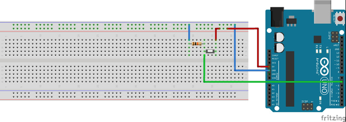

# 1. Seri Port Üzerinden Haberleşme

Projelerimizde Arduino'ya komut yollamak veya sensörlerdeki değerleri görüntülemek için seri haberleşmeyi kullanırız. Seri haberleşmeyle bu protokolü destekleyen cihazlarla haberleşebiliriz. Eğitimlerimizde Bluetooth ve USB üzerinden bilgisayara veri aktarmak için seri haberleşme protokolünü kullanacağız.

Arduino'nun 0 ve 1 numaralı yani Rx ve Tx pinleri seri haberleşmeyi sağlamaktadır. Bu pinler aynı zamanda Arduino'nun bilgisayarla haberleşmesini sağlayan USB hattına da bağlıdır. 0 ve 1 numaralı pinler başka bir yere bağlı olduğunda, Arduino bilgisayarla haberleşmesini sağlayamamaktadır. Bu yüzden Arduino'ya kod atarken bu pinlerin bir yere bağlı olmamasına dikkat edilmelidir.

## 1.1. USB üzerinden bilgisayara veri aktaralım

Arduino'nun USB kablosu üzerinden bilgisayara veri aktaracağız. Bunun için öncelikle haberleşme hızını (BaudRate) ayarlamalıyız. Bu ayarın sadece bir kere yapılması yeterli olduğu için, haberleşme hızı setup fonksiyonu içerisinde ayarlanmalıdır. Artık bilgisayara veri aktarmaya hazırız.

Aşağıdaki kodla her saniye bilgisayara "Merhaba Dunya" yazdıralım. Haberleşme için daha önceden bizim için tanımlanmış olan "Serial" nesnesini kullanacağız.

```cpp
void setup() {
 Serial.begin(9600); /* haberleşme hızını ayarlayıp haberleşmeyi başlattık */
}
void loop() {
 Serial.println("Merhaba Dunya"); /* aktarmak istedigimiz veriyi yazdık */
 /* 
 mesajımızı yeni satırda yazmak için Serial.println, 
 aynı satırda yazdırmak için Serial.print kullanmalıyız
 */
 delay(1000); // Bir saniye bekle
}
```

Gönderdiğimiz mesajları görmek için Arduino programının sağ üstünde büyüteç şeklindeki butona (Serial Monitor) basalım. Eğer mesajlarımız doğru bir şekilde görüntülenemiyor ise, Baud Rate hızımız yanlış olabilir. Serial Monitor ekranının sağ altından baud hızımızı 9600 olarak ayarlayalım.

Eğer gönderdiğimiz mesajı bilgisayarda hatasız bir şekilde görebiliyorsak, diğer uygulamamıza geçebiliriz.

## 1.2. Tıklama Sayacı 

Bu uygulamamızda daha önce nasıl kullanacağımızı öğrendiğimiz butonu kullanacağız. Butona her basıldığında ilk başta tanımlayacağımız değişkenin değerini bir arttıracağız. Böylece butona kaç kere basıldığını sayacağız. Aynı zamanda butona basıldığında, butona kaç kere basıldığını bilgisayara da göndereceğiz.

Bu uygulamayı yapmak için ihtiyacınız olan malzemeler:

    1 x Arduino
    1 x Buton
    1 x 10K ohm direnç
    1 x breadboard



```cpp
const int buton = 6; /* Butonun bağlı olduğu pin */
int sayac = 0; /* butona basılma sayısını tutacak değişken */
int butonDurumu = 0; /* Butonun durumu */  

void setup() {
 pinMode(buton, INPUT);
 Serial.begin(9600);
}

void loop() {
 butonDurumu = digitalRead(buton);
 if (butonDurumu == HIGH) {
   delay(10); /* dalgalanmalar için biraz bekleyelim */
   sayac ++; /* sayaç = sayaç + 1 yani sayaç değeri bir arttırıldı */
   Serial.print("Butona ");
   Serial.print(sayac); /* sayaç değerimizi ekrana yazdırıyoruz */
   Serial.println(". defa basildi.");
   while(butonDurumu == HIGH){ /* Butona basili olduğu surece bekle */
     butonDurumu = digitalRead(buton); /* Butonun durumunu kontrol et */
   }
   delay(10); /* dalgalanmalar için biraz bekleyelim */
 }
}
```
Şu ana kadar yaptığımız uygulamalarda Arduino'dan bilgisayara veri yolladık. Şimdi de bilgisayardan Arduino'ya veri yollayalım. Bilgisayardan veri yollamak için Serial Monitor penceresindeki metin kutusunu kullanacağız.

Aşağıda yazdığımız kodlar, bilgisayardan Arduino'ya yolladığımız mesajları okuyacak ve okuduğu mesajları aynı şekilde bilgisayara geri yollayacaktır.

```cpp
char gelenVeri = 0; /* gelen verinin kaydedileceği değişken */
void setup() {
   Serial.begin(9600); /* haberleşmeyi başlatalım */
}
void loop() {
   if (Serial.available() > 0) { /* bilgisayardan veri gelmesini bekliyoruz */
   gelenVeri = Serial.read(); /* bilgisayardan gelen karakteri oku */
   Serial.print("gelen veri: ");
   Serial.println(gelenVeri); /* bilgisayardan gelen veriyi bilgisayara geri yolluyoruz */
   }
}
```
## 1.3. SoftwareSerial Kütüphanesiyle Haberleşme

Bilgisayarla seri haberleşme yaptığımız gibi, diğer elektronik elemanlarla da seri haberleşme yapabiliriz. Bunun için haberleşilecek elemanların Tx ve Rx uçlarını çapraz bir şekilde Arduino'nun Tx ve Rx pinlerine takmalıyız. Arduino UNO'da sadece bir çift Tx ve Rx (1. ve 0. pinler) bulunur. Bu pinler aynı zamanda USB üzerinden bilgisayarla haberleşmemizi sağlayan pinlerdir. Yani bilgisayarla haberleşme halinde bulunan Arduino'nun 0 ve 1. pinler kullanılamaz.

Arduino MEGA gibi gelişmiş kartlarda birden fazla Tx Rx çifti bulunduğu için bu cihazlar, hem harici olarak başka modüllerle seri haberleşebilirken hem de bilgisayara veri yollayabilir. "SoftwareSerial" kütüphanesi Arduino Uno gibi sadece bir çift Tx Rx pini bulunan kartlar için geliştirilmiştir. Bu kütüphane yardımıyla Arduino'nun diğer pinleri de Tx ve Rx olarak kullanılabilmektedir.

**Dikkat!** "SoftwareSerial" kütüphanesiyle tanımlanacak Rx pinlerinin OnChange kesmesini (interrupt) sağlamaları gerekmektedir.

"SoftwareSerial" kütüphanesi kullanabilmek için öncelikle bu kütüphaneyi projemize eklemeliyiz. Bu kütüphane Arduino IDE'si kurulduğunda otomatik olarak oluşturulmaktadır. Eğer Arduino'nun yüklü olduğu dizindeki "libraries" dosyasında "SoftwareSerial" kütüphanesi bulunmuyor ise, kütüphaneyi internetten indirip bu dizine atabilirsiniz.

Hatırlatma: "Libraries" dosyasına yeni kütüphane yüklediğinizde, açık olan Arduino programlarını kapatıp tekrar açmayı unutmayınız.

"#include <SoftwareSerial.h>" komutuyla kütüphaneyi kodumuza ekledikten sonra seçeceğimiz iki pini Rx ve Tx olarak tanımlayabiliriz. Bunun için;

```SoftwareSerial seriHaberlesmeNesnesi(10, 11);```

Komutu kullanılır. Burada "seriHaberlesmeNesnesi" yerine farklı bir değişken ismi verilebilir. Bu değişken seri haberleşme fonksiyonlarını çağırabilmek için kullanacağımız nesnedir. Nesne kurulumuna yazılan 10 ve 11 numaraları pin sayılarını göstermektedir. Örneğin burada 10. pin Rx olarak, 11. pin ise Tx olarak tanımlanmıştır.

Hatırlatma: Rx pininin kullandığınız Arduino türünde onChange Interrupt'ını desteklediğinden emin olunuz. Aksi taktirde bu porttan veri alınamaz.

Rx ve Tx pinleri tanımlandığına göre bu portlar üzerinde işlem yapabiliriz. Öncelikle donanımsal serialda yapıldığı gibi "seriHaberlesmeNesnesi.begin(9600)" komutuyla haberleşme başlatılmalıdır. Bu komutun bir kere kullanılması yeterli olduğu için setup fonksiyonu içerisine yazılması yeterlidir. Normal Serial nesnesinin sahip olduğu diğer fonksiyonlar da bu kütüphaneyle oluşturulacak nesnelerde mevcuttur.

Aşağıdaki kodla 10 ve 11. pinlere seri haberleşmeyi destekleyen cihaz bağlayarak haberleşebilirsiniz.

```cpp
#include <SoftwareSerial.h>

SoftwareSerial yeniSeriPort(10, 11);
/*
Arduino -> Diğer Cihaz
10(Rx)  ->   Tx
11(Tx)  ->   Rx
*/

void setup()  
{
  Serial.begin(9600); /* bilgisayarla haberleşmeyi başlatıyoruz */
 
  yeniSeriPort.begin(9600); /* Yeni oluşturduğumuz haberleşme portunu açıyoruz */
  yeniSeriPort.println("Merhaba Dunya"); /* Yeni porta mesaj yolluyoruz */
}

void loop()
{
  while(yeniSeriPort.available()){ /* Yeni porta gelen bir mesaj var mı */
    Serial.write(yeniSeriPort.read()); /* Yeni porta gelen mesaj var ise mesaj bilgisayara yollanıyor */
    delay(1);  
  }
  yeniSeriPort.println("selam"); /* Yeni porta "selam" mesajı yollanıyor */
  delay(100);
}
```
İlerleyen konularımızda seri haberleşme portu olarak tanımladığımız 10 ve 11. pinlere, Bluetooth gibi seri haberleşme yapabilen cihazlar bağlayacağız.


### 1.3.1 Birden fazla Software Serial nesnesi

"SoftwareSerial" kütüphanesi kullanılarak birden fazla seri port aynı anda açılabilir. Bunun için her bir port için yeni bir nesne oluşturmalıyız. Bu nesnelere de Rx ve Tx için farklı pinler atamalıyız. Arduino donanımsal haberleşme portları için hafızasında buffer denilen özel alanlar bulunur. Porttan gelen mesajlar otomatik olarak bu alanlara kaydedilir. Software Serial kütüphanesi yazılımsal haberleşme oluşturduğu için donanımsal haberleşme kadar başarılı olmamaktadır.

Aynı anda iki Software Serial portu dinlenemediği için, portlar arasında geçiş yapmak için listen() fonksiyonu kullanılır. Bu fonksiyon tanımlandığında, tanımlanan nesnenin portu dinlenmeye başlanır. Porta gelen mesajlar otomatik olarak kaydedilir. Dinlenme işlemi bittiğinde listen() fonksiyonu diğer nesneler için kullanılabilir. Böylece tüm Software Serial portları sırayla dinlenir.

Aşağıdaki kodda bilgisayar bağlantısı için donanımsal seri haberleşme portu açılmıştır. Arduino'ya seri haberleşme destekleyen iki farklı cihaz bağlanabilmesi için iki adet yazılımsal seri haberleşme portu açılmıştır. Bu portlara gelen mesajlar sırasıyla dinlenmiş ve gelen mesajlar bilgisayara aktarılmıştır.

```cpp
#include <SoftwareSerial.h>

SoftwareSerial portbir(10,11);
/*
Port Bir:
Arduino -> Diğer Cihaz
10(Rx)  ->   TX
11(Tx)  ->   RX
*/

SoftwareSerial portiki(8,9);
/*
Port İki:
Arduino -> Diğer Cihaz
8(Rx)  ->   TX
9(Tx)  ->   RX
*/

void setup()
{
 
  Serial.begin(9600); /* Bilgisayar ile haberleşmeyi başlatıyoruz */

  portbir.begin(9600); /* birinci yazılımsal haberleşme portu başlatılıyor */
  portiki.begin(9600); /* ikinci yazılımsal haberleşme portu başlatılıyor */
}

void loop()
{
  /* portbir dinleniyor */
  portbir.listen(); 
  Serial.println("Birinci porttan gelen mesaj:");
  while (portbir.available() > 0) {
    char karakter = portbir.read();
    Serial.write(karakter);
  }

  Serial.println();

  /* portiki dinleniyor */
  portiki.listen();  
  Serial.println("ikinci porttan gelen mesaj:");
  while (portiki.available() > 0) {
    char karakter = portiki.read();
    Serial.write(karakter);
  }

  Serial.println();
}
```
Böylece Arduino'da donanımsal ve yazılımsal olarak seri haberleşme nasıl yapılır öğrenmiş olduk. Bu haberleşme türünü ilerleyen konularda tekrar kullanacağız.


