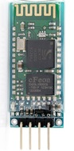
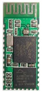
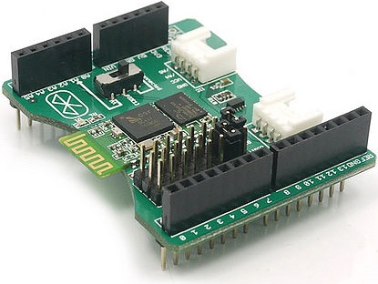
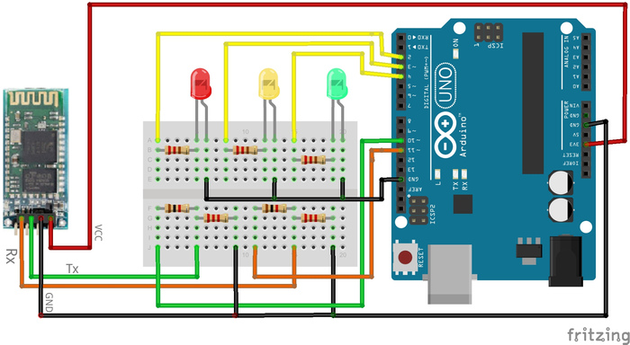
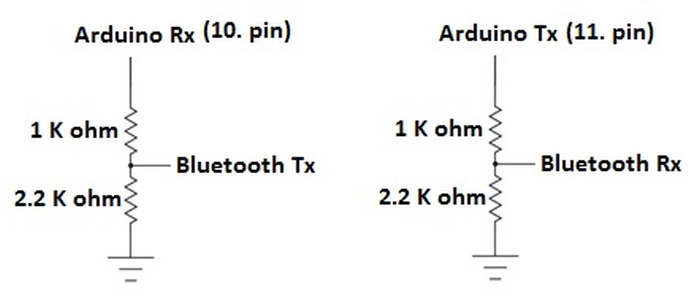

# 2. Bluetooth ile İletişim 

Bluetooth kısa mesafeli haberleşmeler için geliştirilmiş, 2,4 – 2,48 GHz ISM bandını kullanan bir haberleşme protokolüdür. Bluetooth modülleri arasındaki iletişim mesafesi eğer arada bir engel yoksa yaklaşık 20 metredir. Geliştirilen yeni teknolojiler ile bu mesafe yaklaşık 100 metreye kadar arttırılmıştır. Bu yeni geliştirilen Bluetooth modülleri henüz Arduino projelerinde kullanılmamaktadır. Arduino projelerinde genellikle HC-05 veya HC-06 Bluetooth modülleri kullanılır. Biz de projelerimizde bu Bluetooth modüllerini kullanacağız.

HC-05 ve HC-06 Bluetooth modülleri özellik olarak hemen hemen birbirinin aynısıdır. Tek fark, HC-05 hem kendisine gelen bağlantı isteklerine cevap verirken hem de başka Bluetooth cihazlarına bağlantı isteği yollayabilmesidir. HC-06 Bluetooth modülü ise yalnızca kendisine gelen bağlantı isteklerini cevaplayabilir, başka bir Bluetooth modülüne bağlantı isteği yollayamaz. Kısacası HC-05 hem master (yönetici) hem de slave (köle) modunda çalışabilirken, HC-06 sadece slave (köle) modunda çalışabilmektedir.

HC-05 ve HC-06 Bluetooth modüllerinin ortak özellikleri aşağıda verilmiştir.

|2,4 GHz haberleşme frekansı (ISM)|                           |
|---------------------------------|---------------------------|
|Hassasiyet                       |≤-80 dBm                   |
|Çıkış gücü                       |≤+4 dBm                    |
|Asenkron hız                     |2,1 MBps / 160 KBps        |
|Senkron hız                      |1 MBps / 1 MBps            |
|Çalışma gerilimi                 |1,8 - 3,6 V (Önerilen 3,3 V|
|Akım                             |50 mA                      |
|Kimlik doğrulama ve şifreleme    |                           |

Bluetooth modülü satın alınırken dikkat edilmesi gereken bazı noktalar vardır. Projede Bluetooth modülünün master modunda çalışması isteniyorsa HC-05 tercih edilmelidir. Modülün sadece slave modunda çalışması yeterliyse bu iki modülden birisi seçilebilir. Projede kullanım kolaylığı için breakout'a (kılıf) sahip Bluetooth modülü seçilmesi gerekir. Breakout kablolamada kolaylık sağlamaktadır. Proje mühendisinin işini daha da kolaylaştırmak için Arduino üzerine direkt takılabilen Bluetooth Shield'leri de bulunmaktadır.




Kılıfa (breakout) sahip olan (solda) ve olmayan Bluetooth modülü




Arduino üzerine doğrudan takılabilen Bluetooth Shield

**Dikkat!** Bluetooth modülleri 3,3 Volt ile çalışmaktadır fakat kılıfa (Breakout) sahip Bluetooth modülleri üzerinde genellikle voltaj regülatörü bulunmaktadır. Bu Bluetooth modülleri 3,3 V – 5 V arası gerilimde çalışmaktadır. Bluetooth modülünün üzerinde genellikle çalışma gerilimi yazmaktadır.

Bluetooth modülünün üzerinde VCC, GND, Rx ve Tx olmak üzerine 4 adet pin bulunmaktadır. Bu pinlerden VCC ve GND modülü beslemek için kullanılır. Arduino tarafından yollanan komutlar Bluetooth modülü tarafından alınabilmesi için, Arduino'nun Tx pini Bluetooth modülünün Rx ayağına takılmalıdır. Aynı şekilde Bluetooth'a gelen mesajların Arduino'ya aktarılması için, Arduino'nun Rx pini Bluetooth modülünün Tx pinine takılması gerekmektedir.

Bluetooth modülü her ne kadar 3,3 volt ile beslense bile Rx ve Tx pinlerindeki gerilim Arduino tarafından 5 volt düzeyine çekilebilmektedir. Bazı Bluetooth modülleri için 3,3 volt gerilimin üstü cihaza zarar verebildiği için, bu pinlerin daha önce öğrendiğimiz gibi voltaj bölücü (voltage divider) ile devreye bağlanmalıdır. Bu bağlantı şekli aşağıdaki uygulamada gösterilecektir.

## 2.1. Bluetooth Eşleştirmesi

Bluetooth modüllerinin bilgisayar veya telefon gibi Bluetooth özelliği bulunan cihazlara bağlanabilmesi için, öncelikle bu cihazların Bluetooth modülüyle eşleştirilmesi gerekmektedir. Akıllı telefonlarda bu işlem normal bir telefon eşleştirir gibi yapılabilmektedir fakat bilgisayar ile eşleşme yapıldığında bilgisayar, Bluetooth modülü için otomatik olarak COM (haberleşme portu) oluşturmaktadır. Haberleşme için kullanacağımız bilgisayar programları da bu port üzerinden Bluetooth modülüne bağlanacaktır.

Bluetooth modülünün parolası değiştirilmemiş ise fabrika ayarı parola 1234 şeklindedir. Eşleşme sırasında modülün parolası sorulduğunda, bu şifre girilmelidir.

**Hatırlatma:** Bilgisayar ile eşleştirildikten sonra Bluetooth modülünün aldığı port numaraları için 'Aygıt Yöneticisi' kontrol edilmelidir. Aygıt yöneticisinin yeri daha önceki konularımızda anlatılmıştı. Burada iki adet Bluetooth portu görülebilir. Bunlardan büyük olanı projelerde kullanılacak olan haberleşme portudur.

Eşleştirilme işlemleri bittikten sonra, Bluetooth ile akıllı cihazların haberleşmesini sağlayacak ara programlara ihtiyaç duymaktayız. Bu programlar, normal bir seri haberleşme yapan bilgisayar programları olarak düşünülebilir.

Windows kullanıcıları Bluetooth ile haberleşmek için, ücretsiz olarak 'Tera Term' yazılımını indirebilirler. Android kullanıcıları ise haberleşme için 'Bluetooth Terminal' isimli ücretsiz uygulamayı kullanabilirler.

**Not:** Daha önce bilgisayar programı geliştirmiş yazılımcılar, Bluetooth haberleşmesini sağlayacak programı kendileri de yazabilirler. Bu programın temel amacı seri porttan gelen verileri ekranda gösterme ve program kullanıcının mesajlarını seri porta yazmadır.

Eğer eşleştirme işlemini başarıyla tamamlamış ve gerekli yazılımlar indirilmiş ise ilk bağlantımızı kurabiliriz. Bunun için Bluetooth modülünün sadece VCC ve GND pinlerinin takılması yeterlidir. Bu pinler takıldığında Bluetooth modülü üzerinde bulunan ışık yanıp sönmeye başlamaktadır. Bu ışığın hızlı bir şekilde yanıp sönmesi bağlantı isteklerine açık olduğunu göstermektedir.

Akıllı cihazımızdaki program aracılıyla Bluetooth modülüne bağlanmayı deneyiniz. Birkaç saniye bekledikten sonra, eğer cihazımız ile Bluetooth modülü başarılı bir şekilde bağlanmış ise, modül üzerindeki ışık yanıp sönmeyi bırakıp sadece yanacaktır.

Şu anda Rx ve Tx pinlerini takmadığımız için haberleşme yapamayız, fakat Bluetooth modülümüzün düzgün çalıştığını ve akıllı cihazımızın da başarılı bir şekilde eşleştirildiğini görmüş olduk.

Artık Bluetooth projeleri geliştirmeye hazırsınız.

## 2.2. Telefon Kontrollü Işık Projesi

Bu uygulamada Bluetooth modülü yardımıyla Arduino'ya bağlı LED'leri akıllı telefon üzerinden kontrol edeceğiz. Projede yazılan Arduino kodu biraz değiştirilerek akıllı ev projeleri yapılabilir. Kurulan devre sadece akıllı telefonlar ile değil, Bluetooth bağlantısına sahip tüm cihazlar üzerinden kontrol edilebilir. Projede telefon kontrolünün seçilmesinin nedeni projenin taşınabilirliğini sağlamaktır.

Projede Bluetooth modülü slave (köle) modunda çalışacağından, HC-05 veya HC-06 modülleri kullanılabilir. Bluetooth modülünün haberleşme pinleri (Rx ve Tx) voltaj bölücü yardımıyla Arduino'ya bağlanmıştır. Bunun nedeni daha önce de öğrendiğimiz gibi, 3,3 volt üzerindeki gerilimlerin Bluetooth modülüne zarar verebilmesindendir.

Bu uygulamayı yapmak için ihtiyacımız olan malzemeler;

    1 x Breadboard
    1 x Arduino
    1 x Bluetooth modülü (HC-05 veya HC-06)
    7 x Direnç (3 adet 220 ohm, 2 adet 1K ohm, 2 adet 2,2K ohm)
    3 x LED
    Bluetooth bağlantısına sahip akıllı cihaz

Proje için aşağıdaki devreyi kurunuz:



Yukarıdaki resimde direnç değerleri belli olmadığı için aşağıda Bluetooth modülü ve Arduino arasına kurulacak voltaj bölücü devresi gösterilmiştir.




**Not:** Eğer belirtilen direçler elinizde yok ise, elektroniğe giriş konusunda öğrenmiş olduğumuz voltaj bölücü hesaplama yöntemi ile farklı direnç değerleri kullanabilirsiniz.

Arduino UNO'nun sadece bir tane haberleşme portu bulunduğu için Bluetooth modülü Arduino'nun 10 ve 11. pinlerine bağlanmıştır. Bu pinlerin seri port olarak kullanılabilmesi için 'Software Serial' kütüphanesi kullanılmıştır. Bu kütüphanenin kullanımını daha önceki konularda öğrenmiştik.

**Not:** Bluetooth modülleri Arduino'nun donanımsal seri portuna da bağlanabilirdi. Fakat o zaman 'Serial Mönitör' üzerinden bilgisayara veri gönderilemezdi ve her programlama yapılacağı zaman bu pinlerin çıkarılması gerekirdi.

Kontrol edeceğimiz pinleri ve diğer devre bağlantılarını da yaptıktan sonra Arduino programını yazmaya başlayabiliriz. Arduino programı Bluetooth modülü için açılmış sanal seri portları dinlemektedir. Eğer burada yeni bir veri var ise bu veriyi okuyarak işleme almaktadır. Gelen verinin değerine göre LED ışıkları kontrol edilmektedir. Unutulmamalıdır ki, Bluetooth modülü üzerinden gelecek veriler karakter formatındadır. Ayrıca her 'read' fonksiyonu kullanıldığında Arduino tarafından bir karakter okunmaktadır.

```cpp
#include <SoftwareSerial.h>

SoftwareSerial bluetoothModulu(10, 11); 
/* Arduino  ->  Bluetooth modulu
  10 (Rx)   ->  Tx
  11 (Tx)   ->  Rx
*/

const int LED1 = 2;
const int LED2 = 3;
const int LED3 = 4;

void setup()
{
  bluetoothModulu.begin(9600); /* Bluetooth haberleşmesi */
  pinMode(LED1, OUTPUT);
  pinMode(LED2, OUTPUT);
  pinMode(LED3, OUTPUT);
}

char okunanKarakter; /* okunan verilerin kaydedileceği değişken */
void loop()
{
  while(bluetoothModulu.available()>0){ /* Yeni veri var mı */
    okunanKarakter = bluetoothModulu.read(); /* Yeni veriyi okunanKarakter degiskenine kaydet */
    switch(okunanKarakter){ /* Okunan karaktere göre işlem yap */
      case 'a': /* gelen karakterin işlem karşılığı */
        digitalWrite(LED1, HIGH);
        bluetoothModulu.println("LED 1 yakildi");
        break;
      case 'b':
        digitalWrite(LED1, LOW);
        bluetoothModulu.println("LED 1 sonduruldu");
        break;  
      case 'c':
        digitalWrite(LED2, HIGH);
        bluetoothModulu.println("LED 2 yakildi");
        break;
      case 'd':
        digitalWrite(LED2, LOW);
        bluetoothModulu.println("LED 2 sonduruldu");
        break;  
      case 'e':
        digitalWrite(LED3, HIGH);
        bluetoothModulu.println("LED 3 yakildi");
        break;
      case 'f':
        digitalWrite(LED3, LOW);
        bluetoothModulu.println("LED 3 sonduruldu");
        break;  
    } /* Switch sonu */
  }/* While sonu*/
}/* Loop sonu */
```
Bu bölümde Bluetooth modülünün Arduino ile nasıl kullanıldığını öğrendik. Artık Arduino projelerimizi Bluetooth özelliği bulunan cihazlar ile kontrol edebiliriz. Bluetooth kullanımının pekişmesi için sizde yukarıdaki kod üzerinde değişiklikler yaparak kendi projenizi gerçekleştirebilirsiniz.

İlerleyen bölümlerimizde DC motor kontrolünü öğrendikten sonra, Bluetooth ile kontrol edilen araba yapacağız.


