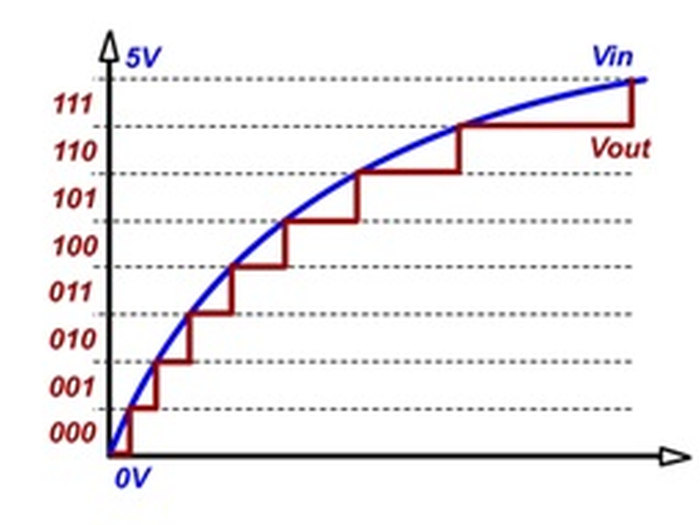
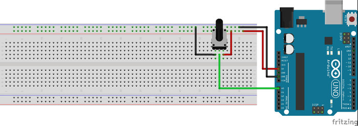
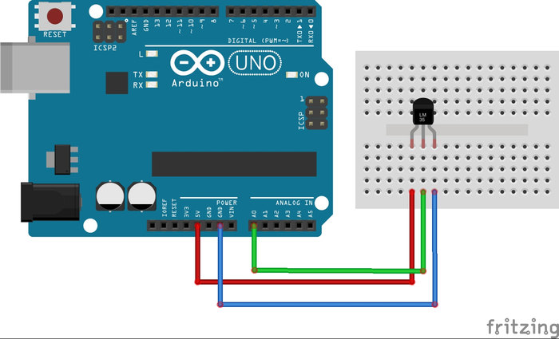

# 3. Analog Sinyal Okuma 

Yaşadığımız ortamda her etki analog bir sinyale karşılık gelir. Bu etkileri ölçen sensörler de genellikle analog çıkış verir fakat Arduino analog sinyalleri işleyememektedir. Bu yüzden analog sinyallere karşılık gelen dijital değerlerin bulunması gerekir. Bu işleme ADC (Analog Digital Converter) denir. Çok fazla detaya girmeden analog sinyalin dijitale çevrilmesini şu şekilde özetlenebilir:

Resimdeki gibi 0 ve 5 volt arasında değişen analog bir sinyalimiz olsun. Bu sinyalin dijital sinyale çevrilmesi için Arduino'da 10 bitlik bir saklayıcı bulunmaktadır. Bu saklayıcı 0 volt giriş için 0, 5 volt giriş için ise 1023 değerini almaktadır. Bu artış doğrusaldır yani girişteki 0,005 voltluk bir değişim saklayıcının değerini bir artırmaktadır. Örneğin sinyal girişimiz 3,3 volt ise okuyacağımız değer yaklaşık olarak 675'tir.

Kısacası ADC, 0 ve 5 volt arasındaki sinyali oranlayarak 0 ve 1023 arasında sayısal bir değer döndürmektedir.



Arduino'nun bu dönüşümü yapabilmesi için özelleşmiş analog okuyucu pinleri bulunmaktadır. Analog okuyucu pinlerin sayısı Arduino'nun türüne göre değişmektedir. Bu pinlerin numaraları A0, A1, A2... şeklindedir.

Hatırlatma: Analog pinler de diğer dijital pinler gibi en fazla 5 volt gerilime dayanabilmektedir. Bu pine 5 voltun üzerinde bir gerilim uygulanırsa, Arduino bozulabilir. Kısacası Arduino'nun ölçebileceği en yüksek gerilim 5 volttur.

Arduino'nun A0 girişindeki gerilimi ADC yardımıyla ölçelim. Ölçülen değeri bir değişkene kaydedelim. Daha sonra da bu değeri seri haberleşme yardımıyla bilgisayara aktaralım. Eğer A0 pini boşta bırakılırsa, gürültü nedeniyle bu pinden sürekli değişen bir ADC değeri okunur. Daha doğru değerler okumak için A0 girişine potansiyometre bağlayalım. Potansiyometre bağlantısı için aşağıdaki devreyi inceleyebilirsiniz. Potansiyometreyi çevrildiğinde değişen gerilimi bilgisayardan görüntüleyebilirsiniz.

Bu uygulamayı yapmak için ihtiyacınız olan malzemeler:

    1 x Arduino
    1 x Potansiyometre
    1 x Breadboard



```cpp
void setup() {
  Serial.begin(9600);
}
void loop() {
  int sensorDegeri = analogRead(A0); /* Arduinonun A0 ayagindaki gerilim olculuyor */
  Serial.println(sensorDegeri); /* olculen deger seri haberlesme ile yollaniyor */
  delay(10); /* daha dogru bir olcum icin biraz bekleme kullanilmalidir */
}
```

**Uygulama: Arduino ile voltmetre yapımı**

Potansiyometrenin çıkışındaki analog değeri ADC kullanarak ölçmeyi öğrendik. Ölçtüğümüz bu değer 0 ile 1023 arasındaydı. Yapacağımız voltmetre uygulaması ile bu değeri daha anlamlı bir şekle getireceğiz.  Bunun için öncelikle adım aralığını bulmamız gerekir. 5 volt 1023'e karşılık geldiği için adım aralığımız 5/1023 olmaktadır.  Eğer bu kesir ADC ölçümü ile çarpılırsa ölçülen değerin gerilim karşılığı bulunur. Bulduğumuz bu sonucu ekrana yazdıralım. Devrede farklı gerilimleri gözlemleyebilmek için potansiyometre kullanılmıştır. Devre şeması "Analog Sinyal Okuma" konusunda verilmişti.

```cpp
void setup() {
  Serial.begin(9600);
}
void loop() {
  int sensorDegeri = analogRead(A0); /* A0’daki gerilimin sayısal değeri */
  float gerilim = ((float)5/1023)*sensorDegeri; 
  /* 
  5 volt 1023 ile ölçülüyordu. 
  Bu yüzden adim aralığını bulmak için 5/1023 kesrini bulduk. 
  Bu kesir okunan ADC değeri ile çarpılmıştır. 
  Böylece gerilim değeri bulunmuştur.
  */
  Serial.print(gerilim);/* bulunan gerilim değeri bilgisayara aktarıldı.   */
  Serial.println(" Volt");
  delay(100); 
}
```

**Dikkat!** Asla 5 volt üzerindeki değerleri ölçmeye çalışmayın. Böyle bir hatayı engellemek için devrenize 5 volt değerinde bir Zenner Diyotu ters bağlamanız yararlı olabilir.

**Uygulama: LM35 ile sıcaklık ölçümü**

Bu uygulamada LM35 sıcaklık sensörü yardımıyla ortamın sıcaklığını ölçeceğiz. LM35 sensörünün besleme (5 V), toprak ve çıkış olmak üzere üç adet pini bulunmaktadır. Çıkış pinindeki değer ortamın sıcaklığına göre doğrusal olarak değişmektedir.

Bu uygulamayı yapmak için ihtiyacınız olan malzemeler;

    1 x Arduino
    1 x LM35 (Sıcaklık Sensörü)
    1 x Breadboard



Kablo bağlantılarınızı şekildeki gibi yapınız. Sensörün resimde görüldüğü gibi yazılı kısmı size bakacak şekilde tuttuğunuzda 1. pin 5 volt besleme, 2. pin çıkış pini ve 3. pin toprak pinidir. Devreyi resimdeki gibi kurduktan sonra yazılıma geçelim.

Arduino'nun A0 pininden LM35'in çıkışındaki gerilimi ölçeceğiz. Bu gerilimin sayısal değerini LM35'in datasheet'inden aldığımız formül ile sıcaklığa çevireceğiz. Daha sonra da elde ettiğimiz sonuçları USB üzerinden bilgisayara aktaracağız.

```cpp
float sicaklik;

void setup()
{
  Serial.begin(9600); /* Haberleşme başlatıldı */
}

void loop()
{
  sicaklik = analogRead(A0); /* A0daki gerilim ölçüldü */
  sicaklik = sicaklik * 0.48828125;/* Ölçülen gerilim sıcaklığa çevrildi */
  Serial.print("SICAKLIK = ");
  Serial.print(sicaklik);
  Serial.println(" C");
  delay(500);
}
```

Bu bölümde öğrenilen bilgileri özetlemek gerekirse; analog sinyaller devamlı sinyallerdir ve sonsuz çözünürlükte değerler alabilir, bu yüzden Arduino analog sinyalleri direkt olarak işleyemez. Arduino'nun bu sinyalleri kullanabileceği duruma getirme işlemine Analog Dijital Çevrim (ADC) denir. Arduino üzerinde ADC işlemi için özelleşmiş pinler bulunur. Bu pinler ile alınan analog sinyal, 10 bitlik sayısal değere çevrilerek kullanılır.


