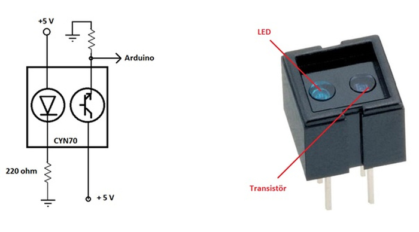
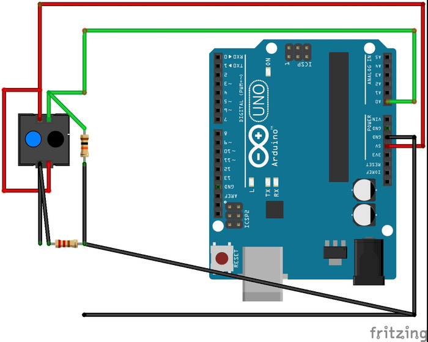
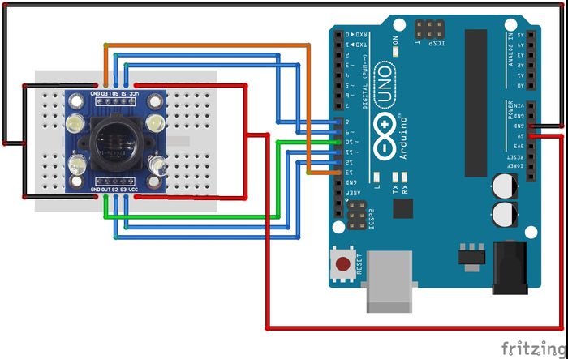

# 4. Arduino ile Renk Okuma

Fiziksel dünyada bulunan renkleri okumak için geliştirilmiş ve Arduino ile çalışabilen sensörler bulunmaktadır. Bu sensörlerden birisi CNY70'tir. Bu sensör 2-3 cm uzaktaki siyah ve beyaz renkleri ayırt etmek için kullanılır. Bu sensör genellikle çizgi takibi yapan robotlarda kullanılır. Siyah ve beyaz dışındaki renklerin algılanması için geliştirilmiş sensörler bulunmaktadır. TCS3200 bu sensörlere örnek olarak verilebilir.

Renk algılayan sensörler birçok projede kullanılabilir. Örnek olarak robot yarışmalarında farklı renkteki çöplerin ayrı ayrı toplanması için bu sensör kullanılmaktadır. Bu bölümde bu iki farklı sensörün nasıl kullanıldığını öğreneceğiz.

# 4.1. Arduino ile siyah ve beyaz rengi ayırma

Robot yarışmaları denildiğinde akla ilk gelen kategori çizgi izleyen robotlardır. Bu robotların yapıtaşını oluşturan kısım, siyah beyaz sensörüdür. Çizgi izleyen robotlar siyah ve beyaz zeminler üzerinde hareket etmektedir. Siyah ve beyaz renkleri ayırmak için uygulamalarda, CNY70 isimli sensör kullanılacaktır. Bu sensörü elektronik malzeme satan mağazalarda kolaylıkla bulabilirsiniz. Analog olarak çalışan çoğu siyah beyaz sensörü de CNY70 ile aynı mantıkta çalışmaktadır.

CNY70 üzerinde iki adet LED bulunmaktadır. Bu LED'lerden birisi kızılötesi ışık yayar. Yüzeye çarpan kızılötesi ışık, sensör üzerinde bulunan diğer LED'de toplanır. Toplanan kızılötesi ışığın şiddeti sensör tarafından ölçülür. Siyah ve beyaz renklerin kızılötesi ışığı yansıtma katsayıları farklı olduğu için, sensörden okunan farklı ışık şiddetleri Arduino tarafından siyah ve beyaz renk olarak algılanır. Sensör topladığı kızılötesi ışığın şiddetine göre analog bir çıkış verir. Bu yüzden CNY70 sensörü Arduino'nun analog girişlerine bağlanır.

**Hatırlatma:** Arduino, ADC yardımıyla analog sinyalleri dijital veriye çevirir.

CNY70 sensörünün bağlantıları aşağıdaki resimde gösterilmiştir. Devreyi breadboard üzerine kurmak için sensörü baklava dilimi şeklinde kullanmak bağlantı açısından kolaylık sağlamaktadır. Kızılötesi ışık yayan LED'in bağlantısına 220 ohm'luk bir direnç bağlanmıştır. Kızılötesi ışığı toplayan LED'e de 10K ohm değerinde pull-down direnç bağlanmıştır.

**Not:** Devre bağlantılarının doğru yapılıp yapılmadığını test etmek için, Android işletim sistemine sahip telefon kameraları kullanılabilir. Eğer sensör çalışıyorsa telefon kamerasında kızılötesi ışığı görebilirsiniz.





Aşağıdaki kodla öncelikle sensörden alınan analog sinyal dijital değere çevrilmiştir. Elde edilen dijital değer eşik gerilimiyle karşılaştırılmıştır. Eşik gerilimin üstüne siyah, altına beyaz renk denmiştir. Bu eşik değeri sensöre ve ortama göre değişmektedir. Seri Monitör'den okuduğunuz sensör değerlerine göre, siz de programınız için siyah ve beyaz ayrımı yapabilen bir eşik değeri bulabilirsiniz. Bulduğunuz eşik değerini kodda güncelleyerek Arduino ile siyah ve beyaz yüzeyleri ayırt edebilirsiniz.

```cpp
int referansDegeri = 800; /* siyah ve beyaz yuzeyin ayrimini yapan deger */
/* 
referansDegeri sensorden okunan degerlere gore yeniden belirlenmelidir.
Cunku bu deger ortama ve sensore gore degismektedir.
referansDegerini belirlemek icin siyah yuzeyde okunan deger ile beyaz yuzeyde okunan degerin ortalamasi alinabilir
*/
void setup()
{
  Serial.begin(9600); 
  /* veri yollamak icin seri haberlesmeyi 9600 baud rate hizinda baslattik */
}

void loop()
{
  int sensorDegeri = analogRead(A0); /* Sensorden gelen analog deger dijitale cevriliyor */
  Serial.print("sensorden okunan deger= ");
  Serial.print(sensorDegeri); /* Sensorden okunan deger ekrana yazdiriliyor. Bu degere gore referansDegeri ayarlanabilir */
  
  Serial.print("\t renk= ");
  if(sensorDegeri > referansDegeri){
    /* Sensorden okunan deger referansDegerinden buyuk ise renk siyahtir */
    Serial.println("siyah");
  }else{
    /* Sensorden okunan deger referansDegerinden kucuk ise renk beyazdir */
    Serial.println("beyaz");
  }
  delay(1000); 
}
```

## 4.2. Arduino ile tüm renklerin algılanması

TCS3200 tüm renkleri algılayabilen ve Arduino ile kolayca çalıştırılabilen bir renk sensörüdür. Piyasada TCS3200 benzeri sensörler bulunmaktadır. Bu sensörlerle TC3200 hemen hemen aynı görevi görmektedir. Aynı kodla benzer sensörleri kullanabilirsiniz.

TCS3200 sensörü renklerin ayırt edilmesi için kullanılan bir sensördür. Sensör 3 ana rengi okumasının yanı sıra 3 ana renk oranlarını da belirleyerek bu renklerin okunmasını sağlamaktadır. Bunun için üzerinde kırmızı, yeşil, mavi ve beyaz ışık bulunmaktadır. Arduino komutlarıyla bu 4 LED farklı zamanlarda belirli bir sırayla yanması sağlanır.

Yüzeye gönderilen ışığın yansıması, yüzeyin rengine bağlı olarak değişmektedir. Sensör tarafından bir yüzeye 4 farklı renkte ışık yollanmaktadır. Bu ışıkların yansımaları sensörün ortasında bulunan alıcı tarafından ölçülmektedir. Bu ölçüm sonucunda yüzeyin rengi, ölçüm oranlarına bağlı olarak algılanmaktadır.

Sensörün çalışma teorisini öğrendiğimize göre şimdi nasıl kullanıldığına bakalım. Sensör üzerinde bulunan S0 ve S1 pinleri LED'lerin çalışma frekansını belirlemektedir. S2 ve S3 pinleri ise sensör üzerindeki LED'lerden hangilerinin etkinleştirileceğini seçmektedir. Aşağıdaki tabloda bu pinlerin kullanımı gösterilmiştir.

|S0   |S1  |Frekans|S2  |S3  |Renk   |
|-----|----|-------|----|----|-------|
|0    |0   |-      |0   |0   |Kırmızı|
|0    |1   |1:50   |0   |1   |Mavi   |
|1    |0   |1:5    |1   |0   |Beyaz  |
|1    |1   |1:1    |1   |1   |Yeşil  |

Sensör üzerinde bulunan diğer pinlerden OUT pini ölçüm değerlerinin Arduino'ya aktarıldığı hattır. LED pini ise LED'lerin yanması veya sönmesi için kullanılan pindir. Sensörün VCC pini 5 volta, GND pini toprağa takılmalıdır.

# 4.3. Yüzey Renklerinin Algılanması 

Sensörün nasıl çalıştığını ve kullanıldığını öğrendiğimize göre küçük bir uygulamayla bu bilgilerimizi pekiştirelim. Uygulamada sensör tutulduğu yüzeyin rengini algılayarak seri port üzerinden bilgisayara aktarmaktadır. Bunun için öncelikle aşağıdaki devreyi kurunuz.



```cpp
/* Sensör pinleri tanımlanıyor */
int S0 = 8;
int S1 = 9;
int S2 = 12;
int S3 = 11;
int OUT = 10;
int LED = 13;

/* Renk yüzdeleri tanımlanıyor
Bu sayılar ortama göre değişiklik gösterebilir
Bu yüzden sensörü kalibre etmek için sensörden okuduğunuz değerler ile bu sayıları güncelleyiniz
Dizi elemanları sırasıyla sensörden ölçülen Kırmızı,Mavi ve Yeşil frekanslarını göstermektedir
*/
int RenkYuzdesi[5][3] = { {38,31,37}, // Sarı renk
                            {13,65,26}, // Mavi renk
                            {29,36,29}, // Beyaz renk
                            {64,31,22}, // Kırmızı renk
                            {23,34,45} }; // Yeşil renk
                            
String Renkler[5] = {"Sari", "Mavi", "Beyaz", "Kirmizi", "Yesil"};

/* Sensör hassasiyeti */
int aralik = 7;

/* Renk frekanslarının tutulduğu değişkenler */
int KirmiziYuzdesi, YesilYuzdesi, MaviYuzdesi;

void setup() {
  Serial.begin(9600);
  pinMode(S0,OUTPUT); 
  pinMode(S1,OUTPUT); 
  pinMode(S2,OUTPUT); 
  pinMode(S3,OUTPUT); 
  pinMode(LED,OUTPUT); 
  pinMode(OUT,INPUT); 
}

void loop() { 
  RengiTanimla();
  delay(1000);
}


void TCS3200_Ac() {
  digitalWrite(LED,HIGH); // switch LED on
  digitalWrite(S0,HIGH); // output frequency scaling (100%)
  digitalWrite(S1,HIGH);
  delay(5);
}

void TCS3200_Kapat() {
  digitalWrite(LED,LOW); // switch LED off
  digitalWrite(S0,LOW); // power off sensor
  digitalWrite(S1,LOW);
}

void Filtresiz() { 
  digitalWrite(S2,HIGH); // select no filter
  digitalWrite(S3,LOW);
  delay(5);
}

void KirmiziFiltre() { 
  digitalWrite(S2,LOW); // select red filter
  digitalWrite(S3,LOW);
  delay(5);
}

void YesilFiltre() { 
  digitalWrite(S2,HIGH); // select green filter
  digitalWrite(S3,HIGH);
  delay(5);
}

void MaviFiltre() { 
  digitalWrite(S2,LOW); // select blue filter
  digitalWrite(S3,HIGH);
  delay(5);
}


void RengiTanimla() {
  float BeyazFrekansi, KirmiziFrekansi, YesilFrekansi, MaviFrekansi;
  TCS3200_Ac();
  Filtresiz();
  BeyazFrekansi = float(pulseIn(OUT,LOW,40000)); 
  KirmiziFiltre();
  KirmiziFrekansi = float(pulseIn(OUT,LOW,40000)); 
  YesilFiltre();
  YesilFrekansi = float(pulseIn(OUT,LOW,40000)); 
  MaviFiltre();
  MaviFrekansi = float(pulseIn(OUT,LOW,40000)); 
  TCS3200_Kapat();
  KirmiziYuzdesi = int((BeyazFrekansi / KirmiziFrekansi) * 100.0);
  YesilYuzdesi = int((BeyazFrekansi / YesilFrekansi) * 100.0);
  MaviYuzdesi = int((BeyazFrekansi / MaviFrekansi) * 100.0); 
  
  RengiBul();
}

void RengiBul() {
    Serial.println("Renk Yuzdeleri");
    
    Serial.print("Kirmizi=");
    Serial.print(KirmiziYuzdesi);
    
    Serial.print("Mavi=");
    Serial.print(MaviYuzdesi);
    
    Serial.print("Yesil=");
    Serial.println(YesilYuzdesi);
    
    Serial.println();
    Serial.print("Okunan Renk=");
    
    int okunduMu=0;
    for(int renk =0; renk < 5; renk ++){
      if(KirmiziYuzdesi > RenkYuzdesi[renk][0] - 7 && KirmiziYuzdesi < RenkYuzdesi[renk][0] + 7 && 
         MaviYuzdesi > RenkYuzdesi[renk][1] - 7 && MaviYuzdesi < RenkYuzdesi[renk][1] + 7 && 
         YesilYuzdesi > RenkYuzdesi[renk][2] - 7 && YesilYuzdesi < RenkYuzdesi[renk][2] + 7 ){
         Serial.println(Renkler[renk]); 
         okunduMu=1;
         break;
      }
    }
    if(okunduMu == 0)
      Serial.println("Renk Algilanamadi");
      
    Serial.println();
    Serial.println();
}
```
Yukarıdaki kodlamada öncelikle renk aralıkları kalibre edilmelidir. Bu yüzden öncelikle kodu yükleyin. Beş renk için (sarı, mavi, beyaz, kırmızı, yeşil) ölçümleme yapınız. Ölçümde elde ettiğiniz sonuçları sırasıyla RenkYuzdesi değişkenine yazın. Bu noktadan sonra sensörünüz kullanıma hazırdır.

RengiTanıma fonksiyonu sensörün LED'lerini sırasıyla yakarak, sensör önünde bulunan cismin 3 ana renk için frekanslarını bulmaktadır. Bulunan renk frekansları RengiBul fonksiyonu içerisinde kullanılmaktadır. Bu fonksiyonda daha önceden kalibre edilmiş değerlerle ölçülen frekans değerleri karşılaştırılmaktadır. Bu karşılaştırma sonucunda hesaplanan renk ekrana yazdırılmaktadır.

Bu bölümde Arduino ile kullanılan renk sensörlerini incelemiş olduk. Eğer siyah ve beyaz rengin ayırt edilmesi proje için yeterliyse, daha hızlı ölçümler için CYN70 renk sensörü kullanılmalıdır. Ara renklerin de ölçülmesi gereken projelerde TCS3200 gibi tüm renkleri algılayabilen sensörler kullanılmalıdır.

