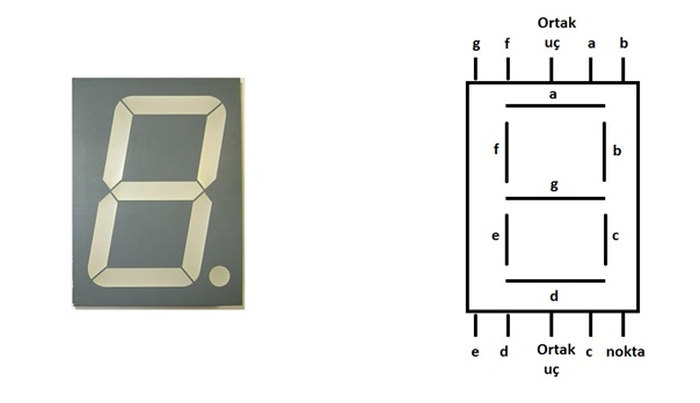
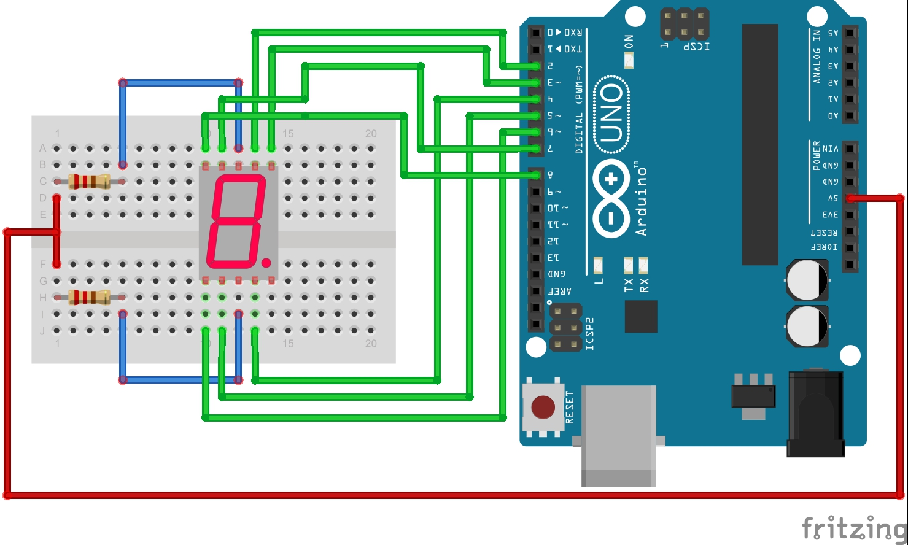
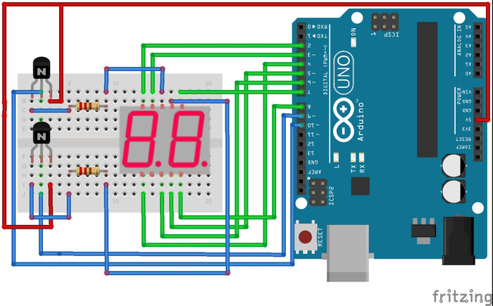
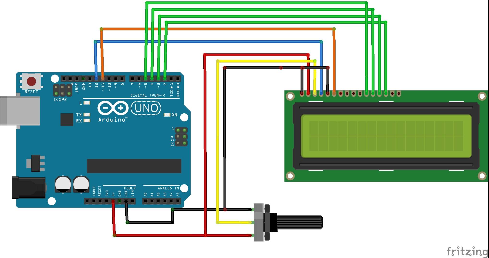

# 6. Arduino ile Gösterge Kullanımı 

Bu bölümde Arduino ile çalışabilen elektronik göstergeleri tanıyacağız ve bu göstergeler ile uygulamalar yapacağız. Eğitim kapsamında 7 segmentli göstergelerden ve 2x16 LCD ekranlardan yararlanacağız.

## 6.1. Arduino ile 7 segmentli gösterge kullanımı

Arduino projelerinde sayı bazlı çıktıların Bluetooth veya bilgisayara ihtiyaç duymadan gösterilmesi için 7 segmentli göstergeler kullanılır. Gösterge üzerinde bulunan ve ayrı ayrı kullanılabilen 7 çubuk LED bulunmaktadır. Bu yüzden bu göstergeye 7 segmentli gösterge denir. Gösterge üzerinde ondalıklı sayıların gösterimi için sağ altta nokta bulunmaktadır. Aşağıdaki resimde 7 segmentli gösterge ve göstergenin içi gösterilmiştir.



Bir sayının ekrana yazdırılması için a, b, c, d, e, f ve g harfleri ile temsil edilen çubuk LED'ler yakılır. Bu LED'lerin yanması için LED pinlerinin 5 Volt veya 0 Volta çekilmesi gerekir. LED'in yanması için 5 volta mı yoksa 0 volta mı çekilmesi gerektiği, göstergenin türüne göre değişmektedir. Anot göstergelerde ortak uç + 5 volta bağlanır ve yakılmak istenin LED'in pini 0 volt düzeyine çekilir. Katot türündeki bir göstergede ise tam tersi olarak ortak uç toprağa bağlanır ve yakılmak istenilen LED'in pini 5 Volt düzeyine çekilir.

Not: Elektronik parça satıcılarından gösterge almak istediğinizde size ilk olarak ortak anot mu yoksa ortak katot mu istediğiniz sorulur. Bu yüzden malzemeleri satın almadan önce kullanacağınız göstergenin türünü belirlemelisiniz.

LED çubuklarının fazla akım çekmemesi için ortak uçlara 220 ohm direnç takılmalıdır. Bu direnç LED'in üzerine düşen akımı düşürmektedir. Göstergenin kullanımını daha iyi anlamak için 0 ile 9 arasında sayan bir sayıcı yapalım.

### 6.1.1. Uygulama: 0-9 arasında sayan kronometre

Bu uygulamada 0 ile 9 arasında her saniye bir artan bir sayaç yapacağız. Devre bağlantılarının daha iyi anlaşılması için öncelikle yukarıda paylaşılan LED bağlantılarına tekrar bakınız. Arduino gösterge kullanımını kolaylaştırmak için hazır kütüphaneye sahiptir. Fakat öncelikle konunun daha iyi anlaşılması için kendi kodumuzu yazacağız.

Bu uygulamayı yapmak için ihtiyacınız olan malzemeler:

 * 1 x Arduino
 * 7 x 220 ohm direnç
 * 1 x 7 segmentli gösterge
 * 1 x Breadboard



```cpp
/*

Arduino -> Gösterge
 2	-> A
 3	-> B
 4	-> C
 5	-> D
 6	-> E
 7	-> F
 8      -> G
 VCC    -> Ortak Uç
 */

byte gosterge[10][7] = { { 0,0,0,0,0,0,1 },  // = 1
                         { 1,0,0,1,1,1,1 },  // = 0
                         { 0,0,1,0,0,1,0 },  // = 2
                         { 0,0,0,0,1,1,0 },  // = 3
                         { 1,0,0,1,1,0,0 },  // = 4
                         { 0,1,0,0,1,0,0 },  // = 5
                         { 0,1,0,0,0,0,0 },  // = 6
                         { 0,0,0,1,1,1,1 },  // = 7
                         { 0,0,0,0,0,0,0 },  // = 8
                         { 0,0,0,1,1,0,0 }   // = 9
                         };

void setup() {                
  pinMode(2, OUTPUT);   
  pinMode(3, OUTPUT);
  pinMode(4, OUTPUT);
  pinMode(5, OUTPUT);
  pinMode(6, OUTPUT);
  pinMode(7, OUTPUT);
  pinMode(8, OUTPUT);
  pinMode(9, OUTPUT);
}

void sayiyiYaz(byte sayi) {
  byte pin = 2;
  for (int i = 0; i < 7; i++) {
    digitalWrite(pin, gosterge[sayi][i]);
    pin ++;
  }
}

void loop() {
  for (int i = 0; i < 10; i ++) {
   sayiyiYaz(i); 
   delay(1000);
  }
}
```
Yukarıdaki kodu ile 0-9 arasında bir sayıcı yapmış olduk. Kod biraz incelenirse, tüm sayıların gosterge isimli değişken dizisinde tutulduğu görülmektedir. Bu diziden seçilen herhangi bir sayı kümesi (satır) kendi içerisinde hangi LED'lerin yakılacağını tutmaktadır. sayiyiYaz fonksiyonu ile seçilen yazdırılmak istenin sayının satırı gosterge dizisinden alınmaktadır. Daha sonra for döngüsü yardımıyla tüm LED girişleri sayının değerine göre 5 Volt veya 0 Volt düzeyine çekilmektedir.

Eğer elinizde Anot yerine Katot türünde bir gösterge var ise, gosterge dizisindeki tüm 0'ları 1, tüm 1'leri de 0 yapmalısınız. Ayrıca göstergenin ortak ucunu da toprağa bağlamayı unutmayınız.

Loop fonksiyonu for dögüsü içerisinde 0'dan 9'a kadar saymaktadır. Döngünün her değeri sayiyiYaz fonksiyonu içerisine aktarılmaktadır. Böylece sayılar gösterge üzerinde görünmektedir. "delay" fonksiyonu ile bir saniye bekleme sağlanmıştır.

## 6.2. 7 Segmentli Göstergede İki Haneli Sayıların Gösterilmesi

Çoğu projede tek haneli göstergeler yetersiz olmaktadır. Bu yüzden birden fazla haneyi barındıran göstergeler üretilmiştir. Kablo kalabalığını azaltmak için gösterge içerisinde LED çubuk pinleri haneler arasında birbirine bağlanmıştır fakat göstergenin ortak uçları haneler arasında birbirine bağlanmamıştır. Bu fark kullanılarak haneler ayrı ayrı kontrol edilebilmektedir.

Örneğin göstergeye 25 yazdırmak isteyelim. Bunun için öncelikle onlar hanesindeki sayı, 2 ele alınır. 2 sayısının karşılığı olan pinler 'digitalWrite' fonksiyonu ile ayarlandıktan sonra bu hanenin ortak ucu transistör yardımıyla iletime geçirilir. Böylece akım bizim belirttiğimiz LED çubukları üzerinden sadece ilk haneden geçerek devreyi tamamlar. Birler hanesini yani 5 sayısını yazdırmak için öncelikle 1. haneye bağlı transistör kapatılır. Daha sonra 5 sayısına karşılık gelen LED çubuk pinlerine çıkış verilir. Hemen ardından devrenin tamamlanması için bu haneye bağlı transistör iletime geçirilir.

Bu işlem toplamda 10 milisaniyede yapılmaktadır. Aslında gösterge üzerinde hiçbir hane aynı anda yanmasa bile, insan gözü sanki tüm haneler aynı anda yanıyormuş gibi görür. Konunun daha iyi anlaşılması için bir uygulama yapalım.

### 6.2.1. Uygulama: 0-99 arasında sayan kronometre

0 ile 99 arasında saymak için iki haneli gösterge kullanılacaktır. Bir önceki uygulamamızda gösterge mantığının anlaşılması için hazır kütüphane kullanılmamıştı. Daha hızlı kullanım için Arduino'nun hazır gösterge kütüphaneleri bulunmaktadır. İnternet üzerinde birçok gösterge kütüphanesi bulunmaktadır. Projede bu kütüphanelerden "SevenSeg" isimli olan kullanılacaktır. Diğer kütüphaneler de benzer mantıkla çalışmaktadır. Bu kütüphaneyi indirip Arduino'ya ekleyiniz.

**Hatırlatma:** Arduino kütüphaneleri dosya klasörü ile birlikte Arduino'nun yüklü olduğu dizindeki "libraries" klasörü içerisine kopyalanmalıdır.

Bu uygulamayı yapmak için ihtiyacınız olan malzemeler;

 * 1 x Arduino
 * 7 x 220 ohm direnç
 * 1 x 2 segmentli gösterge
 * 1 x Breadboard

```cpp
#include <SevenSeg.h>

/* gostergenin LED pinleri sirasi ile tanimlaniyor */
SevenSeg gosterge(2,3,4,5,6,7,8);

const int haneSayisi =2;
/* hanerli kontrol edecek transistörlerin pinleri */
int haneler[haneSayisi] = {
  9,10};
void setup()
{
  pinMode(2, OUTPUT);
  pinMode(3, OUTPUT);
  pinMode(4, OUTPUT);
  pinMode(5, OUTPUT);
  pinMode(6, OUTPUT);
  pinMode(7, OUTPUT);
  pinMode(8, OUTPUT);
  /* gösterge kuruluyor */
  gosterge.setDigitPins(haneSayisi,haneler);
}

unsigned long timer=0;
int i = 0;
void loop()
{
  if(millis() - timer >1000){
    i ++;
    timer = millis();
    if(i > 99)
      i = 0;
  }
  gosterge.write(i);
}
```


Bu kodla öncelikle "SevenSeg" kütüphanesi projeye dâhil edilmiştir. Bu projeden gosterge adında bir nesne üretilmiş ve göstergenin kontrol pinleri nesneye yüklenmiştir. Projede kaç haneli gösterge kullanılacağı tanımlanmış ve bu haneleri kontrol eden transistörlerin pinleri belirlenmiştir. Kullanılan göstergenin türü setCommonAnode() veya setCommonCathode() fonksiyonu ile belirtilmelidir.

Loop fonksiyonu içerisinde for döngüsü ile 0 – 99 arasındaki değerler i değişkenine aktarılmıştır. Bu değişkenin değerini göstergeye yazdırmak için write(i) fonksiyonu kullanılmıştır.

## 6.3. Arduino ile LCD Ekran Kullanımı 

Önceki uygulamalarımızda sonuçları görmek için, sayı tabanlı çıktıları 7 segmentli ekranlara ve diğer verileri de seri haberleşme ile başka cihazlara göndermiştik. Sonuçların kullanıcıya bilgisayar gibi bir ortama gerek kalmadan devre üzerinde göstermek için LCD ekranları kullanabilirsiniz.

LCD ekranın bağlantı kabloları dikkatlice takılmalıdır. Genellikle LCD uygulamalarında yapılan en büyük hata yanlış veya eksik takılan kablolardır. LCD üzerindeki pin sıralaması üretici firmaya göre değişiklik gösterebilir. Bu yüzden devre kurulumundan sonra LCD bağlantıları bir kere daha kontrol edilmelidir.

LCD ekran 5 volt ile çalışmaktadır. VCC ve GND bağlantıları buna göre yapılmalıdır. LCD'nin Vo bağlantısı, ekran üzerinde oluşacak karakterlerin görünürlüğünü ayarlamaktadır. Bu ayar ortama ve üretici firmaya göre değiştiği için Vo pini potansiyometreye bağlanır. Potansiyometrenin diğer iki ucu 5 volt ve GND'ye bağlanır. Böylece potansiyometre ile yazıların görünürlüğü ayarlanabilir. Eğer bu bağlantı düzgün bir şekilde yapılmaz ise ekran üzerinde görüntü oluşmayacaktır.



Yukarıdaki şemaya göre devrenizi dikkatlice kurduktan sonra programlama kısmına geçebilirsiniz. LCD ekrana yazı yazabilmeniz için kullanacağınız karakterler, daha önce Arduino geliştiricileri tarafından tanımlanmıştır. Tanımlanmış karakterleri kullanabilmeniz için öncelikle LCD kütüphanesini 'LiquidCrystal.h' projenize eklemelisiniz. Kütüphane eklendikten sonra LCD'ye bağlanan Arduino pinleri programda belirtilmelidir. Setup fonksiyonu içerisinde LCD türünü de belirttikten sonra LCD ekran kullanıma hazırdır.

Önemli LCD Fonksiyonları:

    **lcd.begin(sutun_sayisi, satir_sayisi):** LCD ekranın tanınması için setup fonksiyonu içerisinde kullanılır. LCD kurulumu için fonksiyona sütun ve satır sayısı eklenmelidir.
    **lcd.print("Hasbi Sevinc*"):** LCD ekrana yazı yazdırmak için kullanılır.
    **lcd.setCursor(sütun_sayısı, satır_sayısı):** LCD ekran üzerinde imlecin yerini ayarlamak için kullanılır. Sütun ve satır sayıları 0'dan başlamaktadır. Örneğin alt satıra inmek için fonksiyon içerisine (0,1) yazılmalıdır. Böylece imleç, 0. sütun ve 1. satıra gidecektir. İmlecin yeri ayarlandıktan sonra yazma işlemi, imlecin bulunduğu yerden başlar.
    **lcd.clear():** LCD ekranda yazan her şeyi siler ve imleci en başa alır.

Aşağıdaki kod ile LCD'yi test edebilirsiniz. Eğer tüm ayarlamalar doğru bir şekilde yapıldıysa, ekranda Arduino'nun çalışma süresi yazacaktır.

```cpp
#include <LiquidCrystal.h> /* LCD kullanimi icin kutuphane dahil edilmelidir */
/*
 Devre şeması;
 - LCD'nin RS pini -> Arduino'nun 12. pini
 - LCD'nin Enable (E) pini -> Arduino'nun 11. pini
 - LCD'nin D4 pini -> Arduino'nun 5. pini
 - LCD'nin D5 pini -> Arduino'nun 4. pini
 - LCD'nin D6 pini -> Arduino'nun 3. pini
 - LCD'nin D7 pini -> Arduino'nun 2. pini
 
 - LCD'nin R/W pini -> toprağa
 - LCD'nin R0 pini -> potansiyometre çıkışına
 - LCD VDD -> Arduino 5 Voltuna
 - LCD VSS -> toprağa
*/
LiquidCrystal lcd(12, 11, 5, 4, 3, 2); /* LCDnin baglandigi Arduino pinleri */

void setup() {
  lcd.begin(16, 2); /* Kullandigimiz LCDnin sutun ve satir sayisini belirtmeliyiz */
  lcd.print("Hasbi Sevinc"); /* Ekrana yazi yazalim */
}
void loop() {
  lcd.setCursor(0, 1); /* Imlecin yeri 1. satir 0. sutun olarak ayarlandi */
  /* Artik LCDye yazilanlar alt satirda gorunecektir */
  lcd.print(millis()/1000); /* LCDye Arduinonun calisma suresi saniye cinsinden yaziliyor*/
  /*
  millis() fonksiyonu Arduino calismaya basladiginda calisan bir Kronometredir. 
  Fonksiyon cagirildiginda gecen sureyi milisaniye olarak dondurur
  Ekrana gecen sureyi saniye cinsinden yazdirmak icin fonksiyonun degeri 1000e bolunmustur
  */  
}
```


