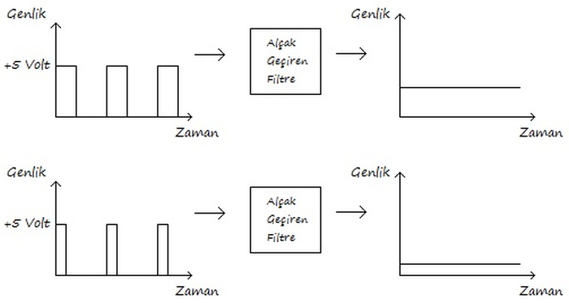
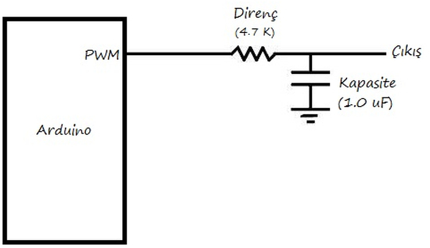
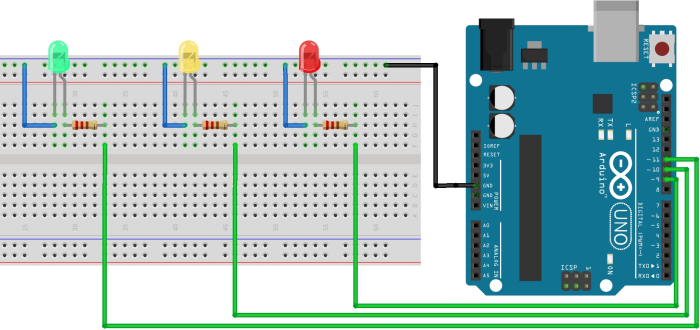

# 1. Arduino'da Analog Sinyal Üretme

Arduino pinlerinin çıkış olarak ayarlandığında 0 veya 5 volt verebildiğini daha önce öğrenmiştik. Arduino üzerinden 0 ile 5 volt arasında çıkış gerilimi verebilmek için analog sinyal üretmeliyiz. Bu sinyali Arduino'nun tüm pinleri üretememektedir. Bu sinyalin üretimi için seçilecek pinlerin PWM çıkışa sahip olması gerekir. Üretilen analog sinyalin genliğiyle motor hız kontrolü, LED parlaklığının ayarlanması gibi uygulamalar yapılmaktadır.

**Hatırlatma:** Kullandığınız kartın üzerindeki PWM çıkışları öğrenmek için Arduino'nun web sitesine bakabilirsiniz.

PWM sinyali daha önce servo motor kontrolünde öğrenmiştik. Arduino üzerinden üretilin analog sinyal aslında bir PWM sinyalidir. Analog çıkışın gerilimi, PWM sinyalinin görev zamanıyla (duty cycle) doğru orantılı olarak değişmektedir. Örneğin %50 görev zamanına sahip bir PWM sinyali üretildiğinde çıkış geriliminin 2,5 volt olduğu görülmektedir.

Aşağıdaki resimde PWM sinyalinin görev zamanıyla çıkış gerilimi arasındaki doğru orantı gösterilmiştir:



Her ne kadar analog çıkış denilse bile aslında bu pinlerden PWM sinyali üretildiği için, bazı uygulamalarda alçak geçiren filtre kullanılması gerekebilir. Alçak geçiren filtre, yüksek frekansa sahip sinyalleri süzerek sadece düşük frekanstaki sinyallerin kullanılmasını sağlar, yani sinyali yumuşatır. Bu filtre PWM sinyaline uygulandığında dalga tepeleri ve çukurlarını birleştirerek, dalga tepesi ve çukurları oranında sabit bir çıkış gerilimi sağlamaktadır.

Alçak geçiren filtrenin devre şeması aşağıdaki resimde gösterilmiştir. Bu filtredeki direnç ve kapasitenin değerine göre, filtrenin hassasiyeti değiştirilebilir.



Motorların hız kontrolü ve LED ışığın parlaklığının ayarlanması gibi projelerde alçak geçiren filtre kullanılmasına gerek yoktur. Bu filtre sadece kesin olarak sabit analog değere ihtiyaç duyan hassas uygulamalarda kullanılmaktadır.

Analog sinyalin üretilmesi için, daha önce temel Arduino fonksiyonlarında öğrendiğimiz analogWrite fonksiyonu kullanılır. Bu fonksiyon iki giriş değişkenine ihtiyaç duymaktadır. Bu değişkenlerden ilki analog çıkışın yapılacağı pini belirler. İkinci değişken ise çıkış geriliminin belirleyecek PWM sinyalinin görev zamanıdır. Buraya 0 ile 255 arasındaki değerler yazılır. Fonksiyona 0 değeri yollandığında bu pinden 0 volt, 255 değeri yollandığında 5 volt düzeyinde çıkış gerilimi alınır.

Çıkış gerilimi 0 - 255 değerleriyle doğru orantılı olarak değişmektedir. Örneğin, 3,3 volt çıkış gerilimine sahip olmak için fonksiyona 168 değeri yazılmalıdır. Bu sinyal Arduino'nun 10. pininden alınmak istenseydi fonksiyon analogWrite(10,168); şeklinde yazılırdı.

## 1.1. Değişken Parlaklığa Sahip LED Işık

Bu uygulamada, Arduino'ya bağlanan 3 farklı LED'in parlaklıkları üretilen analog sinyallerle ayrı ayrı kontrol edilmektedir. Arduino her 500 milisaniyede bir 1. LED'in parlaklığını azaltırken, 3. LED'in parlaklığını artırmaktadır. 2. LED'in parlaklığı ise 'LEDParlaklıgi' dizisindeki rastgele parlaklık değerlerine göre kontrol edilmektedir. Bu uygulamadaki amaç analogWrite fonksiyonuyla analog sinyalin nasıl üretildiğini öğrenmek ve fonksiyona verilen değerlerle sinyalin değişimini gözlemlemektir.

Bu uygulamayı yapmak için ihtiyacımız olan malzemeler:

 *   1 x Arduino
 *   1 x breadboard
 *   3 x LED
 *   3 x 220 ohm direnç



```cpp
/* LED pinleri 9,10,11 olarak belirlendi */
const int LED1= 9, LED2 = 10, LED3 = 11;

/*
LED Parlaklıklarının tutulduğu değişkenler tanımlandı
LED1 tam yanık pozisyona, LED3 tam sönük pozisyonda başlatılacak
LED2 rastgeleParlakliklar dizisinden parlaklık değerlerini alacak
*/
int LED1Parlakligi = 255,LED2Parlakligi=0,LED3Parlakligi = 0;

/* LED2 için rastgele parlaklık değerleri tanımlandı */
int rastgeleParlakliklar[20] = {182,183,10,125,152,102,88,6,95,1,245,178,224,227,74,62,196,177,254,116};

void setup()
{
  /* LED pinleri çıkış olarak ayarlandı */
  pinMode(LED1,OUTPUT);
  pinMode(LED2,OUTPUT);
  pinMode(LED3,OUTPUT);
}

void loop()
{
  /* LED1 parlaklığı LED1Parlakligi değişkeninin değeri olarak ayarlandı */
  analogWrite(LED1,LED1Parlakligi);
  /* LED1 parlaklığı bir azaltıldı */
  LED1Parlakligi --;
  /* Eğer LED1 parlaklığı 0'dan az olur ise tam yanık pozisyona ayarlandı */
  if(LED1Parlakligi < 0)
    LED1Parlakligi = 255;
    
  /* LED1 parlaklığı rastgeleParlakliklar dizisinin LED2Parlakligi. elemanın değeri olarak ayarlandı */
  analogWrite(LED2,rastgeleParlakliklar[LED2Parlakligi]);
  /* rastgeleParlakliklar dizisinin bir sonraki elemanına geçiş yapıldı */
  LED2Parlakligi ++;
  /* Dizi sınırlarından çıkılmaması için koşul eklendi */
  if(LED2Parlakligi>19)
    LED2Parlakligi = 0;
    
  /* LED3 parlaklığı LED1Parlakligi değişkeninin değeri olarak ayarlandı */
  analogWrite(LED3,LED3Parlakligi);
  /* LED3 parlaklığı bir azaltıldı */
  LED3Parlakligi ++;
  /* Eğer LED3 parlaklığı 0'dan az olur ise tam yanık pozisyona ayarlandı */
  if(LED3Parlakligi > 255)
    LED3Parlakligi = 0;
  
  
  delay(25);  
}
```
Yukarıda belirtildiği gibi devre kurulduktan sonra Arduino'ya kod yüklenmelidir. analogWrite fonksiyonuyla LED parlaklıkları istenilen değere ayarlanmıştır. Bu bölümde analogWrite fonksiyonu kullanılarak 0 ile 5 volt arasındaki gerilimlerin projelere uygun olarak nasıl üretildiğini öğrenmiş olduk.
