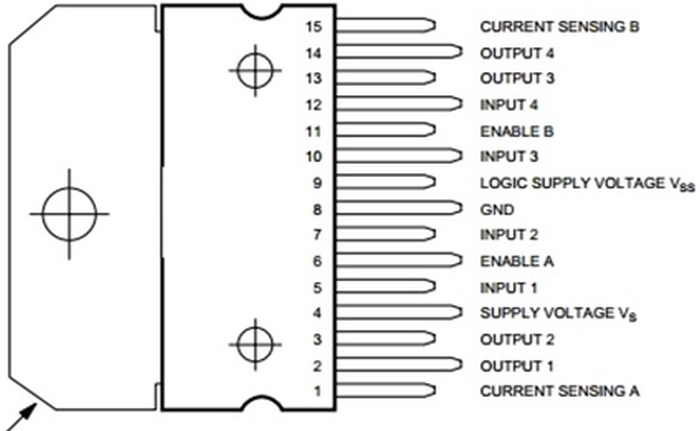
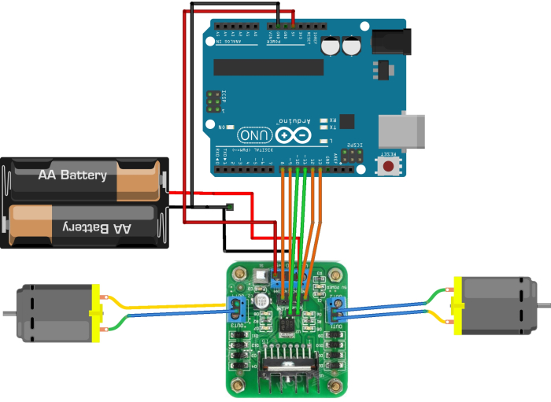
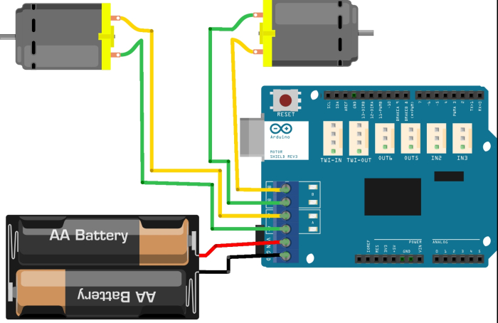

# 2. Arduino ile DC Motor Sürme

Arduino projeleri denildiğinde akla ilk gelen DC motorla kontrol edilen otonom araçlardır. Bu bölümde DC motorun Arduino ile nasıl kontrol edileceğini öğreneceğiz. DC motorun ileri veya geri dönmesinin yanında, dönme hızını da Arduino üzerinden kontrol edeceğiz. Arduino pinlerinden verilebilen akım motorları çalıştırmak için yeterli olmamaktadır. Bu yüzden DC motorlar, motor sürücülerle kullanılmalıdır. Motor sürücüsü kullanmadan doğrudan motoru Arduino'ya bağlamak, Arduino'nun pinlerine zarar verebilir.

DC motorları kullanmak için motor sürücüsünü hazır devre kartı olarak alabileceğiniz gibi kendiniz de devreyi kurabilirsiniz. Fakat devre üzerinde çok fazla bağlantı olduğu için, devreye yeni fonksiyonlar da eklendiğinde devre karışıklığı artmaktadır.

Sistemin nasıl çalıştığını kavrayabilmek için bir kereye mahsus olsa da devrenin hazır kart kullanılmadan kurulması yararlı olabilir. DC motorlar için Arduino pinlerinden çıkan akımı kuvvetlendirmek ve motorların hızını kontrol etmek için L298 entegresini kullanacağız. Benzer entegreler de aynı görevi yapmaktadır. L298 entegresinin en önemli özellikleri, 2 ampere kadar dayanabilmesi ve iki adet H köprüsünün bulunmasıdır.

**Not:** H Köprüsü DC motorların ileri ve geri yönde hareket etmesini sağlayan devredir. Devrede 2 adet NPN ve 2 adet PNP transistör bulunur.


## 2.1. L298 entegresiyle motor sürücü kartının yapımı

L298 entegresinde 15 adet pin bulunmaktadır. Bu pinlerden bazıları motorlara, bazıları Arduino'ya bazıları ise besleme kaynağına bağlanacaktır. L298 entegresinin pinleri aşağıdaki resimde gösterilmiştir.



Entegre üzerinde bulunan pinlere ve bu pinlerin görevlerine kısaca göz atalım:

    **INPUT 1, 2, 3 ve 4 (5, 7, 10 ve 12. pinler):** INPUT pinleri motorların dönme yönünün kontrolü için Arduino'ya bağlanır. INPUT 1 ve 2 pinleri 1. motorun, INPUT 3 ve 4 pinleri ise 2. motorun kontrolünde kullanılır. Örneğin 1. Motorun kontrolü için, INPUT 1 pini 5 volt, INPUT 2 pini 0 volt yapılır ise motor ileri yönde dönmeye başlar. Eğer INPUT 1 pini 0 volt ve INPUT 2 pini 5 volt yapılır ise motor geri yönde dönmeye başlar. İki pinin aynı anda 5 volt olması motoru kilitleyerek fren yapmasını sağlar. İki pininde 0 volt düzeyinde olması ise motorun boşta olmasına neden olup kısa süre sonra motorun durmasını sağlar.

    **OUTPUT 1, 2, 3 ve 4 (2, 3, 13 ve 14. pinler):** Bu pinler motorlara bağlanan pinlerdir. OUTPUT 1 ve 2. pinler 1. Motora, OUTPUT 3 ve 4. pinler ise 2. motora bağlanır.

    **ENABLE A ve ENABLE B (6. ve 11. pinler):** Bu iki pin motorların dönüş hızını ayarlamak için kullanılır. Bu yüzden bu pinleri Arduino'nun PWM ayaklarına bağlamamız gerekir. PWM sinyalinin görev zamanına göre motorun hızı arttırılabilir veya azaltılabilir. ENABLE A pini 1. motorun, ENABLE B pini ise 2. motorun hızını kontrol etmek için kullanılır. Eğer hız kontrolü yapılmayacak sa bu pinler 5 volt hattına bağlanabilir.

**Hatırlatma:** PWM sinyali daha önce öğrendiğimiz gibi bir kare sinyaldir. Bu sinyalin 5 volt ve 0 volt düzeylerinin oranına görev zamanı denir. Görev zamanı çıkış sinyalinin genliğini belirlediği için motorların dönme hızını ayarlamada kullanılır. Motorlar için PWM sinyalini üretmek için Arduino'nun analogWrite fonksiyonunu kullanacağız.

    **VSS (LOGIC SUPPLY voltAGE – 9. pin):** Adından da anlaşıldığı gibi bu pinin 5 volta bağlanması gerekmektedir. Devrenin kararsızlığını azaltmak için bu pinle toprak arasına 100nF'lık kondansatör bağlanabilir.

    **GND (8. pin):** Besleme hattının devreyi tamamlayabilmesi için bu pin toprak hattına bağlanması gerekir. Ayrıca entegrenin üzerindeki demir de GND pinine bağlıdır. Bu metalin devre kurulumunda yanlış pinlere değip kısa devre yapmamasına özen göstermek gerekir.

    **VS (4. pin):** Entegrenin motorlara vereceği enerjiyi aldığı ana besleme hattıdır. Bu hatta bağlanacak enerji kaynağı motorlara verileceği için, motorlarımızın özelliğine göre besleme gerilimi kullanmalıyız. Genellikle bu hatta 7 ila 12 volt arasında besleme kaynakları bağlanmaktadır.

Entegre üzerinde bulunan pinlerin görevlerini öğrendiğimize göre motor sürücü devresini kurabiliriz. Devreyi test etmek için öncelikle breadboard üzerinde devre elemanını yerleştirip kablo bağlantılarını yapalım. Devre için kullanılacak Arduino kodu, konunun ilerleyen kısmında paylaşılacaktır. Devrenizin hatasız olarak çalıştığından emin olduktan sonra devrenizi delikli pertinaks üzerine kurabilirsiniz.

Yukarıda anlatılan tüm işlemler ilk defa motor sürücüsüyle tanışanlar için anlatılmıştır. Her projede tekrardan motor sürücüsünü kurmak hem zahmetli olmakta, hem de devrenin fonksiyonları arttığında karmaşıklığı arttırmaktadır. Bu yüzden piyasada bulunan hazır motor sürücüleri kullanmak daha mantıklıdır. Fakat hazır motor sürücüler kullanılsa bile sistemin nasıl çalıştığının bilinmesinde fayda vardır.

Piyasada Arduino üzerine direkt olarak takılabilen shield sürücüler bulunduğu gibi, harici olarak pinle Arduino'ya bağlanabilen motor sürücüler de bulunur. İki motor sürücü türü de aynı işlemi yapmaktadır. Shield tarzı motor sürücülerin kullanımı daha kolaydır, fakat fiyatları diğer motor sürücülere göre daha fazladır.

## 2.2. Harici Motor Kullanımı

Shield motor sürücülere göre daha ucuz olduğu için harici motor sürücüler proje bütçesine göre tercih edilebilmektedir. Harici motor sürücüler, bu bölümde gösterilen kendinizin kurabileceği motor sürücülerin hazır kart şekline getirilmiş halidir. Bu sürücülerde INPUT, OUTPUT, ENABLE ve besleme pinleri bulunur. INPUT pinleri daha önce öğrendiğimiz gibi yön kontrolünde, ENABLE pinleri motorların dönme hızını kontrol etmede kullanılır.

Motor sürücüsünün nasıl çalıştığını bildiğimize göre kablo bağlantılarını yapmaya başlayabiliriz. Motorlara enerji sağlayacak besleme 7-12 volt arasındaki besleme kaynaklarına bağlanmalıdır. Mantıksal besleme 5 volt hattına ve GND ise toprak hattına bağlanmalıdır. INPUT pinleri Arduino'nun çıkış pinlerine; ENABLE pinleri ise Arduino'nun PWM çıkış verebilen pinlerine bağlanmalıdır. Motor pinleri sürücü yanlarında bulunan OUTPUT pinlerine bağlanmalıdır.

Not: Motorun ileri gitmesi beklenirken geri yönde dönmesi, OUTPUT pinlerinin ters bağlanmış olduğundan kaynaklanmaktadır. Bu pinlerin yerleri değiştirilerek motorların doğru yönde dönmesi sağlanabilir.

Motor sürücü bağlantısını aşağıdaki gibi yapınız.



Resimde yapılan kablo bağlantıları aşağıdaki tablolarda gösterilmiştir.


|Arduino| 	Motor Sürücü|
|-------|---------------|
|8      |INPUT 1        |
|9 	    |INPUT 2        |
|13 	|INPUT 3        |
|12 	|INPUT 4        |
|11 	|ENABLE A       |
|10 	|ENABLE B       |

|Motor 	 |Motor Sürücü|
|--------|------------|
|Motor1 +|OUTPUT 1    |
|Motor1 -|OUTPUT 2    |
|Motor2 +|OUTPUT 3    |
|Motor2 -|OUTPUT 4    |

(Motorun + veya – ucunun hangisi olduğu farketmez)

|Besleme      |Motor Sürücü|
|-------------|------------|
|+12 volt     |VCC         |
|Toprak (- uç)|GND         |
|+5 volt 	  |VS          |

Devre kurulumunu yaptığımıza göre aşağıdaki kodu Arduino'ya yükleyerek devremizi test edelim. Kendi motor sürücüsünü kurmuş olanlar da aşağıdaki Arduino kodunu kullanabilirler.

```cpp
int DonmeHizi = 175; 
/* bu değişken ile motorların dönme hızı kontrol edilebilir */

/* motor sürücüsüne bağlanacak INPUT ve ENABLE pinleri belirleniyor */
const int sagileri = 9;
const int saggeri = 8;
const int solileri = 12;
const int solgeri = 13;
const int solenable = 11;
const int sagenable = 10; 

void ileri(int hiz){
/* ilk değişkenimiz sag motorun ikincisi sol motorun hızını göstermektedir.
 * motorlarımızın hızı 0-255 arasında olmalıdır.
 * Fakat bazı motorların torkunun yetersizliğiniden 60-255 arasında çalışmaktadır.
 * Eğer motorunuzdan tiz bir ses çıkıyorsa hızını arttırmanız gerekmektedir.
*/
 analogWrite(sagenable, hiz); /* sağ motorun hız verisi */
 digitalWrite(sagileri,HIGH); /* ileri dönme sağlanıyor */
 digitalWrite(saggeri,LOW); /* ileri dönme sağlanıyor */
 
 analogWrite(solenable, hiz); /* sol motorun hız verisi */
 digitalWrite(solileri, HIGH); /* ileri dönme sağlanıyor */
 digitalWrite(solgeri,LOW); /* ileri dönme sağlanıyor */
}

void sagaDon(int hiz){
 analogWrite(sagenable, hiz); /* sağ motorun hız verisi */
 digitalWrite(sagileri,LOW); /* geri dönme sağlanıyor */
 digitalWrite(saggeri,HIGH); /* geri dönme sağlanıyor */
 
 analogWrite(solenable, hiz); /* sol motorun hız verisi */
 digitalWrite(solileri, HIGH); /* ileri dönme sağlanıyor */
 digitalWrite(solgeri,LOW); /* ileri dönme sağlanıyor */
}

void solaDon(int hiz){
 analogWrite(sagenable, hiz); /* sağ motorun hız verisi */
 digitalWrite(sagileri,HIGH); /* ileri dönme sağlanıyor */
 digitalWrite(saggeri,LOW); /* ileri dönme sağlanıyor */
 
 analogWrite(solenable, hiz); /* sol motorun hız verisi */
 digitalWrite(solileri, LOW); /* geri dönme sağlanıyor */
 digitalWrite(solgeri,HIGH); /* geri dönme sağlanıyor */
}

void geri(int hiz){ 
 analogWrite(sagenable, hiz); /* sağ motorun hız verisi */
 digitalWrite(sagileri,LOW); /* geri yönde dönme sağlanıyor */
 digitalWrite(saggeri, HIGH); /* geri yönde dönme sağlanıyor */
 
 analogWrite(solenable, hiz); /* sol motorun hız verisi */
 digitalWrite(solileri, LOW); /* geri yönde dönme sağlanıyor */
 digitalWrite(solgeri, HIGH); /* geri yönde dönme sağlanıyor */
}
 
void dur()
{
  /* Tüm motorlar kitlenerek durma sağlanıyor */
  digitalWrite(sagileri, HIGH);
  digitalWrite(saggeri, HIGH);
  digitalWrite(solileri, HIGH);
  digitalWrite(solgeri, HIGH);
}

void setup(){
/* motorları kontrol eden pinler çıkış olarak ayarlanıyor */
pinMode(sagileri,OUTPUT);
pinMode(saggeri,OUTPUT);
pinMode(solileri,OUTPUT);
pinMode(solgeri,OUTPUT);
pinMode(sagenable,OUTPUT);
pinMode(solenable,OUTPUT);
}

void loop(){
  ileri(DonmeHizi);
  delay(1000);
  dur();
  delay(1000);
  solaDon(DonmeHizi);
  delay(1000);
  dur();
  delay(1000);
  sagaDon(DonmeHizi);
  delay(1000);
  dur();
  delay(1000);
  geri(DonmeHizi);
  delay(1000);
  dur();
  delay(1000);
}
```
Yukarıdaki kodla motorlar dönmeye başlamalıdır. Eğer motorların dönmesinde bir sorun var ise, öncelikle kablo bağlantılarınızı gözden geçiriniz. INPUT pinleri hatalı bağlanmış olabilir, birbiri arasında yerlerini değiştirmeyi deneyebilirsiniz. Motorun ileri yönde dönmesi beklenirken geri yönde dönüyorsa motor bağlantılarının yerini değiştirebilirsiniz.

Bu bölümde Arduino ile DC motor kontrolünün nasıl yapıldığını öğrenmiş olduk. Motor kontrolü için gereken motor sürücülerin türlerini ve kendimiz nasıl motor sürücü yapacağımızı da öğrendik. Artık hareket gerektiren projelerimizde motor sürücüler yardımıyla DC motorlarımızı kullanabiliriz.

## 2.3. Motor Shield Kullanımı 

Öncelikle motor shield'ı Arduino kartının üzerine takınız. Takma işleminden sonra Arduino pinlerine shield yokmuş gibi, shield üzerindeki pinlerden ulaşabilirsiniz fakat bu pinlerden bazıları motor sürücüde kullanıldığı için başka işlemler için kullanılamaz. Motor sürücüsü Arduino'nun Dijital pinlerinden 3, 8, 9, 11, 12 ve 13; analog pinlerden A0 ve A1'i kullanmaktadır. Bu pinlerinde kullanım amaçları aşağıdaki tabloda gösterilmiştir.

|Görev 	    |A motoru 	|B motoru|
|-----------|-----------|----------|
|Yön 	    |Dijital 12 |Dijital 13|
|Hız (PWM)  |Dijital 3  |Dijital 11|
|Fren 	    |Dijital 9  |Dijital 8 |
|Akım ölçümü|Analog 0   |Analog 1  |

Fark edildiği gibi normal motor sürücülerden farklı olarak tek pinle ileri ve geri yön kontrolü yapılmaktadır. Yön pinlerinin 5 volt yada 0 volt olmasına göre motor ileri veya geri yönde dönmektedir. Fren pini ise motorun durmasını sağlamaktadır.

Örneğin motorlardan birini harekete geçirmek için öncelikle motorun döneceği yönü belirlemek için yön pinini 5 volt veya 0 volt düzeyine çekmeliyiz. İleri yönde dönmesi için bu pin 5 volt, geri yönde dönmesi için 0 volt düzeyine getirilmelidir. Yön ayarlandıktan sonra motorun dönmesi için fren pini 0 volt düzeyine getirilmelidir. Motorun hızının ayarlanması için hız pinine analogWrite fonksiyonuyla 0-255 arasında hız bilgisi gönderilmelidir.

Shield doğrudan Arduino üzerine takıldığı için harici olarak devre kurulmasına gerek kalmamaktadır. Motor ve besleme bağlantısını aşağıdaki resimde gösterildiği gibi shield üzerine bağlanmalıdır.



Motor shield Arduino üzerine şekildeki gibi yerleştirildikten ve pin bağlantıları resimdeki gibi yapıldıktan sonra Arduino programlanabilir. Aşağıdaki programla iki motor ayrı ayrı kontrol edilmiştir. Program çalıştığında iki motor da 1 saniye boyunca ileri yönde dönmektedir. Daha sonra motorlar 1 saniye boyunca fren yapmakta ve bir saniye sonunda iki motor farklı yönlerde dönmeye başlamaktadır.

**Dikkat!** Aşağıdaki Arduino kodu sadece motor shield'larla çalışmaktadır. Diğer motor sürücüler için Arduino kodu konunun ilerleyen bölümlerinde paylaşılacaktır.

```cpp
int DonmeHizi = 175; 
/* bu değişken ile motorların dönme hızı kontrol edilebilir */

void ileri(int hiz){
  /* A motoru ileri yönde dönmesi için ayarlanıyor */
  digitalWrite(12, HIGH); /* ileri yön ayarı yapıldı */
  digitalWrite(9, LOW);   /* fren kapatıldı */
  analogWrite(3, hiz);   /* dönme hızı ayarlandı */
  
  /* B motoru ileri yönde dönmesi için ayarlanıyor */
  digitalWrite(13, HIGH); /* ileri yön ayarı yapıldı */
  digitalWrite(8, LOW);   /* fren kapatıldı */
  analogWrite(11, hiz);   /* dönme hızı ayarlandı */
}

void solaDon(int hiz){
  /* A motoru geri yönde dönmesi için ayarlanıyor */
  digitalWrite(12, LOW); /* geri yön ayarı yapıldı */
  digitalWrite(9, LOW);   /* fren kapatıldı */
  analogWrite(3, hiz);   /* dönme hızı ayarlandı */
  
  /* B motoru ileri yönde dönmesi için ayarlanıyor */
  digitalWrite(13, HIGH); /* ileri yön ayarı yapıldı */
  digitalWrite(8, LOW);   /* fren kapatıldı */
  analogWrite(11, hiz);   /* dönme hızı ayarlandı */
}

void sagaDon(int hiz){
  /* A motoru ileri yönde dönmesi için ayarlanıyor */
  digitalWrite(12, HIGH); /* ileri yön ayarı yapıldı */
  digitalWrite(9, LOW);   /* fren kapatıldı */
  analogWrite(3, hiz);   /* dönme hızı ayarlandı */
  
  /* B motoru geri yönde dönmesi için ayarlanıyor */
  digitalWrite(13, LOW); /* geri yön ayarı yapıldı */
  digitalWrite(8, LOW);   /* fren kapatıldı */
  analogWrite(11, hiz);   /* dönme hızı ayarlandı */
}

void geri(int hiz){
  /* A motoru geri yönde dönmesi için ayarlanıyor */
  digitalWrite(12, LOW); /* geri yön ayarı yapıldı */
  digitalWrite(9, LOW);   /* fren kapatıldı */
  analogWrite(3, hiz);   /* dönme hızı ayarlandı */
  
  /* B motoru geri yönde dönmesi için ayarlanıyor */
  digitalWrite(13, LOW); /* geri yön ayarı yapıldı */
  digitalWrite(8, LOW);   /* fren kapatıldı */
  analogWrite(11, hiz);   /* dönme hızı ayarlandı */
}

void dur(){
  digitalWrite(9, HIGH);   /* fren yapıldı */
  digitalWrite(8, HIGH);   /* fren yapıldı */
}

void setup() {
  /* A motorunun ayarları */
  pinMode(12, OUTPUT); /* yön pini çıkış olarak ayarlandı */
  pinMode(9, OUTPUT); /* Fren pini çıkış olarak ayarlandı */

  /* B motorunun ayarları */
  pinMode(13, OUTPUT); /* yön pini çıkış olarak ayarlandı */
  pinMode(8, OUTPUT); /* Fren pini çıkış olarak ayarlandı */
}

void loop(){
  ileri(DonmeHizi);
  delay(1000);
  dur();
  delay(1000);
  solaDon(DonmeHizi);
  delay(1000);
  dur();
  delay(1000);
  sagaDon(DonmeHizi);
  delay(1000);
  dur();
  delay(1000);
  geri(DonmeHizi);
  delay(1000);
  dur();
  delay(1000);
}
```