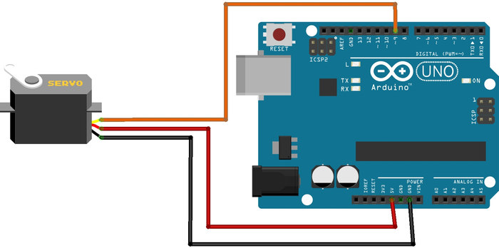
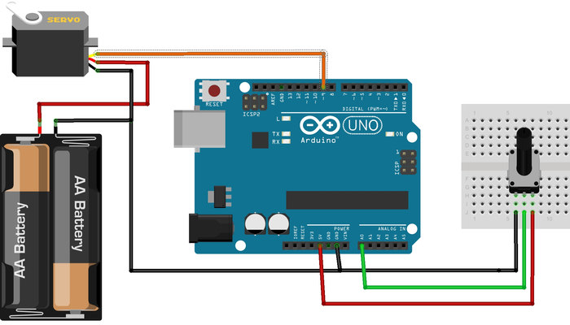

# 3. Servo Motor

Servo motor 0 ila 180 derece arasında 1 derece hassasiyetle dönebilen motor çeşididir. Tam tur atamaz. Genellikle robot kol gibi tam tur dönmesine gerek olmayan, hassas açılı yerlerde kullanılır. Servo motor içerisinde bir adet DC motor bulunur. DC motorun ucuna bağlı dişli sisteminin yardımıyla servo mili daha fazla yük kaldırabilmektedir. Bu işlem sırasında servonun dönüş hızı da yavaşlamış olur. Kullanılan dişli sistemine göre servo motorların kaldırabileceği yük değişir.

Servoların kaldırabileceği yük tork gücü üzerinden ifade edilir. Servo motorların torku, motor miline bağlı 1 cm uzunluğundaki çubuğun kaldırabileceği maksimum yük olarak tarif edilir. Piyasada bulunan servolar genellikle 1,4 kgf.cm torka sahiptir. Bu da demek oluyor ki, motor milinize bağlı 1 cm uzunluğunda bir çubuk varsa ve bu çubuğun ucuna bağlı yük 1,4 kilogramdan fazlaysa motorunuzun gücü mili döndürmeye yetmez. Eğer çubuğun uzunluğu 10 cm ise en fazla 140 gram kaldırabilirsiniz.

Kaliteli dişli sistemine sahip daha güçlü servo motorlar da vardır. Projede kullanılacak servo motorun seçimi, taşıyacağı maksimum yüke göre yapılmalıdır.

Servo motorun üç adet bağlantı kablosu bulunmaktadır. Bu kablolar genellikle kırmızı, turuncu (bazen sarı) ve siyah (bazen kahverengi) olmaktadır. Bu renkler kabloların görevini göstermektedir. Kırmızı renk besleme (genellikle 5 volt) bağlantısını, siyah veya kahverengi renk de toprak bağlantısını göstermektedir. Geriye kalan turuncu kablo ise motorun açısını belirleyecek olan veri bağlantısıdır. Motorun dönüş açısının belirlenmesi için veri hattı üzerinden PWM adı verilen özel kare dalga sinyalleri yollanmaktadır. PWM sinyali belirli bir süre 5 volt, belirli bir süre 0 volt düzeyinde verilen gerilimdir. 5 volt düzeyinde geçen süreye "görev zamanı", toplam süreye de "PWM periyodu" denir. Servo motorun kontrolü için ayarlanmış özel görev zamanları ve PWM periyotları vardır. Bu ayarlar dışındaki PWM sinyalleri servo motoru düzgün çalıştıramaz.



Arduino’da servo motor kontrolü için özelleştirilmiş PWM pinleri bulunmaktadır. PWM pin sayısı Arduino’nun türüne göre değişmektedir. Bu pinlerin yanında dalga (~) işareti bulunmaktadır.

Servo motor kontrolü için öncelikle Servo.h kütüphanesini projemize eklemeliyiz. Servo kütüphanesi eklendikten sonra Servo nesnesi kullanılarak yeni servo motorlar tanımlanır. Tanımlanan servo motorın bağlı olduğu pinler seçilir ve servo kullanıma hazır hale getirilir. Motor milinin konumunu değiştirmek için Servo nesnesinin attach metodu kullanılır. Bu metodun içerisine motor milinin gitmesi istenilen 0-180 derece arasında açı yazılır. Servonun yeni konumunu alması biraz zaman alabilir. Bu yüzden bekleme (Delay) komutu kullanılmalıdır.

```cpp
#include <Servo.h>  /* Servo kutuphanesi projeye dahil edildi */
Servo servoNesnesi;  /* servo motor nesnesi yaratildi */

void setup()
{
  servoNesnesi.attach(9);  /* Servo motor 9 numarali pine baglandi */
}
 
void loop()
{
  servoNesnesi.write(100);  /* Motorun mili 100. dereceye donuyor */
  delay(1000);
  servoNesnesi.write(20);   /* Motor mili 20. dereceye donuyor */
  delay(1000);
}
```

Servo gibi mekanik içyapıya sahip elektronik elemanların kullanımına dikkat edilmelidir. Bu elemanlar zorlanmalara bağlı olarak fazla akım çekebilir. Besleme kaynağının fazla akımlar için yeterli olmasına dikkat edilmelidir.

Servo motorun teknik bilgilerinde önerilen besleme geriliminden fazlası, motorun iç yapısına ve dişli sistemine zarar verebilir. Bu yüzden servo motora önerilen besleme geriliminden (genellikle 5 volt) fazlası verilmemelidir. Servo motor ve benzeri mekanik elemanların fazla akım çekmesinden dolayı, bu elemanların besleme ve toprak bağlantıları arasına kapasitör konmalıdır. Böylece devremiz, bu elemanların yaratacağı gerilim dalgalanmalarından korunmuş olur.

## 3.1. Uygulama: Potansiyometreyle servo motor kontrolü

Potansiyometrenin ve servo motorun nasıl kullanıldığını öğrenmiştik. Bu uygulamada, servo motoru potansiyometreyle kontrol edeceğiz. Potansiyometrenin dönmesiyle değişien gerilimi servonun dönebilmesi için 0 ila 180 derece arasında çevireceğiz. Böylece potansiyometrenin döndürülme oranında servo motor da dönecektir.

Eğer projede motor gibi fazla akım çekebilecek elemanların kullanılması gerekiyorsa bu elemanları Arduino üzerinden beslemek doğru değildir. Bu yüzden fazla akım çekebilecek elemanlar genellikle Arduino üzerinden değil, harici bir kaynak üzerinden beslenir. Uygulamada servo motor Arduino üzerinden değil, harici bir pil (yaklaşık 5 volt) üzerinden beslenecektir. Arduino ve harici besleme kaynağının toprak hatları birbirine bağlanmalıdır. Aksi halde motor düzgün çalışmayacaktır.



```cpp
#include <Servo.h> /* Servo kutuphanesi projeye dahil edildi */
 
Servo servoMotor;  /* servo motor nesnesi yaratildi */
 
int Potansiyometre = A0; /* Potansiyometre pini belirlendi*/
int PotDeger; /* Potansiyometre degeri icin degisken olusturuldu */
 
void setup() 
{ 
  servoMotor.attach(9); /* Servo motor 9 numarali pine baglandi */
} 
 
void loop() 
{ 
  PotDeger = analogRead(Potansiyometre);  /* Potansiyometrenin cikis gerilimi olculuyor */
  PotDeger = map(PotDeger, 0, 1023, 0, 179);  
  /* 
  Potansiyometreden olculen 0 ve 1023 arasindaki deger map fonksiyonu ile 
  Servo motorun calisma araligina yani 0 ve 180 dereceye cevriliyor.
  Bu fonksiyon 0 ve 1023 arasindaki degerleri, lineer olarak 0 ve 180 arasina cevirir
  */
  servoMotor.write(PotDeger); /* Hesaplanan deger servo motora yollaniyor*/ 
  delay(15);  /* Motorun konumunu almasi icin bir sure bekleniyor */ 
}

```


