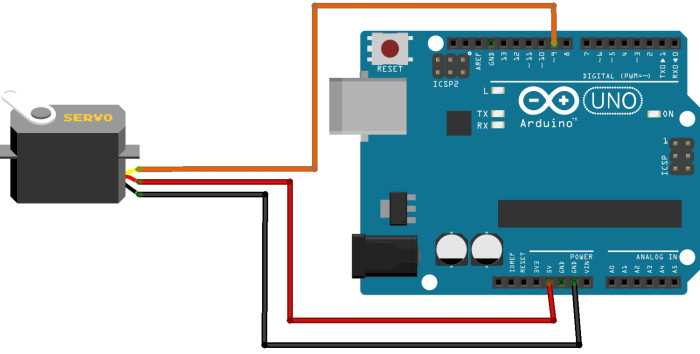

# 4. Dahili EEPROM Nedir ve Nasıl Kullanılır?

EEPROM, ihtiyacımız olan değişken verilerini tutabilen, elektriksel olarak bu verileri yazıp silebilen küçük depolama birimidir. Arduino'nun mikroişlemcisinde dâhili olarak bulunan EEPROM'a verilerimizi kaydedebilir, istediğimiz zaman bu verileri tekrar kullanabiliriz.

Arduino'nun enerjisi kesilse dahi EEPROM'daki veriler silinmez. Bu özellikten dolayı Arduino'nun çalışmaya başladığında ilk olarak yapması gereken önemli işlerin verileri bu alanda depolanır. EEPROM depo alanı, Arduino'nun üzerinde bulunan mikroişlemcinin türüne göre değişmektedir. ATmega328'in 1024 byte, ATmega168 ve ATmega8'in 512 byte, ATmega1280 ve ATmega2560'ın ise 4 kb depolama alanı vardır. Bu alanlar projelerimiz için yeterli olacak. Yeterli olmadığı durumlarda hafıza alanının artırılması için harici EEPROM'lar da kullanılabilir.

Uygulamalarda Arduino'nun dâhili EEPROM'u kullanılacaktır. Bunun için öncelikle EEPROM.h kütüphanesini projemize dâhil etmeliyiz. EEPROM kütüphanesini dâhil etmemizle artık EEPROM'a yazma ve EEPROM'dan okuma fonksiyonlarını kullanabiliriz. EEPROM'a veri yazmak için "EEPROM.write" fonksiyonu kullanılır.

Bu fonksiyon veri olarak sırasıyla EEPROM'da kaydedilecek adresi ve kaydedilmesi gereken veriyi almaktadır. EEPROM'a kaydedilecek adres kullanıcı tarafından belirlenmektedir. Böylece kullanıcı kaydettiği verinin hangi adreste olduğunu bilmektedir. İhtiyaç olunduğunda bu verinin geri alınması için "EEPROM.read" fonksiyonu kullanılır. Bu fonksiyon veri olarak EEPROM'un okunmak istenen adresini almaktadır.

```cpp
#include <EEPROM.h> /* EEPROM fonksiyonları için kütüphane dahil edilmelidir. */

int kayitAdresi , kaydedilecekVeri; 
int okunacakAdres, okunanVeri;

void setup()
{
 Serial.begin(9600); /* Bilgisayara veri göndermek için */
}

void loop()
{
 /* EEPROMa veri kaydediyoruz */
 kayitAdresi = 10; /* Verinin yazılacağı EEPROM adresi */ 
 kaydedilecekVeri = 50; /* EEPROMA kaydedilecek veri */
 EEPROM.write(kayitAdresi, kaydedilecekVeri); /* EEPROMun 10 adresine 50 verisi yazdırıldı. */
 delay(10);
 
 /* EEPROMa kaydedilmiş verileri okuyalım */
 okunacakAdres = 10; // 10 adresini okuyacağız
 okunanVeri = EEPROM.read(okunacakAdres ); /* EEPROMun 10 adresindeki veri okunanVeri değişkenine aktarılıyor. */
 delay(10);
 
/* Sonuçlar bilgisayar ekranına yazdırıldı */
 Serial.print("EEPROMun ");
 Serial.print(okunacakAdres);
 Serial.print(" Adresindeki Deger= ");
 Serial.print(okunanVeri);
 Serial.println();
 delay(1000); // biraz bekleyelim
}
```
 
## 4.1. Uygulama: Kaldığı yeri hatırlayan servo motor

Servo motorlar tek yönlü PWM sinyaliyle kontrol edilir. Bu kontrolün tek yönlü olması nedeniyle Arduino'ya geri bilgi gelmez. Arduino servo motoru kontrol ettikten sonra kapatılıp açılırsa, servo motorun en son hangi konumda kaldığını hatırlayamaz. Bu durum bazı projeler için sorun teşkil edebilir. Servo motorun en son konumunu Arduino'ya hatırlatmak için, servoyu kontrol ettikten sonra Arduino'nun EEPROM'una en son yollanan açıyı kaydedeceğiz. Böylece Arduino'nun gücü kesilip tekrar başlatılsa bile, servo motor en son konumundan başlayacak.

EEPROM kullanmanın yaratacağı fark görülmesi için aşağıda verilen ilk kodda EEPROM kullanılmamıştır. İkinci kodda son açı EEPROM'a kaydedilmiş ve servonun kaldığı yerden çalışması sağlanmıştır.

Bu uygulamayı yapmak için ihtiyacımız olan malzemeler:

 *   1 x Arduino
 *   1 x Servo motor



```cpp
#include <Servo.h>

Servo servoMotor;

int servoAcisi = 1;
int donusYonu = 0; /* 0 ise servo ileri, 1 ise geri yönde dönmektedir. */

void setup()
{
  servoMotor.attach(9); /* Servo Arduinonun 9 numaralı pinine takıldı */
  Serial.begin(9600);
}

void loop()
{                         
  servoMotor.write(servoAcisi); /* Servo motoru kontrol ediyoruz */              

  if(donusYonu == 0){ /* Motor ileri yönde donuyorsa */
    servoAcisi = servoAcisi + 5; /* 5 derece döndürelim */
    Serial.println(servoAcisi);
    
    if(servoAcisi > 179){ /* Motor ileri yönde sona ulaştıysa */
       servoAcisi = 179;
       donusYonu = 1; /* Geri yönde dönmeye basla */   
    }
  }else{ /* Motor geri yönde donuyorsa */
    servoAcisi = servoAcisi - 5; /* 5 derece geri don */
    Serial.println(servoAcisi);
    if(servoAcisi < 1){ /* Motor geri yönde sona ulaştıysa */
       servoAcisi = 1;
       donusYonu = 0; /* ileri yönde dönmeye basla */
    }
  }
  
  delay(15); /* Motorun konumunu alması için biraz bekleme */
}
```
Aşağıdaki kodda yukarıdaki koddan farklı olarak açı ve yön bilgisi EEPROM'a kaydedilmiştir. İlk kodda Arduino'yu motor herhangi bir konumdayken kapatıp tekrar açtığınızda, motor hareketine en baştan başlamaktadır. Aşağıdaki kodda açı ve yön bilgisi EEPROM'a kaydedildiği için Arduino'nun gücü kesilse bile, Arduino'ya tekrar güç verildiğinde servo motor kaldığı yerden çalışmaya devam edecektir.

EEPROM diğer projelerde de benzer mantıkla kullanılabilir.
```cpp
#include <Servo.h>
#include <EEPROM.h>

Servo servoMotor;

int servoAcisi;
int donusYonu = 0; /* 0 ise servo ileri, 1 ise geri yönde dönmektedir. */

void setup()
{
  servoMotor.attach(9); /* Servo Arduinonun 9 numaralı pinine takıldı */
  
  servoAcisi = EEPROM.read(1); /* Servonun kaldığı yer EEPROMdan alınıyor */
  if(servoAcisi < 1 || servoAcisi > 179){ /* EEPROMda servo açısı yerine başka bir veri varsa */
    servoAcisi = 1; /* Motor ilk konumuna donsun */
  }
  donusYonu = EEPROM.read(0);
  if(donusYonu != 1 && donusYonu != 0){ /* EEPROMda dönüş yönü yerine başka bir veri varsa */
    donusYonu = 0;  /* Motor ileri yönde donsun */
  }
}
void loop()
{                         
  servoMotor.write(servoAcisi); /* Servo motoru kontrol ediyoruz */              
  EEPROM.write(1,servoAcisi); /* Son açıyı EEPROMa kaydediyoruz */
  
  if(donusYonu == 0){ /* Motor ileri önde donuyorsa */
    servoAcisi = servoAcisi + 5; /* 5 derece döndürelim */
    if(servoAcisi > 179){ /* Motor ileri yönde sona ulaştıysa */
       servoAcisi = 179;
       donusYonu = 1; /* Geri yönde dönmeye basla */   
       EEPROM.write(0,donusYonu); /* Yon bilgisi EEPROMa kaydedildi */
    }
  }else{ /* Motor geri yönde donuyorsa */
    servoAcisi = servoAcisi - 5; /* 5 derece geri don */
    if(servoAcisi < 1){ /* Motor geri yönde sona ulaştıysa */
       servoAcisi = 1;
       donusYonu = 0; /* ileri yönde dönmeye basla */
       EEPROM.write(0,donusYonu); /* Yon bilgisi EEPROMa kaydediliyor */
    }
  }
  
  delay(15); /* Motorun konumunu alması için biraz bekleme */
}
```
 