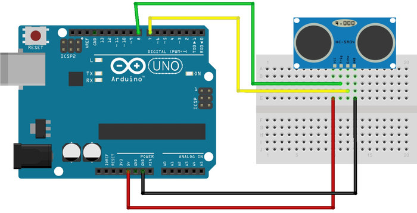
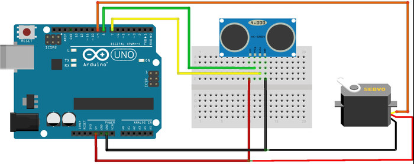

# 5. Arduino ile Uzaklık Ölçümü

Uygulamalarda uzaklık ölçümü için HC-SR04 ultrasonik uzaklık sensörü kullanılacaktır. Bu sensör elektronik/robotik malzeme satan mağazalarda kolaylıkla bulunabilir.  Sensör üzerinde giriş ve çıkış olmak üzere iki yüzey bulunmaktadır. Çıkış yüzeyinden ortama belirli bir frekansta ultrasonik ses dalgası salınır. Giriş yüzeyi de çıkış yüzeyinin ortama saldığı belirli frekanslardaki ses dalgalarını toplar. Uzaklık ölçümü için öncelikle çıkış yüzeyinden ortama ses dalgası salınır. Salınan ses dalgası 15 derece açıyla ortamda yayılır. Yayılan ses dalgası bu alanda bulunan bir cisme çarptığında, cisim yüzeyinden sensöre geri yansır. Yansıyan dalganın giriş yüzeyine gelmesiyle işlem tamamlanır. Dalganın çıkış yüzeyinden çıkmasıyla giriş yüzeyine ulaşması arasında geçen süre ölçülerek, cismin uzaklığı hesaplanır. Bu basit mantıkla çalışan sensör, 2 cm ile 200 cm arasındaki uzaklıkları 1 cm hassasiyetle ölçebilmektedir. Sensör bu aralık dışındaki uzaklıkları istikrarlı olarak ölçememektedir.

Sensör üzerinde VCC, Trig, Echo, GND olmak üzere 4 adet pin bulunmaktadır. Bunlardan VCC pini besleme (5 volt), GND pini toprak hattıdır. Trig pini çıkış yüzeyinden dalganın salınmasını sağlayan pindir. Echo pini ise giriş yüzeyine yansıyan dalganın ulaştığını Arduino'ya haber veren pindir. Açıklamalardan da anlaşıldığı gibi Arduino'da trig pini çıkış, echo pini ise giriş olarak ayarlanmalıdır.

Aşağıdaki resimde sensörün Arduino bağlantılarını görebilirsiniz.



Arduino ve uzaklık sensörünün bağlantıları resimdeki gibi yapıldıysa, kodlama kısmına başlayabiliriz.

İlk olarak setup fonksiyonu içerisinde sensörün trig ve echo pinleri ayarlanmalıdır. Sensör önündeki cismin uzaklığını ölçmesi için trig pini aktif yapılmalıdır. Daha önceden bu pinin aktif kalma ihtimalinden dolayı öncelikle pin LOW durumuna getirilmelidir. Kısa bir süre bekledikten sonra trig pini 10 mikro saniye boyunca HIGH konumuna tutulmalıdır. 10 mikro saniye sonunda pin, tekrardan LOW konumuna getirilmelidir. Böylece çıkış yüzeyinden ses dalgası salınmış oldu. Salınan dalga sensörün önündeki bir cisme çarptığında giriş yüzeyine yansıyacaktır. Dalga giriş yüzeyine ulaştığında sensör otomatik olarak echo pinini HIGH konumuna getirecektir. Echo pininin HIGH konumuna gelme süresi pulseIn fonksiyonuyla ölçülür. Ölçülen süre 14,55'e bölünerek cismin uzaklığı ölçülür. Uygulamada sensör yardımıyla ölçülen uzaklığın kullanıcı tarafından görülmesi için, uzaklık bilgisi seri haberleşmeyle bilgisayara aktarılmaktadır.

```cpp
int trigPin = 6; /* Sensorun trig pini Arduinonun 6 numaralı ayağına bağlandı */
int echoPin = 7;  /* Sensorun echo pini Arduinonun 7 numaralı ayağına bağlandı */

long sure;
long uzaklik;

void setup(){
  pinMode(trigPin, OUTPUT); /* trig pini çıkış olarak ayarlandı */
  pinMode(echoPin,INPUT); /* echo pini giriş olarak ayarlandı */
  Serial.begin(9600); /* Seri haberlesme baslatildi */
}
void loop()
{
  digitalWrite(trigPin, LOW); /* sensör pasif hale getirildi */
  delayMicroseconds(5);
  digitalWrite(trigPin, HIGH); /* Sensore ses dalgasının üretmesi için emir verildi */
  delayMicroseconds(10);
  digitalWrite(trigPin, LOW);  /* Yeni dalgaların üretilmemesi için trig pini LOW konumuna getirildi */ 
  sure = pulseIn(echoPin, HIGH); /* ses dalgasının geri dönmesi için geçen sure ölçülüyor */
  uzaklik= sure /29.1/2; /* ölçülen sure uzaklığa çevriliyor */            
  if(uzaklik > 200)
    uzaklik = 200;
  Serial.print("Uzaklik ");  
  Serial.print(uzaklik); /* hesaplanan uzaklık bilgisayara aktarılıyor */
  Serial.println(" CM olarak olculmustur.");  
  delay(500); 
}
```
 
## 5.1. Uygulama: Kısa menzilli radar yapımı

Uygulamada yeni öğrendiğimiz uzaklık sensörünü servo motorun üzerine bağlayarak, 0-180 derece arasındaki cisimlerin uzaklığını bulan basit bir radar yapacağız. Bunun için servo motoru 10 derecelik açılarla döndürüp, o açıdaki maksimum uzaklığı ölçeceğiz. Uzaklığı daha kolay ölçebilmek için bu uygulamamızda "mesafeOlcumu” fonksiyonunu tanımlayacağız. Servonun 10'ar derecelik açılarla dönmesini sağlayabilmek için 2 tane for döngüsü kullanılacaktır. Her 10 derecelik açılardaki maksimum uzaklıklar bilgisayardan görüntülenebilmesi için seri port yardımıyla USB üzerinden bilgisayara yollanacaktır.

Bu uygulamayı yapmak için ihtiyacımız olan malzemeler:

 *   1 x Arduino
 *   1 x Breadboard
 *   1 x HC-SR04 (ultrasonik uzaklık sensörü)
 *   1 x Servo motor



```cpp
#include <Servo.h> 

const int trigPin = 8; /* Sensorun trig pini Arduinonun 6 numaralı ayağına bağlandı */
const int echoPin = 7;  /* Sensorun echo pini Arduinonun 7 numaralı ayağına bağlandı */

Servo radarServosu; 

int aci = 0;

long mesafeOlcumu(){
  long sure;
  long uzaklik;
  digitalWrite(trigPin, LOW); /* sensor pasif hale getirildi */
  delayMicroseconds(5);
  digitalWrite(trigPin, HIGH); /* Sensöre ses dalgasının üretmesi için emir verildi */
  delayMicroseconds(10);
  digitalWrite(trigPin, LOW);  /* Yeni dalgaların üretilmemesi için trig pini LOW konumuna getirildi */ 
  sure = pulseIn(echoPin, HIGH, 11600); /* ses dalgasının geri dönmesi icin gecen sure ölcülüyor */
  uzaklik= sure /29.1/2; /* ölçülen sure uzaklığe çevriliyor */     
  if(uzaklik > 200 || uzaklik < 1 )
    uzaklik = 200;
  return uzaklik;
}

void ekranaYazdir(int aciDegeri, long uzaklikDegeri){
    Serial.print("aci= ");
    Serial.print(aciDegeri);
    
    Serial.print("uzaklik= ");
    Serial.println(uzaklikDegeri);
}

void setup(){
  pinMode(trigPin, OUTPUT); /* trig pini cikis olarak ayarlandi */
  pinMode(echoPin,INPUT); /* echo pini giris olarak ayarlandi */
  
  radarServosu.attach(9);
  
  Serial.begin(9600); /* Seri haberleşme başlatıldı */
}

void loop()
{
  for(aci = 0; aci < 180; aci += 10) /* radarımız 0dan 180 kadar 10ar 10ar dönecektir */
  { 
    radarServosu.write(aci); /* radari donduruyoruz */
    delay(15); /* radarin donmesini bekliyoruz */
    ekranaYazdir(aci, mesafeOlcumu());
  } 
  for(aci = 180; aci>=1; aci-=10) /* radarımız 180dan 0 kadar 10ar 10ar dönecektir */
  {                                
    radarServosu.write(aci); /* radarı donduruyoruz */
    delay(15); /* radarın dönmesini bekliyoruz */
    ekranaYazdir(aci, mesafeOlcumu());
  } 
}
```

Eğer sensörün ölçüm mesafesi içinde engel yoksa, sensörde bir miktar yavaşlama olmaktadır. Bu durumdan kurtulmak için, eğer sensörün önünde engel yoksa zaman aşımına uğraması için pulseIn fonksiyonunu güncelledik. Böylece belirli bir uzaklıkta engel yoksa sistem beklemeden çalışmaya devam edecektir. PulseIn fonksiyonuna yazılan 2895 değeri sensöre ve ortama göre değişiklik gösterebilir.