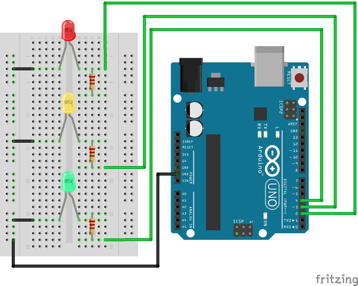
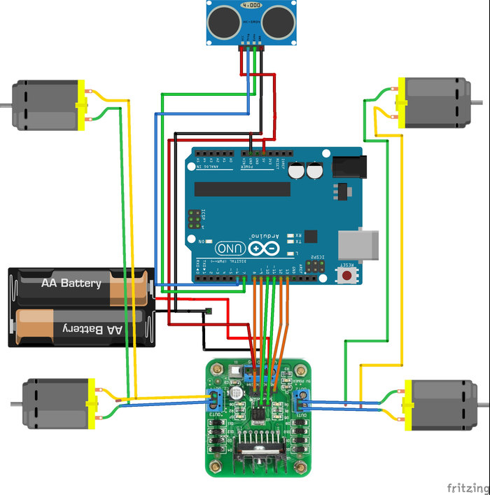
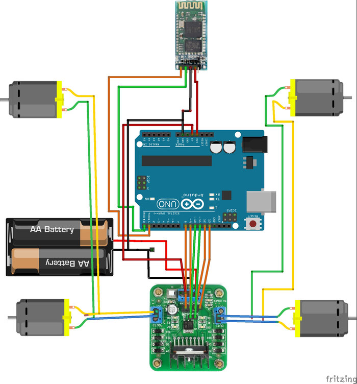
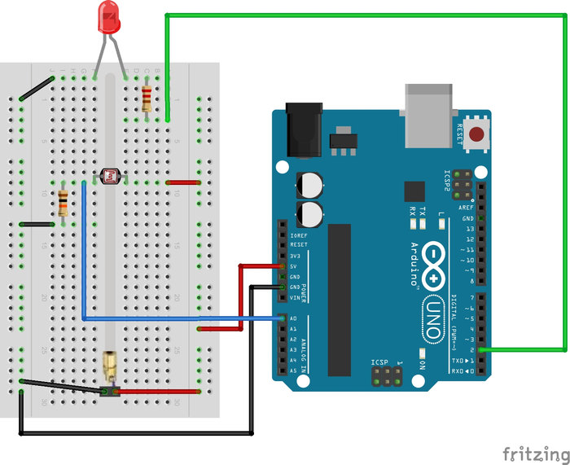

# 6. Genel Arduino Uygulamaları

Arduino ile en çok kullanılan fonksiyon ve özellikleri önceki yazılarımızda öğrendik. Artık öğrendiklerimizle uygulamalar yapmaya başlayabiliriz. Bu bölümde yapacağımız uygulamalar kolaydan zora doğru gitmektedir. Bölümde gösterilen uygulamaların, ilk etapta incelenmesi ve denenmesi, daha sonra da üzerinde değişiklikler yapılarak yeni projelerin üretilmesi, Arduino kullanımını pekiştirecektir.

## 6.1. Trafik Lambaları

Arduino pinlerinin kontrolünü pekiştirmek için her gün gördüğümüz trafik lambalarını Arduino ile yapacağız. Arduino pinlerine bağlanan kırmızı, sarı ve yeşil LED'ler trafik lambalarının sırasına göre kontrol edilecek. Buna göre program ilk başta kırmızı ışığı yakacak. Kırmızı ışık 5 saniye yandıktan sonra sönecek ve 1 saniye boyunca sarı ışık yanacak. Sarı ışık söndükten sonra da 3 saniye boyunca yeşil ışık yanacak.

Proje devresini kurmak için bağlantılarınızı aşağıdaki gibi yapınız:



Yukarıdaki devreyi kurduktan sonra Arduino'ya aşağıdaki kodu yükleyiniz.

```cpp
/* LEDlerin bağlı olduğu pinler tanımlandı */
const int kirmizi = 2,sari = 3,yesil = 4;

void setup()
{
  /* LED pinleri çıkış olarak ayarlandı */
  pinMode(kirmizi,OUTPUT);
  pinMode(sari,OUTPUT);
  pinMode(yesil,OUTPUT);
}

/* Sadece kırmızı ışığı yakan fonksiyon */
void kirmiziIsik(){
  digitalWrite(kirmizi,HIGH);
  digitalWrite(sari,LOW);
  digitalWrite(yesil,LOW); 
}

/* Sadece sarı ışığı yakan fonksiyon */
void sariIsik(){
  digitalWrite(kirmizi,LOW);
  digitalWrite(sari,HIGH);
  digitalWrite(yesil,LOW); 
}

/* Sadece yeşil ışığı yakan fonksiyon */
void yesilIsik(){
  digitalWrite(kirmizi,LOW);
  digitalWrite(sari,LOW);
  digitalWrite(yesil,HIGH); 
}

void loop()
{
  kirmiziIsik();
  delay(5000);
  
  sariIsik();
  delay(1000);
  
  yesilIsik();
  delay(3000);
}
```
Bu uygulamada tek bir trafik lambası için kodlama ve devre tasarımı yapıldı. Kendinizi geliştirmek için, yukarıda paylaşılan koda eklemeler yaparak birden fazla trafik lambasını tek bir Arduino üzerinden kontrol edebilirsiniz.

## 6.2. Çarpmayan Robot Yapımı

Bu uygulamada hemen hemen tüm robot yarışmalarındaki robotlarda kullanılan, engellerden kaçma algoritması üzerine çalışacağız. Bunu yapabilmek için önceki konularda öğrendiğimiz DC motor kontrolü ve ultrasonik uzaklık sensörü ile uzaklık ölçümünü kullanacağız. Bu uygulamada öğrenilen bilgiler, robot yarışmalarında bulunan çöp toplama, labirent çözme, yangın söndürme gibi kategorilerde kullanılabilir.

Bu projede yapılacak olan 4 tekerli robot hareket için 4x4 şeklinde, her bir tekere bağlanan DC motorlardan oluşacak. Bu motorların kontrolü için DC motor sürücüsü kullanacağız. Uzaklık ölçümü için HC-SR04 ultrasonik uzaklık sensörü kullanacağız.

Arduino sürekli olarak uzaklık sensöründen gelen uzaklık verisini kontrol edecek. Eğer ölçülen uzaklık verisi 10 cm'den kısa ise robot durdurulacaktır. Robot engelden kaçmak için yaklaşık 90 derece sola dönecektir. Eğer sola döndükten sonra önünde herhangi bir engel yoksa ilerlemeye devam edecektir. Önüne yeni bir engel geldiğinde robot, tekrar bu işlemleri yapacaktır. Böylece robotumuz engellere çarpmadan ilerleyebilecek.

Bu uygulamayı yapmak için ihtiyacınız olan malzemeler:

 *   1 x Arduino
 *   4 x Tekerlek
 *   1 x Robot şasesi
 *   4 x DC motor
 *   1 x DC motor sürücüsü
 *   1 x HC-SR04 uzaklık sensörü



Devre şemasında görüldüğü gibi aynı tarafta bulunan iki DC motor birbirine paralel olarak bağlanmıştır. Böyle bağlanmasının nedeni bu motorun her zaman için aynı şekilde dönecek olmasıdır. Eğer ayrı ayrı bağlanması istenseydi, o zaman iki adet DC motor sürücüye ihtiyaç duyulurdu. Uzaklık sensörü robotun en önüne takılmıştır. Uzaklığın doğru olarak bulunması için robotun hiçbir parçası sensörün görüş açısında bulunmamalıdır. Resimdeki devreyi robot şasesine bağlayarak Arduino programlamaya başlayabiliriz.

Resimde gösterilen devre şemasının kablo bağlantıları aşağıdaki tablolarda gösterilmiştir:

|Arduino 	|Motor Sürücü|
|-----------|------------|
|8 	        |INPUT 1     |
|9 	        |INPUT 2     |
|13 	    |INPUT 3     |
|12 	    |INPUT 4     |
|11 	    |ENABLE A    |
|10 	    |ENABLE B    |

|Motor 	 |Motor Sürücü|
|--------|------------|
|Motor1 +|OUTPUT 1    |
|Motor1 -|OUTPUT 2    |
|Motor2 +|OUTPUT 3    |
|Motor2 -|OUTPUT 4    |

(Motorun + veya – ucunun hangisi olduğu farketmez)

|Besleme 	  |Motor Sürücü|
|-------------|------------|
|+12 Volt 	  |VCC         |
|Toprak (- uç)|GND         |
|+5 Volt 	  |VS          |

|Arduino 	  |HC-SR04 Uzaklık Sensörü|
|-------------|-----------------------|
|+5 Volt 	  |VCC                    |
|6 	          |Trig                   |
|7 	          |Echo                   |
|Toprak (- uç)|GND                    |

Devre kurulumunu gerçekleştirdikten sonra aşağıdaki kodu Arduino'ya yükleyelim

```cpp
const int trigPin = 6; /* Sensorun trig pini Arduinonun 6 numarali ayagina baglandi */
const int echoPin = 7;  /* Sensorun echo pini Arduinonun 7 numarali ayagina baglandi */

int DonmeHizi = 175;
/* bu değişken ile motorların dönme hızı kontrol edilebilir */
int DonmeZamani = 250;
/* DonmeZamani değişkeni robotun 90 derece dönmesini sağlayan değişkendir
 * Robotun yaklaış 90 derece dönmesi için robotunuza göre bu süreyi ayarlayın 
 */ 

/* motor sürücüsüne bağlanacak INPUT ve ENABLE pinleri belirleniyor */
const int sagileri = 9;
const int saggeri = 8;
const int solileri = 12;
const int solgeri = 13;
const int solenable = 11;
const int sagenable = 10;

/* Uzaklık ölçümünün yapılacağı fonksiyon */
long mesafeOlcumu(){
  long sure;
  long uzaklik;
  digitalWrite(trigPin, LOW); /* sensor pasif hale getirildi */
  delayMicroseconds(5);
  digitalWrite(trigPin, HIGH); /* Sensore ses dalgasinin uretmesi icin emir verildi */
  delayMicroseconds(10);
  digitalWrite(trigPin, LOW);  /* Yeni dalgalarin uretilmemesi icin trig pini LOW konumuna getirildi */

  sure = pulseIn(echoPin, HIGH, 11600); /* ses dalgasinin geri donmesi icin gecen sure olculuyor */
  uzaklik= sure /29.1/2; /* olculen sure uzaklige cevriliyor */


  return uzaklik;
}

void ileri(int hiz){
  /* ilk değişkenimiz sag motorun ikincisi sol motorun hızını göstermektedir.
   * motorlarımızın hızı 0-255 arasında olmalıdır.
   * Fakat bazı motorların torkunun yetersizliğiniden 60-255 arasında çalışmaktadır.
   * Eğer motorunuzdan tiz bir ses çıkıyorsa hızını arttırmanız gerekmektedir.
   */
  analogWrite(sagenable, hiz); /* sağ motorun hız verisi */
  digitalWrite(sagileri,HIGH); /* ileri dönme sağlanıyor */
  digitalWrite(saggeri,LOW); /* ileri dönme sağlanıyor */

  analogWrite(solenable, hiz); /* sol motorun hız verisi */
  digitalWrite(solileri, HIGH); /* ileri dönme sağlanıyor */
  digitalWrite(solgeri,LOW); /* ileri dönme sağlanıyor */
}

void sagaDon(int hiz){
  analogWrite(sagenable, hiz); /* sağ motorun hız verisi */
  digitalWrite(sagileri,LOW); /* geri dönme sağlanıyor */
  digitalWrite(saggeri,HIGH); /* geri dönme sağlanıyor */

  analogWrite(solenable, hiz); /* sol motorun hız verisi */
  digitalWrite(solileri, HIGH); /* ileri dönme sağlanıyor */
  digitalWrite(solgeri,LOW); /* ileri dönme sağlanıyor */
}

void solaDon(int hiz){
  analogWrite(sagenable, hiz); /* sağ motorun hız verisi */
  digitalWrite(sagileri,HIGH); /* ileri dönme sağlanıyor */
  digitalWrite(saggeri,LOW); /* ileri dönme sağlanıyor */

  analogWrite(solenable, hiz); /* sol motorun hız verisi */
  digitalWrite(solileri, LOW); /* geri dönme sağlanıyor */
  digitalWrite(solgeri,HIGH); /* geri dönme sağlanıyor */
}

void geri(int hiz){
  analogWrite(sagenable, hiz); /* sağ motorun hız verisi */
  digitalWrite(sagileri,LOW); /* geri yönde dönme sağlanıyor */
  digitalWrite(saggeri, HIGH); /* geri yönde dönme sağlanıyor */

  analogWrite(solenable, hiz); /* sol motorun hız verisi */
  digitalWrite(solileri, LOW); /* geri yönde dönme sağlanıyor */
  digitalWrite(solgeri, HIGH); /* geri yönde dönme sağlanıyor */
}

void dur()
{
  /* Tüm motorlar kitlenerek durma sağlanıyor */
  digitalWrite(sagileri, HIGH);
  digitalWrite(saggeri, HIGH);
  digitalWrite(solileri, HIGH);
  digitalWrite(solgeri, HIGH);
}

void setup(){
  /* Uzaklık sensörünün pinleri ayarlanıyor */
  pinMode(trigPin, OUTPUT); /* trig pini cikis olarak ayarlandi */
  pinMode(echoPin,INPUT); /* echo pini giris olarak ayarlandi */

  /* motorları kontrol eden pinler çıkış olarak ayarlanıyor */
  pinMode(sagileri,OUTPUT);
  pinMode(saggeri,OUTPUT);
  pinMode(solileri,OUTPUT);
  pinMode(solgeri,OUTPUT);
  pinMode(sagenable,OUTPUT);
  pinMode(solenable,OUTPUT);
}

void loop(){
  
  while( mesafeOlcumu() > 10 ){ // önüne engel gelene kadar düz git
    ileri(DonmeHizi);
  }
  dur();
  delay(500);
  solaDon(DonmeHizi);
  delay(DonmeZamani);
  dur();
  delay(500);
 
}
```

## 6.3. Bluetooth Kontrollü Araç Yapımı 

Daha önceki uygulamalarımızda Bluetooth üzerinden devremizi telefon veya Bluetooth özelliği bulunan cihazlarla nasıl kontrol edeceğimizi öğrenmiştik. DC motor kontrol etmeyi de öğrendiğimize göre Bluetooth üzerinden kontrol edilen bir araç yapabiliriz. Aracımız daha önce yaptığımız gibi 4 tekerlek ve DC motordan oluşmaktadır. Bir önceki uygulamamızdan farklı olarak uzaklık sensörü yerine Bluetooth modülü kullanacağız.

Robotun harekete geçmesi için Bluetooth modülünden veri gelmesi gerekiyor. Bu veri akıllı telefonlardan veya Bluetooth özelliği bulunan tablet ve bilgisayarlardan gelecek. Öncelikle Bluetooth modülüyle cihazlarımızı eşleştirmemiz gerekiyor. Bu konuyu hatırlamıyorsanız, tekrardan "Bluetooth ile Haberleşme" konusuna göz atmanızı öneririz.

_Windows kullanıcıları Bluetooth ile haberleşmek için, ücretsiz olarak Tera Term programını indirebilirler._

_Android kullanıcıları ise haberleşme için Bluetooth Terminal isimli ücretsiz uygulamayı kullanabilirler._

Bu uygulamayı yapmak için ihtiyacınız olan malzemeler;

 *   1 x Arduino
 *   4 x Tekerlek
 *   1 x Robot şasesi
 *   4 x DC motor
 *   1 x DC motor sürücüsü
 *   1 x HC-05 veya HC-06 Bluetooth modülü



Resimde gösterilen devre şemasının kablo bağlantıları aşağıdaki tablolarda gösterilmiştir:

|Arduino 	|Motor Sürücü|
|-----------|------------|
|8 	        |INPUT 1     |
|9 	        |INPUT 2     |
|13 	    |INPUT 3     |
|12 	    |INPUT 4     |
|11 	    |ENABLE A    |
|10 	    |ENABLE B    |

|Motor 	    |Motor Sürücü|
|-----------|------------|
|Motor1 + 	|OUTPUT 1    |
|Motor1 - 	|OUTPUT 2    |
|Motor2 + 	|OUTPUT 3    |
|Motor2 - 	|OUTPUT 4    |

(Motorun + veya – ucunun hangisi olduğu farketmez)

|Besleme 	  |Motor Sürücü|
|-------------|------------|
|+12 Volt 	  |VCC         |
|Toprak (- uç)|GND         |
|+5 Volt 	  |VS          |


|Arduino 	  |Bluetooth Modülü|
|-------------|----------------|
|+3,3 Volt 	  |VCC             |
|Tx 	      |Rx              |
|Rx 	      |Tx              |
|Toprak (- uç)|GND             |

Devre kurulumunu gerçekleştirdikten sonra aşağıdaki kodu Arduino'ya yükleyelim. Arduino'ya Bluetooth üzerinden veri geldiğinde, gelen veri bir char değişkenine yazılır. Araç eğer bu veri 'w' ise ileriye, 'd' ise sağa, 'a' ise sola, 'x' ise geriye doğru gitmeye başlar. Eğer gelen veri 's' ise de araç durur. Yukarıda önerilen programlar yardımıyla bu karakterleri yollayarak aracınızı kontrol edebilirsiniz.

**Not:** Bluetooth üzerinden yollanan veri ile Arduino tarafından beklenen verinin tıpatıp aynı olması gerekmektedir. Yani yollanan veri 'a' ise, Arduino 'A' komutunu bekliyor ise büyük küçük harf farkından dolayı sistem çalışmayacaktır.

```cpp
int DonmeHizi = 175;
/* bu değişken ile motorların dönme hızı kontrol edilebilir */

/* motor sürücüsüne bağlanacak INPUT ve ENABLE pinleri belirleniyor */
const int sagileri = 9;
const int saggeri = 8;
const int solileri = 12;
const int solgeri = 13;
const int solenable = 11;
const int sagenable = 10;

void ileri(int hiz){
  /* ilk değişkenimiz sag motorun ikincisi sol motorun hızını göstermektedir.
   * motorlarımızın hızı 0-255 arasında olmalıdır.
   * Fakat bazı motorların torkunun yetersizliğiniden 60-255 arasında çalışmaktadır.
   * Eğer motorunuzdan tiz bir ses çıkıyorsa hızını arttırmanız gerekmektedir.
   */
  analogWrite(sagenable, hiz); /* sağ motorun hız verisi */
  digitalWrite(sagileri,HIGH); /* ileri dönme sağlanıyor */
  digitalWrite(saggeri,LOW); /* ileri dönme sağlanıyor */

  analogWrite(solenable, hiz); /* sol motorun hız verisi */
  digitalWrite(solileri, HIGH); /* ileri dönme sağlanıyor */
  digitalWrite(solgeri,LOW); /* ileri dönme sağlanıyor */
}

void sagaDon(int hiz){
  analogWrite(sagenable, hiz); /* sağ motorun hız verisi */
  digitalWrite(sagileri,LOW); /* geri dönme sağlanıyor */
  digitalWrite(saggeri,HIGH); /* geri dönme sağlanıyor */

  analogWrite(solenable, hiz); /* sol motorun hız verisi */
  digitalWrite(solileri, HIGH); /* ileri dönme sağlanıyor */
  digitalWrite(solgeri,LOW); /* ileri dönme sağlanıyor */
}

void solaDon(int hiz){
  analogWrite(sagenable, hiz); /* sağ motorun hız verisi */
  digitalWrite(sagileri,HIGH); /* ileri dönme sağlanıyor */
  digitalWrite(saggeri,LOW); /* ileri dönme sağlanıyor */

  analogWrite(solenable, hiz); /* sol motorun hız verisi */
  digitalWrite(solileri, LOW); /* geri dönme sağlanıyor */
  digitalWrite(solgeri,HIGH); /* geri dönme sağlanıyor */
}

void geri(int hiz){
  analogWrite(sagenable, hiz); /* sağ motorun hız verisi */
  digitalWrite(sagileri,LOW); /* geri yönde dönme sağlanıyor */
  digitalWrite(saggeri, HIGH); /* geri yönde dönme sağlanıyor */

  analogWrite(solenable, hiz); /* sol motorun hız verisi */
  digitalWrite(solileri, LOW); /* geri yönde dönme sağlanıyor */
  digitalWrite(solgeri, HIGH); /* geri yönde dönme sağlanıyor */
}

void dur()
{
  /* Tüm motorlar kitlenerek durma sağlanıyor */
  digitalWrite(sagileri, HIGH);
  digitalWrite(saggeri, HIGH);
  digitalWrite(solileri, HIGH);
  digitalWrite(solgeri, HIGH);
}

void setup(){
  /* Bluetooth için port açılıyor */
  Serial.begin(9600);
  
  /* motorları kontrol eden pinler çıkış olarak ayarlanıyor */
  pinMode(sagileri,OUTPUT);
  pinMode(saggeri,OUTPUT);
  pinMode(solileri,OUTPUT);
  pinMode(solgeri,OUTPUT);
  pinMode(sagenable,OUTPUT);
  pinMode(solenable,OUTPUT);
}

void loop(){
  if (Serial.available() > 0) {   /*Bluetooth’tan veri bekliyoruz */
    char tus = (char)Serial.read();
    if( tus == 'w' )
      ileri(DonmeHizi);
    if( tus == 's' )
      dur();
    if( tus == 'a' )
      solaDon(DonmeHizi);
    if( tus == 'd' )
      sagaDon(DonmeHizi);
    if( tus == 'x' )
      geri(DonmeHizi);
  }
}
```

## 6.4. Lazerli Güvenlik Devresi

Arduino günlük projelerin hemen hemen hepsinde kolaylıkla kullanılabilmektedir. Örneğin odanız için basit bir lazerli güvenlik sistemi kurabilirsiniz. Lazer ışığının algılanabilmesi için LDR kullanılacaktır. LDR lazer ışığını alamadığında yani lazerin önünde bir şey geçtiğinde Arduino buna tepki verecektir. Böylece kapıdan birinin girip girmediğini anlayabilirsiniz.

Daha önceden de öğrendiğimiz gibi LDR ışığın şiddetiyle değişen bir dirençtir. LDR çıkışı Arduino'nun analog girişine bağlanmıştır. Arduino analog girişini sürekli kontrol etmelidir. Eğer analog girişin değeri belirli bir değerin altına düşer ise Arduino, lazer ışığı ile LDR arasından bir şey geçtiğini anlayacaktır.

LDR ışığa duyarlı olduğu için çevre ışıklardan da etkilenmektedir. Bu yüzden LDR'a lazer ışığı düşmediğinde tam karanlıkta olması gerekir. Bu yüzden LDR'ın opak bir boru içerisinde karanlıkta kalması sağlanmalıdır.

Bu uygulamayı yapmak için ihtiyacınız olan malzemeler;

 *   1 x Arduino
 *   1x 220 ohm direnç
 *   1x 10 K ohm direnç
 *   1 x LED
 *   1 x LDR
 *   1 x Lazer
 *   1 x Breadboard



Yukarıdaki devreyi breadboard üzerine kurunuz ve aşağıdaki Arduino kodunu kartınıza yükleyiniz.

```cpp
/* LED ve LDR pinleri tanımlandı */
const int LED = 2;
const int LDR = A0;

int LDRdegeri = 0;

void setup()
{
  /* LED pini çıkış olarak ayarlandı */
  pinMode(LED,OUTPUT);
  /* LDR pini giriş olarak ayarlandı */
  pinMode(LDR,INPUT);
}

void loop()
{
  /* LDR'ın çıkışı analog olarak okunuyor */
  LDRdegeri = analogRead(LDR);
  /* 
  Eğer LDR'ın değeri 550'den küçük ise
  Lazerin önünden bir şey geçmiştir
  550 sayısını kendi devrenize göre güncellemelisiniz
  */
  if(LDRdegeri < 550){
     digitalWrite(LED,HIGH);
     delay(250);
  }else{
    digitalWrite(LED,LOW);
     delay(250);
  }
}
```

Yukarıdaki kod ile basit bir güvenlik devresi kurmuş ve analog okuma ve LDR kullanımını tekrar etmiş olduk. Yukarıdaki kodun çalışma mantığını anladıktan sonra, proje üzerinde değişiklikler yaparak kendi projelerinizi oluşturabilirsiniz. Örneğin iki adet lazer devresi kurup tek bir Arduino'dan lazer değerlerini okuyabilirsiniz. İki lazer sistemini aralarında yaklaşık 20 cm olacak şekilde yerleştirerek, odaya birinin girdiğini veya odadan birinin çıktığını belirleyebilirsiniz. Projenizin bir sonraki aşamasında da odada kaç kişinin olduğunu hesaplayabilirsiniz.

Odaya giriş mi çıkış mı yapıldığını anlamak için yerleştirilen iki sistemin çalışma mantığı çok kolaydır. Örneğin ilk olarak çıkışa yakın olan lazerin, daha sonrada girişe yakın olan lazerin ışığı kesiliyor ise odaya birinin girdiği anlaşılır. Eğer girişe yakın lazer ilk olarak kesiliyor ve daha sonra da çıkıştaki lazer kesiliyorsa, odadan birinin çıktığı anlaşılır. Bu şekilde projeyi geliştirerek Arduino kullanımınızı pekiştirebilirsiniz.


