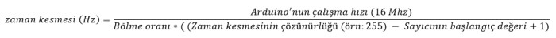
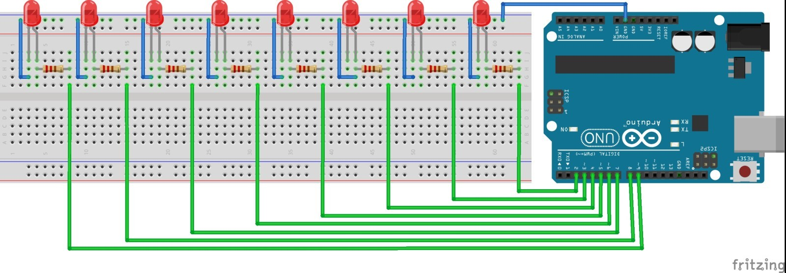
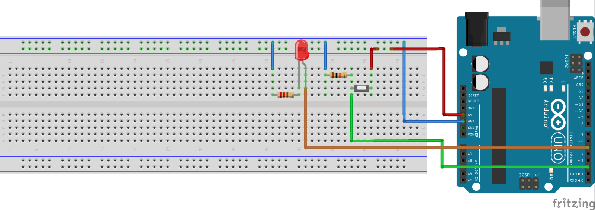

# 1. Arduino ile Interrupt (Kesmeler)

Kesme anlamına gelen Interrupt, birden fazla işlemin yapıldığı projelerde sıklıkla kullanılan bir özelliktir. Interrupt, Arduino'nun çalışması sırasında veya dışarıdan bir etkiyle meydana gelen olaylara otomatik olarak tepki vermesidir. Interrupt sayesinde Arduino sürekli beklenen olayın gerçekleşip gerçekleşmemesini beklemez. Arduino, başka görevleri yerine getirirken bu olay gerçekleştiğinde, otomatik olarak bu olaydan haberdar olur.

Diyelim ki Arduino'nun Interrupt özelliği bulunan bir düğmesine basıldığında bilgisayara veri yollamak istiyoruz. Bunu kolay bir şekilde loop fonksiyonunun içine yazacağımız kodlar ile yapabiliriz. Fakat Arduino'nun bu projedeki tek görevi bu olmayabilir. Arduino başka işlemler yaparken kullanıcı düğmeye basabilir. Böyle bir durumda Arduino düğmeye basıldığını anlayamayacaktır.

Böyle bir hatanın önüne geçilmesi için Interrupt kullanılmalıdır. Düğmeye atanacak bir Interrupt, Arduino başka bir işlem yapmakta olsa bile, düğmeye basıldığı gibi Arduino'ya haber verecektir. Arduino düğmeye basıldığında yapılması gereken işlemleri yaptıktan sonra, kaldığı yerden diğer işlemlere otomatik olarak geri dönecektir.

Arduino'da farklı görevlerde kullanılmak üzere çeşitli Interrupt'lar (kesmeler) bulunur. Zaman kesmesi (timer interrupt) ve dış kesmeler (external İnterrupt) en yaygın olarak kullanılan Arduino kesmeleridir.

## 1.1 Zaman Kesmesi (Timer Interrupt)

Zaman kesmesi (timer interrupt), belirli süre aralıklarında belirli görevlerin yapılabilmesi için kullanılır. Örneğin bir LED'in saniyede bir yakıp söndürülmesi gerekmektedir. Bu işlem için loop fonksiyonunun kullanılması yerine, zaman kesmesinin kullanılması Arduino programının rahatlamasını sağlayacaktır. Kullanılan kesme her saniyede bir Arduino'ya haber vererek, LED'in yakılıp söndürülmesini sağlayacaktır.

Zaman kesmelerinin ayarlanabilmesi için bazı program değişkenlerinin ayarlanması gerekir. Bunlardan en önemlisi zaman sayıcısıdır. Bu değişkende tutulan değer, her saat darbesinde bir artar. Taşma değerine ulaştığında sıfırlanır ve Arduino'ya sürenin dolduğunu, kesmenin yapılması gerektiğini bildirir. Bu değişkenin başlangıç değeri ayarlanarak, kesmeler arasındaki geçecek zaman ayarlanabilir.

Farz edelim ki, 8 bitlik zaman sayıcısının ilk değeri 50 olarak belirlendi. Her adımda bu değer bir artırılacaktır. Zaman sayıcısının değeri 255 olduktan bir adım sonra sıfırlanacaktır. Bu noktada zaman kesmesi gerçekleşecektir. Kesme gerçekleştiğinde Arduino otomatik olarak "ISR(TIMERx_COMPA_vect)" fonksiyonunu çalıştıracaktır. Bu fonksiyonun içerisine her kesmede yapılması istenilen görevler yazılır.

Zaman kesmesinin ne kadar sürede bir gerçekleşeceği, her adımın ne kadar sürede gerçekleşeceğiyle de alakalıdır. Bu süre Arduino'nun kristalinin 1, 1/8, 1/64, 1/256 ve 1/1024 oranında olması sağlanabilir. Zaman kesmesinin oluşma süresi aşağıdaki formül ile hesaplanabilir.



### 1.1.1. Zaman kesmesi kullanarak Kara Şimşek devresi

Zaman kesmesinin ne olduğunu ve nasıl ayarlandığını öğrendiğimize göre, bilgilerimizi pekiştirmek için bir örnek yapalım. Bu örnekte, ilk uygulamalarımızda yaptığımız Kara Şimşek devresini zaman kesmesi kullanarak yapacağız. Önceki uygulamada Kara Şimşek loop fonksiyonu içerisinde yapılmıştı. Bu projede Arduino'nun tüm gücü LED'leri kontrol etmek için kullanılmıştı. Eğer başka bir işlem yapılmak istenseydi, Arduino yetersiz kalabilirdi.

Bu projede ise LED'ler zaman kesmesi ile belirli sürelerde otomatik olarak yaplacağı için, Arduino başka işlemleri de rahatça yapabilecek.



Bu uygulamayı yapmak için ihtiyacımız olan malzemeler:

 *   1 x Arduino
 *   8 x LED
 *   8 x 220 Ohm direnç
 *   1 x Breadboard

```cpp
const int LEDdizisi[] = {2,3,4,5,6,7,8,9};
int j = 0;

void setup()
{
  Serial.begin(9600);
  
  for(int i=0; i<8 ;i++)    
  { /* For döngüsüyle LEDdizisi elemanlarına ulaşıyoruz */
    pinMode(LEDdizisi[i], OUTPUT); /* LED pinleri çıkış olarak ayarlandı */
  } 
  
  cli();
  /* Ayarlamaların yapılabilmesi için öncelikle kesmeler durduruldu */

  /* Timer1 kesmesi saniyede bir çalışacak şekilde ayarlanacaktır (1 Hz)*/
  TCCR1A = 0;
  TCCR1B = 0;
  TCNT1  = 0;
  OCR1A = 15624;
  /* Bir saniye aralıklar için zaman sayıcısı ayarlandı */
  TCCR1B |= (1 << WGM12);
  /* Adımlar arasında geçen süre kristal hızının 1024'e bölümü olarak ayarlandı */
  TCCR1B |= (1 << CS12) | (1 << CS10);
  TIMSK1 |= (1 << OCIE1A);
  /* Timer1 kesmesi aktif hale getirildi */

  sei();
  /* Timer1 kesmesinin çalışabilmesi için tüm kesmeler aktif hale getirildi */

}

/* Arduino otomatik olarak her saniye aşağıdaki fonksiyonu çalıştıracaktır */
ISR(TIMER1_COMPA_vect){
  for(int i=0; i<8; i++){         
    digitalWrite(LEDdizisi[i],LOW);   
    /* Tüm LED'ler söndürüldü */      
  }
  digitalWrite(LEDdizisi[j],HIGH); 
  /* Sıradaki LED yakıldı */
  j ++;
  if(j > 7)
    j = 0;
}

void loop()
{
 Serial.println("Arduino burada baska islemler yapabilir");
 delay(100);
}

```

Yukarıdaki Arduino programında "LEDdizisi" değişkeninde Arduino'ya bağlanan LED'lerin pinleri kaydedildi. Setup fonksiyonu içinde bu LED pinleri çıkış olarak ayarlandı. Programın başka işler de yapabildiğini gösterebilmek için loop fonksiyonu içinde seri monitöre mesaj yazdırıldı. Bunun için setup fonksiyonunda seri haberleşme başlatıldı. Zaman kesmesinin açılması ve saniyede bir görev yapılabilmesi için setup fonksiyonu içerisinde Timer1 ayarlandı.

Zaman kesmesi saniyede bir "ISR(TIMER1_COMPA_vect)" fonksiyonunu çalıştırır. Bu fonksiyonun içinde LED'lerin sırayla yanmasını sağlayacak kodlar yazıldı. Bu kodlarda öncelikle tüm LED'ler sönük konuma getirilir, daha sonra sadece yanması gereken LED yakılır.

## 1.2. Dış Kesmeler (External Interrupt)

Arduino projelerinde sıkça kullanılan diğer bir kesme çeşidi de dış kesmelerdir. Dış kesmeler, Arduino'nun özel pinlerinde gerçekleşen voltaj değişimlerini takip eden kesmelerdir. Örneğin Arduino'nun dış kesme pinine bağlanmış bir düğmeye basıldığında, dış kesme Arduino'ya otomatik olarak haber verir. Bu kesme sayesinde Arduino sürekli olarak düğmeye basılıp basılmadığını kontrol etmek zorunda kalmaz, bu sırada başka işlemleri yerine getirebilir.

Dış kesmelere sahip pinler Arduino türüne göre değişiklik gösterir. Aşağıdaki tabloda Arduino türlerine göre dış kesme özelliğine sahip pinler gösterilmiştir.

|Arduino Türü 	 |Int.0  |Int.1  |Int.2  |Int.3  |Int.4  |Int.5|
|----------------|-------|-------|-------|-------|-------|-----|
|Arduino Uno 	 |2 	 |3 	 |- 	 |-      |-      |-    |
|Arduino Mega 	 |2 	 |3 	 |21 	 |20 	 |19 	 |18   |
|Arduino Leonardo|3 	 |2 	 |0 	 |1 	 |7 	 |-    |

Kullanılacak dış kesme pini, setup fonksiyonu içerisinde "attachInterrupt" fonksiyonu ile belirtilmeli. Bu fonksiyonun içinde kullanılacak olan pinin numarası değil, kesme numarası girilir. Örneğin Arduino Uno kullanıcısı 2. pindeki kesmeler için 0, 3. pindeki kesmeler için 1 değerini kullanmalıdır. "attachInterrupt" fonksiyonun ikinci değeri kesme durumunda çalışacak fonksiyonu belirler, üçüncü değer hangi durumlarda kesmenin gerçekleşeceğini belirler.

Aşağıda "attachInterrupt" fonksiyonu için tanımlanabilecek dış kesmelerin türleri belirtilmiştir.

**LOW:** Pindeki voltaj 0 ise kesme oluşur.

**CHANGE:** Pinde oluşacak voltaj değişimlerinde kesme gerçekleşir.

**RISING:** Yükselen kenarlarda kesme gerçekleşir. Yani pindeki voltaj değeri 0'dan 5 Volta çıktığında kesme gerçekleşir.

**FALLING:** Düşen kenarlarda kesme gerçekleşir. Yani pindeki voltaj değeri 5'ten 0'a düştüğünde kesme gerçekleşir.

Örneğin Arduino Uno'nun 2. pinine düğme bağlamış olalım. Bu düğmeye basıldığında "butonaBasildi" fonksiyonunun çalışmasını istemekteyiz. Bunun için setup fonksiyonunun içerisine attachInterrupt (0, butonaBasildi, RISING) yazmamız gerekir. Böylece düğmeye her basıldığında "butonaBasildi" fonksiyonu otomatik olarak çalışır.

### 1.2.1. Dış kesmeler ile düğme kontrollü LED

Bu uygulamada dış kesme özelliğinden faydalanarak düğme kontrolü yapılır. Düğmeye basıldığında Arduino'nun 5. pinine bağlanmış olan LED yakılır. Kullanıcı düğmeden elini çektiğinde yine dış kesme kullanılarak, LED otomatik olarak söndürülür. Dış kesme kullanılması Arduino'nun sürekli düğme durumunu kontrol etmek zorunda kalmasını engeller. Düğmeye basıldığında veya düğmeden el çekildiğinde, Arduino otomatik olarak anlar. Böylece Arduino düğmeyi kontrol etmeden diğer işlemleri yerine getirebilir.

Bu uygulamayı yapmak için ihtiyacımız olan malzemeler;

 *   1 x Arduino
 *   1 x düğme
 *   1 x 10K ohm direnç
 *   1 x LED
 *   1 x 220 ohm direnç
 *   1 x Breadboard



```cpp
int LED = 5;
/* LED'in bağlı olduğu pin 5 olarak belirlendi */

void setup()
{
  pinMode(LED, OUTPUT);
  /* LED çıkış olarak ayarlandı */
  
  attachInterrupt(0, LEDiyak, RISING);
  
  /* 0 dış kesmesi ayarlandı. Yani Arduino Uno için dugme 2. pine bağlanmalıdır */
  
  Serial.begin(9600);
}

void loop()
{
 Serial.println("Arduino burada baska islemler yapabilir");
 delay(100);
}

void LEDiyak()
{
  /* Dugmeye basıldığında çalışacak fonksiyon */
  digitalWrite(LED,HIGH);
  attachInterrupt(0, LEDisondur, FALLING);
}

void LEDisondur()
{
  /* Dugmeden el çekildiğinde çalışacak fonksiyon */
  digitalWrite(LED,LOW);
  attachInterrupt(0, LEDiyak, RISING);
}
```
Arduino kodunda öncelikle LED'in bağlanacağı pin, 5 olarak belirlenmiş ve bu pin çıkış olarak ayarlanmıştır. Devrede düğme, 2. pine bağlanmıştır. Bu pin 0. dış kesmeye karşılık gelmektedir (Arduino Uno için). Düğmeye basıldığında ve düğmeden el çekildiğinde, Arduino farklı kesmelere girmekte ve LED'in konumunu değiştirir.

Setup fonksiyonu içinde düğmeye basıldığında yapılacak olan görev tanımlandı. Bu alanda düğmeden çekilince yapılacak görevin tanımlanmama nedeni, Arduino'nun aynı anda sadece bir adet dış kesme görevi atayabilmesidir. Bu yüzden 'LEDiyak' ve 'LEDisondur' fonksiyonlarında dış kesme fonksiyonları tekrar tanımlandı.

Zaman ve dış kesmelerin nasıl kullanıldığını öğrendik. Kapsamlı projelerde bu kesmeler kullanılarak Arduino üzerindeki yük azaltılabilir ve projenin daha sağlıklı çalışması sağlanabilir.
