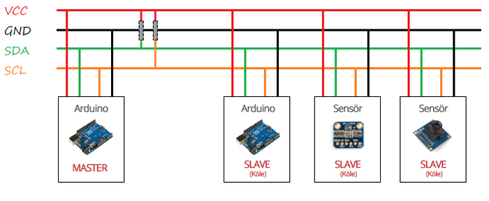
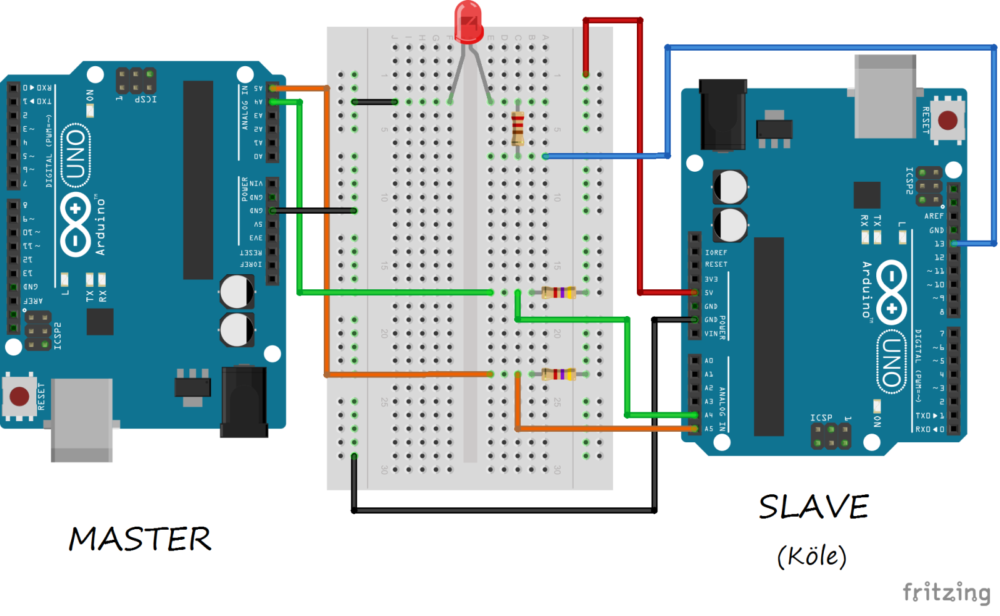
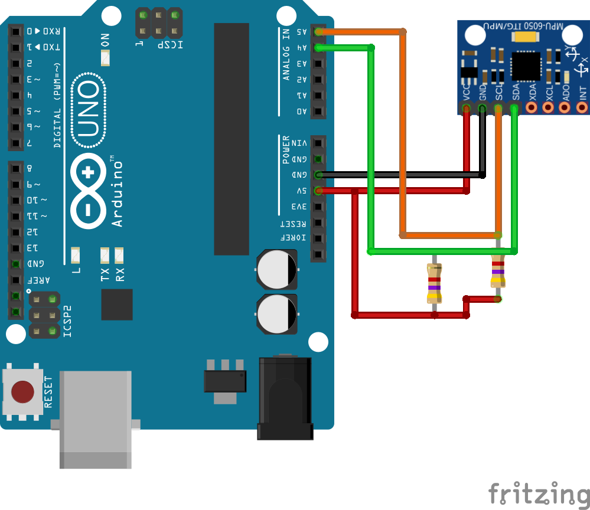

# 2. I2C Protokolü 

Arduino, diğer Arduino veya sensörlerle haberleşmek için bazı haberleşme protokolleri kullanır. Bu protokollerden birisi de I2C'dir. I2C (Inter-Integrated Circuit), seri haberleşme türlerinden senkron haberleşmeye bir örnektir. Haberleşme için toprak hattı dışında SDA ve SCL olmak üzere iki hatta ihtiyaç duyulmaktadır. Hat sayısının fazla olması nedeniyle, uzun mesafeli haberleşmelerde tercih edilmez. Genellikle kısa mesafeli ve düşük veri aktarım hızının yeterli olduğu yerlerde kullanılır.

I2C haberleşmesinde, haberleşmeyi kontrol eden master cihazı bulunur. Her haberleşmede bir tane master bulunmalıdır. Haberleşmenin sağlanabilmesi için haberleşme hattına en az bir adet slave (köle) cihaz bağlanmalıdır. Hatta bağlanan birden fazla slave cihazlardan hangisinin veri aktaracağına, master cihaz karar verir. Böylece hat sayısında bir değişiklik olmadan birden fazla cihazla haberleşme sağlanır.



Master ve slave cihazların aynı besleme hattına bağlanmasına gerek yoktur. Fakat iletişimin sağlanması için toprak hatlarının aynı olması gerekir. Bunun yanında veri aktarımı için SDA (Serial Data Line) ve SCL (Serial Clock) olmak üzere iki adet haberleşme hattı bulunur. Bu hatlardan SDA, cihazlar arasındaki veri aktarımının sağlandığı hattır. Bu hatta çift yönlü veri aktarımı olur. Hatta aktarılan verilerin senkronizasyonu, SCL hattı tarafından gerçekleştirilir. SCL hattında master cihaz tarafından üretilen saat sinyali bulunur. SDA hattındaki haberleşme, bu sinyale göre düzenlenir.

Haberleşmenin tüm hat boyunca hatasız bir şekilde sağlanabilmesi için SDA ve SCL hatları, pull-up dirençlerle VCC hattına bağlanmalıdır. SDA ve SCL pinleri, kullanılan Arduino türüne göre değişiklik göstermektedir. Arduino türlerine göre SDA ve SCL pinleri aşağıdaki tabloda gösterilmiştir.

|Arduino türü 	  |SDA pini |SCL pini|
|-----------------|---------|--------|
|Arduino Uno 	  |A4 	    |A5      |
|Arduino Mega 	  |20 	    |21      |
|Arduino Leonardo |2 	    |3       |
|Arduino Due 	  |20 	    |21      |
|Arduino Nano 	  |A4 	    |A5      |

## 2.1. I2C Fonksiyonları

I2C haberleşme protokolünün çalışma şeklini ve bağlantı hatlarını öğrendiğimize göre, Arduino'nun I2C haberleşmesini yapabilmesi için kullanmamız gereken fonksiyonları tanıyalım. Bu fonksiyonlar Arduino'nun "Wire.h" kütüphanesi içerisinde bulunmaktadır. Bu yüzden öncelikle bu kütüphaneyi projemize dâhil etmeliyiz.

**wire.begin():** I2C haberleşmesini başlatan fonksiyondur. Bu fonksiyon parametre olarak slave cihazın adresini alır. Eğer cihaz master olarak tanımlanacak ise bu fonksiyona herhangi bir parametre atanmaz. Örneğin haberleşme hattında '1' adresine sahip slave bir Arduino tanımlanmak isteniyorsa, wire.begin(1); yazılır. Eğer bu Arduino haberleşme hattının master cihazı olarak tanımlanmak istenseydi fonksiyon, wire.begin(); olarak çağırılmalıydı.

**wire.available():** Fonksiyon hat üzerinden Arduino'ya ulaşmış veri paketlerinin sayısını döndürür. Eğer fonksiyonun değeri 0'dan büyükse Arduino'ya gelen yeni veri paketi vardır.

**wire.beginTransmission(SlaveAdresi)**: Master cihazın hat üzerinde bulunan slave cihazlardan hangisiyle haberleşmek istediğini belirler. Fonksiyon, parametre olarak haberleşmeye başlayacağı cihazın adresini alır.

**wire.endTransmission():** Hat üzerindeki veri aktarımının sonlandığını belirtir.

**wire.read():** Veri hattından gelen verinin okunmasını sağlar.

**wire.write():** Fonksiyona yazılan parametreyi veri hattına aktarır. Kısaca veri yollamak için kullanılır.

**wire.onReceive(GorevFonksiyonu):** Slave olarak tanımlanmış cihaza veri geldiğinde, cihazın yapacağı işlemi belirleyen fonksiyondur. Fonksiyon parametre olarak veri geldiğinde, çağırılacak fonksiyonun ismini alır.

**wire.requestFrom():** Master tarafında kullanılan bu fonksiyon ile slave cihazdan veri istenir. Fonksiyonun ilk parametresi, slave cihazın adresini belirler. İkinci parametre ise slave cihazdan kaç byte'lık veri beklendiğini belirler. Üçüncü ve son parametre ise hattın istekten sonraki durumunu belirler.

**wire.onRequest():** Slave tarafında kullanılan bu fonksiyon, master cihazdan veri isteği geldiğinde çalıştırılacak fonksiyonu belirler. Bu fonksiyon parametre olarak çalıştırılacak fonksiyonun ismini alır.

## 2.2. I2C ile iki Arduino Arasında Veri Aktarımı

I2C bağlantı şemasını ve kullanılacak fonksiyonları öğrendiğimize göre, artık küçük bir örnek ile I2C'yi daha iyi anlayabiliriz. Bu örnekte iki adet Arduino Uno kullanılacaktır. Arduino Uno'lardan birisi master birisi de slave görevinde bulunacaktır.

Master görevindeki Arduino, slave görevindeki Arduino'ya bağlı LED'leri kontrol edecek ve slave görevindeki Arduino'dan veri alacak. Slave görevindeki Arduino, master görevindeki Arduino'dan gelen veriyi yorumlayacak. Gelen veriye göre de LED'leri kontrol edecek ve diğer Arduino'ya veri yollayacak.

Bu uygulamayı yapmak için ihtiyacımız olan malzemeler:

 *   2 x Arduino
 *   2 x 4.7K ohm direnç
 *   1 x LED
 *   1 x 220 ohm direnç
 *   1 x Breadboard



**Not:** Devredeki iki Arduino'da ayrı ayrı veya aynı besleme kaynağından beslenmelidir. Eğer Arduino'lar ayrı kaynaklardan besleniyorsa, toprak hatlarının birleştirilmesi gerektiğini unutmayın. Slave üzerinden gelen mesajları okumak için Master görevindeki Arduino'yu bilgisayara bağlayarak Seri Monitörü açın.

**Master görevindeki Arduino kodu:**

```cpp
/* I2C haberleşmesinde Master olarak görev yapan Arduino kodu */

#include <Wire.h>
/* 
 * I2C fonksiyonlarını kullanabilmek için 
 * Wire.h kütüphanesini projemize ekledik
 */
 
void setup()
{
  Wire.begin();
  /* I2C haberleşmesi master olarak başlatıldı */
  
  Serial.begin(9600);
  /* Bilgisayara veri yazdırabilmek için seri haberleşme başlatıldı */
}

void loop()
{
  Wire.beginTransmission(1);
  /* 1 adresine sahip Slave (köle) cihazına veri yollanacağı bildiriliyor */
  Wire.write("a");
  /* a karakteri slave cihaza yollanıyor */
  Wire.endTransmission();
  /* Yollanacak verilerin bittiği bildiriliyor */
  /* a karakteri slave cihazda LED'i yak anlamına gelecektir */
  
  delay(1000);
  
  Wire.beginTransmission(1);
  /* 1 adresine sahip Slave (köle) cihazına veri yollanacağı bildiriliyor */
  Wire.write("b");
  /* b karakteri slave cihaza yollanıyor */
  Wire.endTransmission();
  /* Yollanacak verilerin bittiği bildiriliyor */
  /* b karakteri slave cihazda LED'i sondur anlamına gelecektir */
  
  delay(1000);
  
  Wire.requestFrom(1, 7);
  /*  1 adresine sahip slave (köle) cihazından 7 BYTE'lık veri bekleniyor */
  char gelenKarakter;
  /* I2C hattından gelen veriler gelenKarakter değişkenine yazdırılacak */
  while(Wire.available()){
    /* I2C hattında yeni veri olduğu sürece döngü devam edecek */
    gelenKarakter = Wire.read();
    /* I2C hattından gelen veriler okunuyor */
    Serial.print(gelenKarakter);
    /* Gelen veriler ekrana yazdırılıyor */
  }
  Serial.println();
 
  delay(1000);
}
```
Master görevindeki Arduino kodunda öncelikle I2C fonksiyonlarının kullanılabilmesi için Wire.h kütüphanesi çalışmaya dahil edilmiştir. Daha sonra haberleşme Wire.begin() komutuyla master olarak başlatıldı. Slave cihazdan gelecek verilerin ekrana yazdırılabilmesi için Serial.begin(9600) komutu ile Arduino ve bilgisayar arasındaki iletişim başlatıldı.

Loop fonksiyonu içinde, bir saniye aralıklarla slave cihaza 'a' ve 'b' karakterleri yollandı. Bu karakterler slave cihazda işlenerek LED'in konumu değiştirilecek. Bu karakterlerin yollanabilmesi için öncelikle Wire.beginTransmission(1) fonksiyonuyla hangi slave cihaza veri aktarılacağı seçildi. Tüm veriler cihaza yollandıktan sonra Wire.endTransmission(); komutuyla cihaza veri aktarımının bittiği bildirildi.

Slave cihazdan veri alınmak istendiği için Wire.requestFrom(1, 7); komutu kullanıldı. Bu komutla slave cihaz 7 byte'lık veriyi master cihaza aktaracağını anladı. Yeni veri geldiği sürece işlemin devam edebilmesi için, while döngüsünün koşulu Wire.available() yapılır. I2C data hattından gelen veriler Wire.read() fonksiyonuyla okunarak seri porta yollandı.

**Slave görevindeki Arduino kodu**
```cpp
/* Slave (köle) görevindeki Arduino'nun kodu */
#include <Wire.h>
/* 
 * I2C fonksiyonlarını kullanabilmek için 
 * Wire.h kütüphanesini projemize ekledik
 */
 
 const int LED = 13;
 /* LED 13. pinde bulunmaktadır */
 
void setup()
{
  Wire.begin(1);
  /* I2C haberleşmesi, haberleşme adresi 1 olan bir slave cihaz olarak başlatıldı */
  Wire.onRequest(istekGeldiginde);
  /* 
  Master olan cihaz bu Arduino'dan veri istediğinde gerçekleşecek işlem seçildi
  */
  Wire.onReceive(veriGeldiginde);
  /*
  Master olan cihazdan bu Arduino'ya veri geldiğinde yapılacak işlem seçildi
  */
  
  pinMode(LED,OUTPUT);
  /* LED pini çıkış olarak ayarlandı */
}
 
void loop()
{
  /*
  * Tüm işlemler veri isteği geldiğinde veya yeni veri geldiğinde 
  * yapılacağı için loop fonksiyonunun içi boş bırakılmıştır
  */
  delay(1);
}
 
void veriGeldiginde(int veri)
{
  /* I2C hattında bu cihaz için yeni veri olduğunda bu fonksiyon çalışır */
  char gelenKarakter;
  /* Hattaki veri okunarak gelenKarakter değişkenine kaydedilir */
  while(Wire.available()){
    gelenKarakter = Wire.read();
  }
  /* Eğer gelen veri 'a' ise LED yakılır, 'b' ise LED söndürülür */
  if(gelenKarakter == 'a')
    digitalWrite(LED,HIGH);
  else if(gelenKarakter == 'b')
    digitalWrite(LED,LOW);
}
 
void istekGeldiginde()
{
  /* 
  * Eğer master bu cihazdan veri istiyor ise master cihaza "Merhaba" verisi yollanılır 
  * Eğer bu bir sensör olsaydı "merhaba" yerine sıcaklık veya ivme verisi yollanıyor olacaktı
  */
  Wire.write("Merhaba"); 
}
```

Slave görevindeki Arduino kodunda öncelikle I2C fonksiyonlarının kullanılabilmesi için Wire.h kütüphanesi çalışmaya dâhil edildi. Daha sonra haberleşme Wire.begin(1) komutuyla 1 adresine sahip slave cihaz olarak başlatıldı. Master cihazından veri geldiğinde "veriGeldiginde()" fonksiyonu, istek geldiğinde "istekGeldiginde()" fonksiyonunun çalışması için "Wire.onReceive(veriGeldiginde)" ve "Wire.onRequest(istekGeldiginde)" fonksiyonları kullanıldı.

Programın ana yapısı bu iki fonksiyon ile çalışır. Arduino'ya master cihazdan yeni veri geldiğinde bu veri okunarak 'gelenKarakter' değişkenine yazdırılır. Gelen karakter eğer 'a' harfine eşitse LED yakılır, 'b' harfine eşitse LED söndürülür. Eğer master cihazdan veri isteği geldiyse, master cihaza "Merhaba" yazısı geri döndürülür. Eğer bu Arduino bir sensör olsaydı, burada "Merhaba" yazısı yerine ortam sıcaklığını veya ivme verisini döndürecekti.

İki Arduino arasında I2C ile nasıl haberleşme ağı kurulacağını öğrendik. I2C sadece mikro denetleyiciler arasında haberleşmeyi sağlamaz, aynı zamanda sensörlerle de haberleşmeyi sağlar. Bir hat üzerine bağlanmış birden fazla sensör, Arduino tarafından kolaylıkla okunabilir. Böylece sensör sayısı artmasına rağmen devredeki karmaşıklık ve kablo sayısı artmamış olur.

## 2.3. Arduino ile IMU Kullanımı

Bu uygulamada I2C haberleşme protokolünü destekleyen MPU-6050 IMU kartının üzerinde bulunan sensörlerle sıcaklık ivme ve cayro değerlerini ölçeceğiz. Bu sensörler yerine aynı görevi yapan farklı sensörler de kullanabilirsiniz. Öncelikle kullanacağınız sensörün datasheet'ini yani belirtimini okuyarak sensörün I2C adresini ve veri isteme şeklini öğrenmelisiniz.

Bu projede kullanacağımız kart, çeşitli görevler için özelleştirilmiş bir IMU kartıdır. IMU ivme, basınç, cayro gibi sensörleri üzerinde bulunduran sensör kartıdır. MPU-6050 elektronik ve robot malzemeleri satan yerlerde kolayca bulunabilir. Ucuz olması ve kolay kullanımından dolayı bu kart seçilmiştir.

MPU-6050'nin belirtimi (datasheet) incelendiğinde görüldüğü gibi, cihazın I2C haberleşme adresi 0x68'dir. Buradan sensörler hakkında daha fazla bilgi de edilinebilir.

Bu uygulamayı yapmak için ihtiyacımız olan malzemeler:

 *   1 x Arduino
 *   2 x 4.7K ohm direnç
 *   1 x MPU-6050



**Slave görevindeki Arduino kodu**
```cpp
/* MPU-6050 ile I2C haberleşme örneği */
#include<Wire.h>
/* 
 * I2C fonksiyonlarını kullanabilmek için 
 * Wire.h kütüphanesini projemize ekledik
 */
 
const int MPU=0x68;
/* MPU-6050'nin I2C haberleşme adresi */

int16_t AcX,AcY,AcZ,Tmp,GyX,GyY,GyZ;
/* IMU'dan alınacak değerlerin kaydedileceği değişkenler */

void setup(){
  Wire.begin();
  Wire.beginTransmission(MPU);
  Wire.write(0x6B);
  Wire.write(0); /* MPU-6050 çalıştırıldı */
  Wire.endTransmission(true);
  /* I2C haberleşmesi başlatıldı ve MPU-6050'nin ilk ayarları yapıldı */
  Serial.begin(9600);
}
void loop(){
  verileriOku();
  /* IMU'dan değerler okundu */
  
  /* Okunan değerler serial monitör'e yazdırılıyor */
  Serial.print("ivmeX = "); Serial.print(AcX);
  Serial.print(" | ivmeY = "); Serial.print(AcY);
  Serial.print(" | ivmeZ = "); Serial.print(AcZ);
  Serial.print(" | Sicaklik = "); Serial.print(Tmp/340.00+36.53);  
  /* Datasheetten alınan sıcaklık hesaplama formülü kullanıldı */
  Serial.print(" | GyroX = "); Serial.print(GyX);
  Serial.print(" | GyroY = "); Serial.print(GyY);
  Serial.print(" | GyroZ = "); Serial.println(GyZ);
  delay(333);
}

void verileriOku(){
  Wire.beginTransmission(MPU);
  /* I2C haberleşmesi yapılacak kart seçildi */
  Wire.write(0x3B); 
  /* 0x3B adresindeki register'a ulaşıldı */
  Wire.endTransmission(false);
  Wire.requestFrom(MPU,14,true);
  /* 14 BYTE'lık veri istendi */
  
  AcX=Wire.read()<<8|Wire.read();   
  AcY=Wire.read()<<8|Wire.read(); 
  AcZ=Wire.read()<<8|Wire.read(); 
  Tmp=Wire.read()<<8|Wire.read(); 
  GyX=Wire.read()<<8|Wire.read(); 
  GyY=Wire.read()<<8|Wire.read();  
  GyZ=Wire.read()<<8|Wire.read();
  /* 
  * Sırası ile okunan her iki byte birleştirilerek sırası ile değişkenlere yazdırıldı
  * Böylece IMU'dan tüm değerler okunmuş oldu
  * 0X3B adresi imu değerlerinden ilk sensörün değerine denk gelmektedir.
  * IMU'dan tüm değerlerin okunabilmesi için bu adresten başlandı
  */
}
```

Böylece I2C ile sensörlerden nasıl veri alacağımızı, iki Arduino'yu nasıl konuşturacağımızı öğrendik. I2C, birden fazla sensörün kullanıldığı devrelerde, sensörlerin ve Arduino'nun birbirinden fazla uzakta bulunmadığı projelerde sıklıkla kullanılır.


