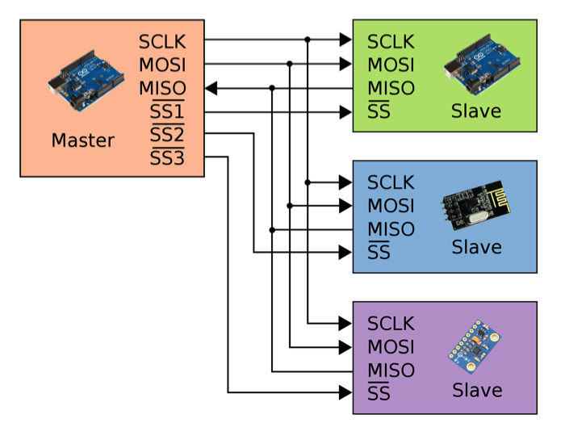
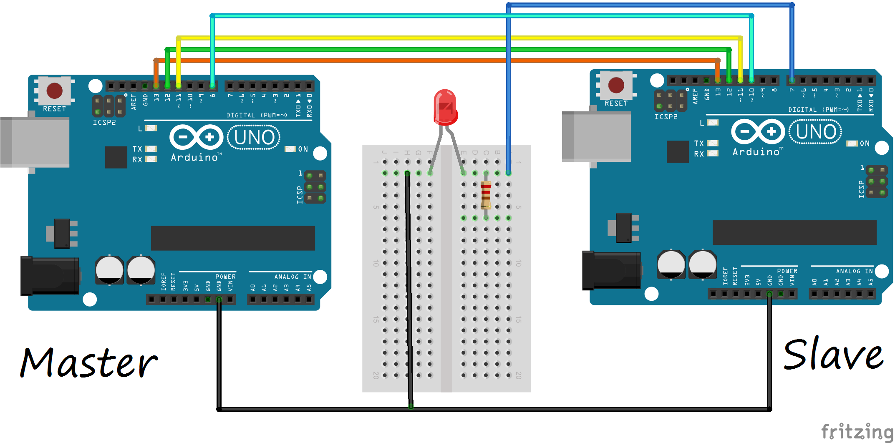

# 3. SPI Protokolü 

SPI (Serial Peripheral Interface), Arduino'nun desteklediği senkron seri haberleşme türlerinden biridir. Özellik ve kullanım olarak I2C'ye benzer. Bir Arduino'nun diğer Arduino veya sensörlerle kısa mesafede haberleşmesini sağlar. SPI protokolünde de I2C'de olduğu gibi bir adet Master cihaz bulunur. Bu cihaz hatta bağlı çevresel cihazları kontrol eder.

Master ve çevresel cihazlara bağlanan MISO (Master In Slave Out), MOSI (Master Out Slave In) ve SCK (Serial Clock) olmak üzere üç adet SPI hattı bulunur.

**MISO:** Çevresel cihazlardan (slave) yollanan verilerin master cihaza aktarıldığı hattır.

**MOSI:** Master cihazdan yollanan verilerin çevresel cihazlara aktrıldığı hattır.

**SCK:** SPI haberleşmesinde senkronu sağlayan saat sinyalinin bulunduğu hattır. Saat sinyali master cihaz tarafından üretilir.

MISO ve MOSI hatlarından da anlaşıldığı gibi SPI protokolünde I2C'den farklı olarak veri hatları tek yönlüdür. Ayrıca çevresel cihazların (slave) adreslerinin olmasına gerek yoktur. Her çevresel cihazın seçim ayağı bulunur. Bu ayağa, SS (Slave Select) denir. Bu hattın sayısı kullanılan çevresel cihazların sayısı kadardır. Her cihaz için master cihazından ayrı SS hattı çıkar. SS hattı LOW (0 volt) düzeyinde olan çevresel cihaz, master cihaz ile iletişime başlar.

Örnek bir SPI haberleşme hattı aşağıdaki resimde gösterilmiştir. Resimde de görüleceği üzere, Master cihazdan çevresel cihaz sayısı kadar SS çıkışı bulunur. Master cihaz iletişime geçmek istediği çevresel cihazın SS pinini LOW (0 Volt) düzeyine çeker.



SPI pinleri Arduino türüne göre değişiklik gösterir. Arduino türlerine göre bu pinleri aşağıdaki tabloda gösterilmiştir.

|Arduino türü    |MOSI         |MISO         |SCK          |SS (slave)|SS (master)|
|----------------|-------------|-------------|-------------|----------|-----------|
|Arduino UNO     |11 veya ICSP4|12 veya ICSP1|13 veya ICSP3|10        |	-         |
|Arduino Mega    |51 veya ICSP4|50 veya ICSP1|52 veya ICSP3|53        |	-         |
|Arduino Leonardo|ICSP-4       |ICSP-1       |ICSP-3       |-         | -         |
|Arduino Due 	 |ICSP-4 	   |ICSP-1 	     |ICSP-3 	   |- 	      | -         |
 
**SPI fonksiyonları**

SPI protokolünü öğrendiğimize göre şimdi haberleşmenin Arduino kısmına bakalım. Arduino'da SPI fonksiyonlarını kullanabilmemiz için öncelikle "SPI.h" kütüphanesini projemize eklememiz gerekir. Kütüphane projeye eklendiğinde aşağıdaki fonksiyonlar kullanılabilir.

**SPI.begin():** SPI haberleşmesini başlatır ve SPI pinlerini başlangıç konumlarına alır.

**SPI.setClockDivider():** Bu fonksiyon ile SPI haberleşmesinin saati ayarlanabilir. Fonksiyon değer olarak saat değişkenlerini almaktadır. Eğer hiçbir değişiklik yapılmazsa SPI saati "SPI_CLOCK_DIV4" olarak çalışır. Fonksiyonun alabileceği değişkenler; SPI_CLOCK_DIV4, SPI_CLOCK_DIV8, SPI_CLOCK_DIV16, SPI_CLOCK_DIV32, SPI_CLOCK_DIV64, SPI_CLOCK_DIV128'dir.

**SPI.transfer():** SPI hattına veri yollamak veya veri almak için bu fonksiyon kullanılır.

## 3.1. SPI ile İki Arduino Arasında Haberleşme

SPI kütüphanesi, Arduino'nun her zaman master konumunda olacağı düşünülerek hazırlanmış fakat bu uygulamamızda kullanacağımız Arduino'lardan birisi master, diğeri ise slave (köle) durumunda çalışacak. Master olan Arduino için SPI kütüphanesi yeterli olacak fakat diğer Arduino için kütüphane dışında kendi komutlarımızı yazmamız gerekir.

Uygulamada master görevindeki Arduino, diğer Arduino'ya bağlı LED'lerin konumunu yollayacağı veriler ile değiştirecek. Slave görevindeki Arduino LED'in konumunu değiştirdikten sonra, SPI üzerinden kaç kere veri geldiğini master olan Arduino'ya geri bildirecek.

Bu uygulamayı yapmak için ihtiyacımız olan malzemeler;

 *   2 x Arduino
 *   1 x LED
 *   1 x 220 ohm direnç
 *   1 x Breadboard



Master Arduino'nun 11, 12 ve 13. pinleri, köle görevindeki Arduino'nun sırası ile 11, 12 ve 13. pinlerine takıldı. Master görevindeki Arduino'nun 8. pini, SS pini olarak belirlendi ve köle görevindeki Arduino'nun 10. pinine bağlandı.

Dikkat: Devredeki iki Arduino da ayrı ayrı veya aynı besleme kaynağından beslenmelidir. Eğer Arduino'lar ayrı kaynaklardan besleniyorsa toprak hatlarının birleştirilmesi gerektiğini unutmayın. Köle üzerinden gelen mesajları okumak için master görevindeki Arduino'yu bilgisayara bağlayarak Seri Monitörü açınız.

```cpp
/* SPI haberleşmesinde Master olarak görev yapan Arduino kodu */
#include <SPI.h>
/* 
* SPI fonksiyonlarını kullanabilmek için 
* SPI.h kütüphanesini projemize ekledik
*/

const int SSpini = 8;  
/* Slave görevindeki Arduino'nun seçilmesi için 8 bumaralı pin SS olarak belirlendi */
 
void setup()
{
  pinMode(SSpini, OUTPUT);
  /* SS pini çıkış olarak ayarlandı */
  digitalWrite(SSpini, HIGH);
  /* Slave olan Arduino başlangıçta haberleşmeye geçmemesi için SS pini HIGH yapıldı */
  SPI.begin();
  /* SPI haberleşmesi başlatıldı */
}
 
void loop()
{
    veriGonder('a', SSpini);
    /* Diğer arduinoya LED'i yakması için 'a' komutu yollandı */
    delay(1000);
    
    veriGonder('b', SSpini);
    /* Diğer arduinoya LED'i söndürmesi için 'b' komutu yollandı */
    delay(1000);
}
 

/* SPI üzerinden veri göndermek için yazılmış fonksiyondur */
void veriGonder(char veri, int SSpini)
{
  digitalWrite(SSpini, LOW);
  /* Diğer Arduino'nun veri dinlemeye başlaması için SS hattını LOW düzeyine çekmeliyiz */
  delay(1);
  /* Kısa bir süre bekleyelim */
  char LEDDurumu;
  LEDDurumu = SPI.transfer(veri);
  Serial.println(LEDDurumu);
  /* veri karakteri diğer Arduino'ya yollandı
  * Fonksiyon diğer arduino'dan gelen veriyi vermektedir
  * Geri gelen veri LEDDurumu değişkeninde tutulmuştur
  * Bu değişken Seri port üzerinden bilgisayardaki Serial monitöre yollanmıştır
  */
  digitalWrite(SSpini, HIGH);
  /* Haberleşmeyi bitirmek için pin LOW konumuna çekilmiştir */
}

```

Öncelikle projeye SPI fonksiyonlarının kullanılabilmesi için "SPI.h" kütüphanesi eklendi. ‘SSpini' değişkeniyle, seçilecek olan köle konumlu Arduino belirlendi. Bu değişken çoğaltılarak sisteme daha fazla köle görevli Arduino eklenebilir. Setup fonksiyonu içinde SS pinleri çıkış olarak ayarlandı ve ‘HIGH' konumuna getirildi. Daha sonra SPI.begin() fonksiyonuyla SPI protokolü başlatıldı. Projenin loop fonksiyonu içinde 1 saniye aralıklarla köle olan Arduino'ya ‘a' ve ‘b' karakterleri yollandı

```cpp
char i = 0;
const int LED = 7;
/* LED Arduino'nun 7. pinine bağlanmıştır */
void setup()
{
  pinMode(MISO, OUTPUT);
  pinMode(SS , INPUT);
  /* MISO pini OUTPUT, SS pini INPUT olarak ayarlandı */
  pinMode(LED,OUTPUT);
  /* LED pini çıkış olarak ayarlandı */

  SPCR  |= 0b11000000;
  SPSR  |= 0b00000000;
  /* Slave mod ve interrupt için ayarlamalar yapıldı */ 

  sei();
  /* Interruptlar çalıştırıldı */
}  
 
void loop()
{
  delay(100);
}

/* SPI kesmesi olduğunda çalışacak fonksiyon */
ISR(SPI_STC_vect)
{
  cli();
  /* Interruptlar durdurulmuştur */
  while(!digitalRead(SS))
  {
      SPDR = i;
      i ++;
      if ( i > 255) 
        i = 0;
      while(!(SPSR & (1 << SPIF)));
      /* SPI hattında veri aktarımı bitene kadar bekle */
      char gelenVeri;
      gelenVeri = SPDR;
      if(gelenVeri == 'a'){
        digitalWrite(LED,HIGH);
      }else if(gelenVeri == 'b'){
        digitalWrite(LED,LOW); 
      }
      /* SPI üzerinden gelen verinin değerine göre LED'in konumu değiştirildi */
  }
  sei();
  /* Interruptlar başlatılmıştır */
}
```
Bu uygulamayla SPI protokolünün nasıl çalıştığını ve Arduino tarafında hem master hem de köle konumunda hangi fonksiyonların kullanıldığını öğrendik. İlerleyen konularda SPI ile çalışan cihazları inceleyeceğiz.


