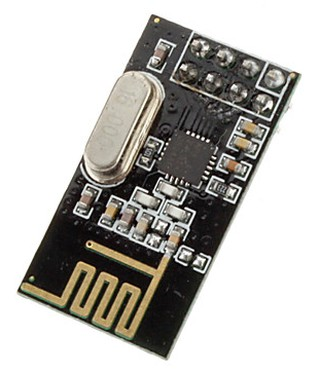
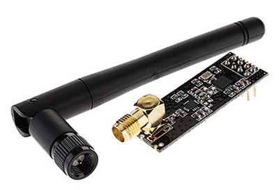
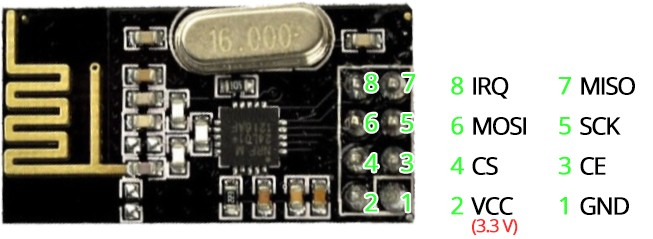
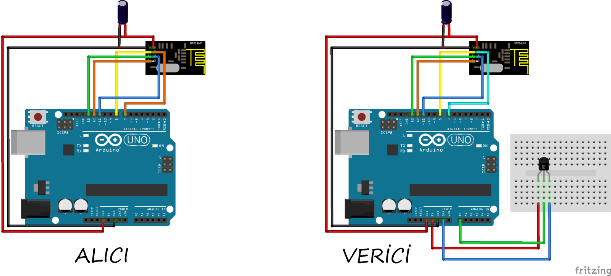

# 4. Arduino ile Kablosuz Haberleşme

Arduino projelerinin çoğunda kablosuz olarak bir yerden, başka bir yere veri aktarmak isteriz. Bu veriler kimi zaman diğer Arduino'ya bağlı parçaları kontrol etmek için, kimi zaman da karşı taraftaki Arduino'dan sensör verilerini almak için kullanılır. Arduino, tek başına kablosuz veri aktarımı için yeterli değildir. Arduino, kablosuz veri aktarımı için kablosuz haberleşme modüllerine ihtiyaç duymaktadır.

Arduino ile çalışan çeşitli kablosuz haberleşme modülleri vardır. Eğitimimizde bu modüllerden kullanımı kolay ve fiyatı düşük olan, nRF24L01 modülünü kullanacağız. nRF24L01 modülü Arduino ile daha önce öğrendiğimiz SPI protokolünü kullanarak haberleşmektedir. Modülün PCB ve harici antenli modelleri bulunmaktadır. İki model de 2.4 GHz’de haberleşmektedir, fakat harici antene sahip modülün haberleşme mesafesi PCB antene sahip modülden daha fazladır.

|  PCB Antenli nRF24L01      | Harici Antenli nRF24L01       |
|----------------------------|-------------------------------|
|||

**Pin bağlantıları**

Modül 3.3 Volt ile çalıştığı için, modülün VCC pini Arduino'nun 3.3 Volt çıkışına takılmalıdır. Yanlışlıkla modülün 5 Volt hattına takılması, modüle zarar verebilir. Bu uygulamada Arduino Uno kullandığımız için, modülün SPI pinlerini Arduino'nun SPI pinlerine bağlamalıyız. Bazı nRF24L01'lerde modül üzerinde pin isimleri yazmamaktadır. Aşağıdaki görselde nRF24L01 modülünün pin bağlantıları gösterilmiştir.



Aşağıdaki tabloda nRF24L01 modülü ile Arduino arasında kurulacak bağlantılar gösterilmiştir.

|nRF24L01 Haberleşme Modülü |Arduino UNO|
|---------------------------|-----------|
|VCC 	                    |3.3 V      |
|GND 	                    |GND        |
|CS 	                    |7          |
|CE 	                    |8          |
|MOSI 	                    |11         |
|MISO 	                    |12         |
|SCK 	                    |13         |

Projelerimizde nRF24L01 modüllerinden birisi alıcı (receiver) diğeri ise verici (transmitter) görevinde kullanılacaktır. Modülün alıcı veya verici olması, kablo bağlantılarını değiştirmemektedir. Hangi modülün alıcı, hangi modülün verici olacağına, Arduino içerisindeki kod karar vermektedir. Projenin ihtiyacına göre haberleşme modülü çift yönlü haberleşme yapmak için, hem alıcı hem de verici (transceiver) olarak kullanılabilir.

**Not:** Tüm kablo bağlantılarının hatasız bir şekilde yapılmasına rağmen, bazen modüller birbiri arasındaki haberleşmeyi sağlayamamaktadır. Böyle bir durumda modüllerin VCC (3.3V) ve GND pinleri arasına 3.3 uF ile 10 uF arasında bir kapasite koyarak tekrar deneyin.

**Arduino yazılımı**

nRF24L01 kablosuz haberleşme modülü, Arduino için "nRF24L01p.h" isimli kütüphaneye sahiptir. Arduino kodunu yazmadan önce bu kütüphaneyi indirip, Arduino projemize dâhil etmeliyiz. Kütüphaneyi indirmek için tıklayın.

**Not:** Arduino kütüphaneleri dosya klasörü ile birlikte Arduino'nun yüklü olduğu dizindeki "libraries" klasörü içerisine kopyalanmalıdır.

Kütüphane projeye eklendikten sonra ilk olarak CS ve CE pinlerinin programa tanımlanmalıdır. Modül, SPI ile haberleştiği için SPI.begin() fonksiyonu ile SPI protokolü başlatılmalıdır. İki haberleşme modülünün birbiri arasında iletişime geçebilmesi için, modüllerin aynı kanal üzerinden haberleşmesi gerekir. “alici.channel(KanalID)” fonksiyonu ile haberleşme kanalı seçilir. Protokol ayarlamaları yapıldıktan sonra iki modül aralarında haberleşmeye hazır hale gelir.

## 4.1. Uzaktan Kontrollü Sıcaklık Sensörü

Bu projede kullanılacak olan iki Arduino Uno'dan birinde LM35 sıcaklık sensörü bulunmaktadır. Bu, Arduino ortam sıcaklığını ölçerek, sıcaklık bilgisini nRF24L01 kablosuz haberleşme modülünü kullanarak, diğer Arduino'ya aktaracaktır. Sıcaklık bilgisini alan Arduino ,seri port üzerinden Serial Monitör'e yazdıracaktır. Bu uygulamada nRF24L01 modülünün devreye nasıl bağlandığını ve Arduino kodunun nasıl yazıldığını öğrenmiş olacağız.

**Not:** Bu uygulamada kullanılacak olan LM35 sıcaklık sensörünün besleme (5 V), toprak ve çıkış olmak üzere 3 adet pini bulunmaktadır. Çıkış pinindeki değer, ortamın sıcaklığına göre lineer olarak değişmektedir.

Bu uygulamayı yapmak için ihtiyacınız olan malzemeler:

 *   2 x Arduino UNO
 *   2 x nRF24L01 kablosuz haberleşme modülü
 *   2 x 10 uF kapasite
 *   1 x LM35 (sıcaklık sensörü)
 *   1 x Breadboard




Alıcı görevindeki
Arduino Uno 	nRF24L01
3.3 Volt 	-> VCC
GND 	-> GND
7 	-> CS
8 	-> CE
11 	-> MOSI
12 	-> MISO
13 	-> SCK

 
Verici görevindeki
Arduino Uno 	nRF24L01
3.3 Volt 	-> VCC
GND 	-> GND
7 	-> CS
8 	-> CE
11 	-> MOSI
12 	-> MISO
13 	-> SCK

 
Verici görevindeki
Arduino Uno 	LM35
5 Volt 	-> 1 (VCC)
A0 	-> 2 (Analog)
GND 	-> 3 (GND)

```cpp
Verici kodu

#include <SPI.h>
#include <nRF24L01p.h>
#include <String.h>

nRF24L01p verici(7,8);
/* CSN - > 7, CE -> 8 olarak belirlendi */

float sicaklik;
static char veri[10];

void setup() {
  Serial.begin(9600);
  SPI.begin();
  SPI.setBitOrder(MSBFIRST);
  /* SPI başlatıldı */
  verici.channel(90);
  verici.TXaddress("Hasbi");
  verici.init();
  /* Verici ayarları yapıldı */
}
void loop() {
  sicaklik = analogRead(A0); 
  /* A0daki gerilim ölçüldü */
  sicaklik = sicaklik * 0.48828125;
  /* Ölçülen gerilim sıcaklığa çevrildi */
  Serial.print("SICAKLIK = ");
  Serial.print(sicaklik);
  Serial.println(" C");
  /* Sıcaklık bilgileri ekrana yazdırıldı */
  
  dtostrf(sicaklik,5, 2, veri);
  /* float değerindeki sıcaklık stringe çevrildi */
  
  verici.txPL(veri);
  boolean gonderimDurumu = verici.send(FAST);
  /* Sıcaklık bilgisi nRF24L01'e aktarıldı */
  /* Eğer gönderim başarısız olursa gonderimDurumu'nun değeri false olacaktır */
  if(gonderimDurumu==true){
        Serial.println("mesaji gonderildi");
  }else{
        Serial.println("mesaji gonderilemedi");
  }
  
  delay(1000); 
}
```
nRF24L01 modülünün CSN ve CE pinleri 7 ve 8 olarak belirlenmiştir. Okunan sıcaklık verisinin ekrana yazdırılabilmesi için, seri haberleşme başlatılmıştır. Modül SPI protokolünü kullandığı için SPI başlatılmıştır. Haberleşmenin sağlanabilmesi için, modüller arasındaki kanal 90 olarak belirlenmiştir. Loop fonksiyonu içerisinde bir saniye aralıklarla LM35'ten sıcaklık verisi okunmuştur. Okunan veri, kablosuz haberleşme modülüne yollanmıştır. Gönderimin başarı durumu 'gonderimDurumu' değişkeni yardımıyla ekrana yazdırılmıştır.

**Alıcı kodu**
```cpp
#include <SPI.h>
#include <nRF24L01p.h>

nRF24L01p alici(7,8);
/* CSN - > 7, CE -> 8 olarak belirlendi */

void setup(){
  Serial.begin(9600);
  SPI.begin();
  SPI.setBitOrder(MSBFIRST);
  /* SPI başlatıldı */
  alici.channel(90);
  alici.RXaddress("Hasbi");
  alici.init();
  /* Alıcı ayarları yapıldı */
}

String sicaklik;

void loop(){ 
  while(alici.available()){
    /* Modülden veri geldiği sürece while devam edecek */
    alici.read();
    alici.rxPL(sicaklik);
    /* Modülden gelen veri okundu */
    if(sicaklik.length()>0)
    {
      Serial.println(sicaklik);
      /* modülden gelen veri ekrana yazdırıldı */
      sicaklik="";
      /* eski veri temizlendi */
    }
  }
}
```

nRF24L01 modülünün CSN ile CE pinleri 7 ve 8 olarak belirlenmiştir. Vericiden alınan sıcaklık verisinin ekrana yazdırılabilmesi için seri haberleşme başlatılmıştır. Modül SPI protokolünü kullandığı için SPI başlatılmıştır. Haberleşmenin sağlanabilmesi için modüller arasındaki kanal 90 olarak belirlenmiştir. Loop fonksiyonu içerisinde haberleşme modülünden veri geldiği sürece, while döngüsünün devam etmesi sağlanmıştır. Gelen veriler 'sicaklik' değişkeninde tutulmuş ve ekrana yazdırılmıştır.

Bu uygulamamızda iki Arduino modülü arasında kablosuz haberleşmenin nasıl sağlandığını öğrenmiş olduk. Bu ve daha önceki bölümlerde öğrenilen bilgiler ile gelişmiş Arduino projeleri yapılabilir. Bölümde incelenen nRF24L01 modülü yerine farklı modüller de aynı şekilde kullanılabilir fakat her modülün haberleşmesi farklı olacağı için, öncelikle kullanılacak modülün belirtimleri (datasheet) incelenmelidir.