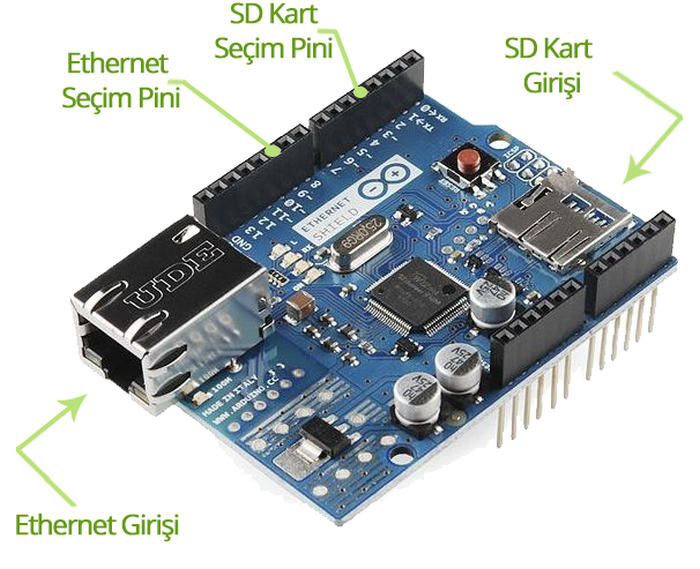
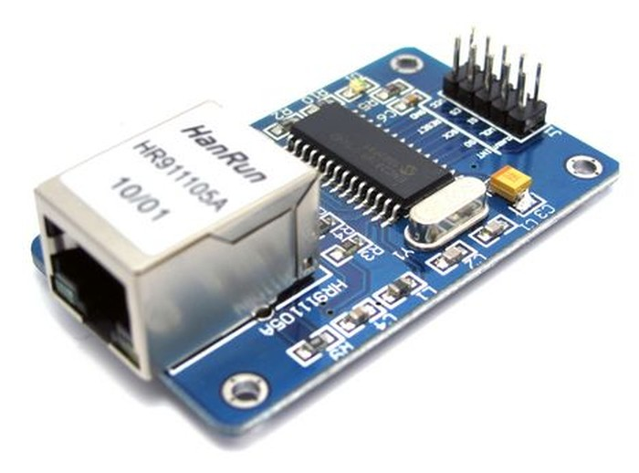
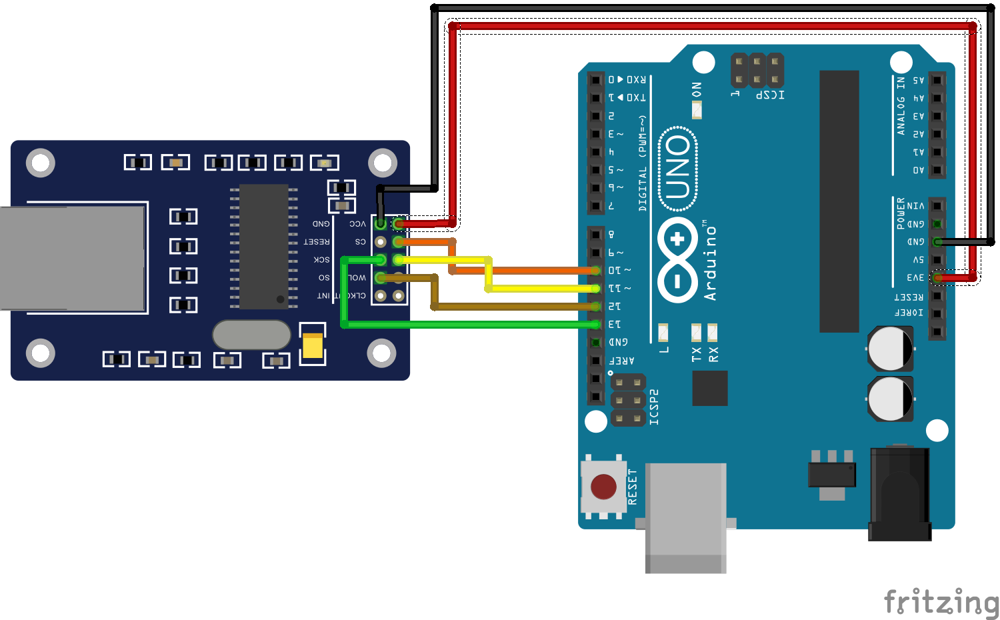

# 5. Arduino ile Ethernet Kullanımı

Ethernet modülü, Arduino'yu kablolu internet ağına bağlamak için kullanılan bir karttır. Ethernet modülüyle Arduino, web tarayıcısı gibi web sitelerine girebilir, web sitelerine veri kaydedebilir hatta sizin için tweet atabilir.

Kart üzerinde Wiznet W5100 entegresi bulunmaktadır. Ethernet modülü hem TCP hem de UDP ile uyumludur. Yeni üretilen ethernet modüllerinde, internete bağlanma özelliğinin yanında SD kart kullanabilme özelliği de bulunur.



Arduino, Wiznet W5100 entegresi ve SD kart SPI üzerinden haberleşir. İnternete bağlanmayı sağlayan Wiznet entegresi ile Arduino'nun haberleşmeye geçmesi için Arduino'nun 10. pininin 0 Volt (LOW) düzeyine getirilmesi gerekir. Eğer SD kart ile işlem yapılmak isteniyorsa Arduino'nun 4. pini 0 Volt (LOW) düzeyine getirilir.

W5100 ile SD kart aynı SPI hattını kullandıkları için beraber çalışamazlar. Bu yüzden aynı anda 4. ve 10. pinler 0 Volt (LOW) düzeyine getirilmemeli. Kullanılmayacak olan özelliğin SPI kontrol pinin 5 Volt (HIGH) konumuna getirilmesi gerekir.

Arduino'yu internete bağlamak için shield'e göre daha ucuz olan ethernet modülleri kullanılabilir. Bu modüller ile Arduino arasındaki kablo bağlantıları elle yapılmalıdır. Aşağıdaki resimde shield'lere göre daha ucuz olan Enc28j60 ethernet modülü gösterilmiştir.



Enc28j60 ethernet modülünü kullanacak Arduino geliştiricilerinin, kablo bağlantılarını aşağıdaki tablo veya devre şemasına göre yapmaları gerekir.

|Enc28j60 Ethernet modülü |	Arduino|
|-------------------------|--------|
|CS 	                  |10      |
|SI 	                  |11      |
|SO 	                  |12      |
|SCK 	                  |13      |
|VCC 	                  |3.3V    |
|GND 	                  |GND     |



Kablo bağlantılarını yaptığımıza göre artık programlama kısmına geçebiliriz. Ethernet modüllerinin Arduino ile kullanılması için birçok hazır kütüphane bulunur. Biz bu kütüphanelerden "ethercard-master" isimli olanını kullanacağız. Bu kütüphaneyi seçme nedenimiz, diğer kütüphanelere göre daha kolay kullanıma sahip olması ve daha kararlı çalışmasıdır. Kütüphaneyi buradan indirebilirsiniz.

Not: Kütüphanede tanımlanan CS pininin 10 olarak değiştirilmemesi Arduino'nun ethernet modülü ile bağlantı kuramamasına neden olacaktır. "EtherCard.h" dosyasındaki "csPin" değişkenini 10 olarak ayarlamayı unutmayınız.


## 5.1. Arduino ile Web Tarayıcı Yapımı

Ethernet modülünün internete başarıyla bağlanıp bağlanmadığını anlamak için bu uygulamada Arduino ile internet sitelerine bağlanmaya çalışacağız. Bağlandığımız sitenin HTML kodlarını seri monitöre yazdıracağız. Böylece Arduino ile basit bir web tarayıcı yapmış olacağız.

Uygulamada daha önceden yüklediğimiz "ethercard-master" kütüphanesini kullanacağız. Ethernet Shield kullanacak Arduino geliştiricileri, Shield'i doğrudan Arduino üzerine takarak, devre kurulumunu tamamlayabilir. Enc28j60 ethernet modülünü kullanacaklar için kurulması gereken devre, aşağıdaki devre şamasında gösterilmiştir.


Devre kurulumunu gerçekleştirdiğimize göre aşağıdaki Arduino kodunu yükleyelim ve serial monitörü açalım.

```cpp
#include <EtherCard.h>


static byte mymac[] = { 0x74,0x69,0x69,0x2D,0x30,0x31 }; 
/* Ethernet ağında tek olması gereke MAC adresi */

byte Ethernet::buffer[700];
static uint32_t timer;

const char website[] PROGMEM = "www.google.com";
/* bağlantı kurulacak internet sitesi */

// called when the client request is complete
static void my_callback (byte status, word off, word len) {
  Serial.println(">>>");
  Ethernet::buffer[off+300] = 0;
  Serial.print((const char*) Ethernet::buffer + off);
  Serial.println("...");
}

void setup () {
  Serial.begin(57600);
  Serial.println(F("\n[web browser]"));

  if (ether.begin(sizeof Ethernet::buffer, mymac) == 0) 
    Serial.println(F("Ethernet baglanti hatasi"));
  if (!ether.dhcpSetup())
    Serial.println(F("DHCP hatasi"));

  ether.printIp("IP:  ", ether.myip);
  ether.printIp("GW:  ", ether.gwip);  
  ether.printIp("DNS: ", ether.dnsip);  

  if (!ether.dnsLookup(website))
    Serial.println("DNS failed");
    
  ether.printIp("SRV: ", ether.hisip);
}

void loop () {
  ether.packetLoop(ether.packetReceive());
  
  if (millis() > timer) {
    timer = millis() + 5000;
    Serial.println();
    Serial.print("Baglanti kuruluyor");
    ether.browseUrl(PSTR(""), "", website, my_callback);
  }
}
```

Yukarıdaki kod çalıştırıldığında, eğer tüm ayarlar ve devre kurulumu doğruysa, Arduino’nun belirtilen internet sitesine bağlanması ve bu site ile ilgili bilgileri ekrana yazdırması gerekmektedir. Bağlantı başarılı bir şekilde kurulduktan sonra sitenin HTML kodları da serial monitörde görünecektir.

Seri haberleşmenin daha hızlı gerçekleşmesi için Baud Rate 57600 olarak belirlenmiştir. Serial monitörde mesajların doğru görülmesi için serial monitor penceresinin sağ altından baud rate ayarını yapmayı unutmayınız.

"mymac" değişkenine yazılacak MAC adresi, orijinal ethernet modülleri üzerinde yapıştırma şeklinde yazmaktadır. Eğer böyle bir yapıştırma bulunmuyorsa, kodda belirtilen MAC adresi denenebilir. Setup fonksiyonu içinde, modülün belirtilen MAC adresi ile ağa bağlanıp bağlanamadığı kontrol edilmiştir. Eğer bağlantı hatasız gerçekleştirildiyse, Arduino'nun ağdan aldığı IP adresi ekrana yazdırılmıştır.

Loop fonksiyonu içinde belirtilen internet sitesine bağlanma komutları bulunmaktadır. Arduino beş saniyede bir belirtilen internet sitesine tekrar bağlanmaktadır. Bunu sağlamak için daha önceden öğrendiğimiz millis fonksiyonu kullanılmıştır.

Eğer Arduino'nuz hatasız bir şekilde internete bağlandıysa, artık Nesnelerin İnterneti (Internet of Things) projelerini gerçekleştirebilirsiniz.


## 5.2. Ortam Sıcaklığını Arduino ile Tweet Atmak

Ethernet modülümüzü başarılı bir şekilde internete bağladığımıza göre, bu modül ile yapılabilecek projelere bakalım. "ethercard-master" kütüphanesi içerisinde tweet atmak için yazılmış örnek program bulunmaktadır. Bu program üzerinde ufak değişiklikler yaparak ortam sıcaklığını tweet atan bir devre kurabiliriz. Öncelikle Twitter'a mesaj yollayabilmemiz için kişisel jetonunuzun (token) olması gerekir. Bunun için burada linki verilen Twiter uygulamasını kullanabilirsiniz.

Twitter üye girişinizi yaptıktan ve uygulamaya izin verdikten sonra, site üzerinde jetonunuz (token) görünür. Bu sayı ve karakterleri yazacağımız Arduino koduna ekleyeceğiz.

Bu uygulamayı yapmak için ihtiyacınız olan malzemeler:

 *   Arduino UNO
 *   Ethernet modülü
 *   1 x LM35 (sıcaklık sensörü)
 *   1 x Breadboard

Devremizi yukarıdaki devre şemasında gösterildiği gibi kuralım. Ethernet kablosunu, ethernet modülümüze bağladıktan sonra devre kurulumumuz tamamlanmış olacaktır. Artık Arduino kodunu hazırlayabiliriz.

Öncelikle Arduino, Ethernet modülü yardımıyla internet ağına bağlanması gerekir. LM35 ile ortam sıcaklığı ölçülerek tweet mesajına eklenecektir. Oluşturulan mesaj, Twitter üzerinden aldığımız jeton (token) ve Twitter uygulaması yardımıyla tweetlenecektir.

```cpp

#include <EtherCard.h>
 
 
#define TOKEN  "BURAYA TOKEN KODUNUZU YAZINIZ"

static uint32_t timer;

byte mymac[] = { 0x74,0x69,0x69,0x2D,0x30,0x31 };
/* tekil MAC adresi */

const char website[] PROGMEM = "arduino-tweet.appspot.com";
/* Tweet atabilmemiz için kullandığımız uygulama adresi */

static byte session;
 
byte Ethernet::buffer[700];
Stash stash;
 
static void TweetAt () {
  Serial.println("Tweet hazirlaniyor");
  float sicaklik = analogRead(A0); 
  /* A0daki gerilim ölçüldü */
  sicaklik = sicaklik * 0.48828125;
  /* Ölçülen gerilim sicaklığa çevrildi */

  byte sd = stash.create();
  stash.print("token=");
  stash.print(TOKEN);
  stash.print("&status=");
  stash.print("Odamin sicakligi su anda ");
  stash.print(sicaklik);
  stash.println(" derecedir.");
  
  Serial.println("Tweet hazirlandi");
  
  stash.save();
  int stash_size = stash.size();  
  Stash::prepare(PSTR("POST http://$F/update HTTP/1.0" "\r\n"
    "Host: $F" "\r\n"
    "Content-Length: $D" "\r\n"
    "\r\n"
    "$H"),
  website, website, stash_size, sd);
  session = ether.tcpSend();
  Serial.println("Tweet yollandi");
}
 
void setup () {
  Serial.begin(57600);
  if (ether.begin(sizeof Ethernet::buffer, mymac) == 0) 
    Serial.println(F("Ethernet baglanti hatasi"));
  if (!ether.dhcpSetup())
    Serial.println(F("DHCP hatasi"));
 
  ether.printIp("IP:  ", ether.myip);
  ether.printIp("GW:  ", ether.gwip);  
  ether.printIp("DNS: ", ether.dnsip);  
 
  if (!ether.dnsLookup(website))
    Serial.println(F("DNS hatasi"));
 
  ether.printIp("SRV: ", ether.hisip);
 
}
 
void loop () {
  ether.packetLoop(ether.packetReceive());
 
  const char* reply = ether.tcpReply(session);
  if (reply != 0) {
    
    Serial.println(reply);
  }
  
  if (millis() > timer) {
    timer = millis() + 60000;
    Serial.print("Baglanti kuruluyor");
    TweetAt();
  }

}
```
**Not:** Seri haberleşmenin daha hızlı gerçekleşmesi için Baud Rate 57600 olarak belirlenmiştir. Serial monitörde mesajların doğru görülmesi için serial monitor penceresinin sağ altından baud rate ayarını yapmayı unutmayınız.

Setup fonksiyonu içinde ethernet modülünün ağa katılabilmesi için ayarlamalar yapıldı. Arduino'nun ağ üzerindeki IP adresi de bu bölümde ekrana yazdırıldı. Loop fonksiyonu içinde ethernet modülünden gelecek mesajlar gösterildi ve 60 saniyede bir "TweetAt" fonksiyonu çağrıldı.

"TweetAt" fonksiyonu, sıcaklığın ölçülerek Twitter mesajının oluşturulduğu fonksiyondur. Burada oluşturulan mesaj daha önceden izin verdiğimiz uygulama aracılığıyla Twitter'a yollanır. Bu fonksiyon, loop fonksiyonu içerisinde 60 saniyede bir çağrılır. Kısa sürelerde aynı tweetlerin atılması, Twitter'ın yollanan mesajları engellemesine neden olabilir.

Ethernet modülü bazen tweet atarken başarısız olabilir. Bu durumlarda tekrar tweet atmayı deneyebilirsiniz.

Bu uygulama değiştirilerek yeni Nesnelerin İnterneti (Internet of Things) projeleri gerçekleştirilebilir. Örneğin burada kullanılan sıcaklık sensörü yerine, toprak-nem sensörü kullanarak çiçeğinizin durumunu çevrimiçi olarak takip edebilir, istediğiniz zaman çiçeğinizi sulayabilirsiniz.
