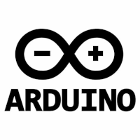

__________________________________________
# Rust ile Arduino Kodlama
  * [Neden Rust?](./embeded_rust.md#neden-rust)
  * [Arduino Nedir?](./embeded_rust.md#arduino-nedir?)
  * [Kurulum ve Ayarlar](./embeded_rust.md#kurulum-ve-ayarlar)
  * [Avrdude ile yeni bir Arduino projesi oluşturma](./embeded_rust.md#avrdude-ile-yeni-bir-arduino-projesi-oluşturma)
  * [Mikrodenetleyiciyi kod yükleme için yapılandırma](./embeded_rust.md#mikronenetleyiciyi-kod-yükleme-için-yapılandırma)
  * [Diğer Arduino Projeleri](./other_project.md)