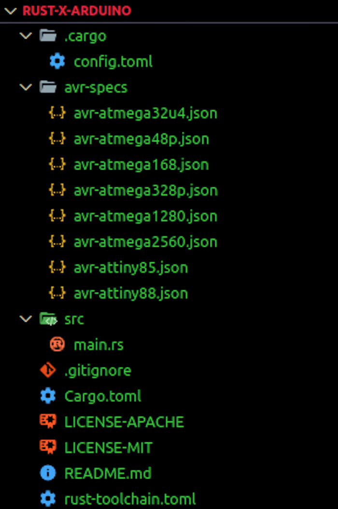
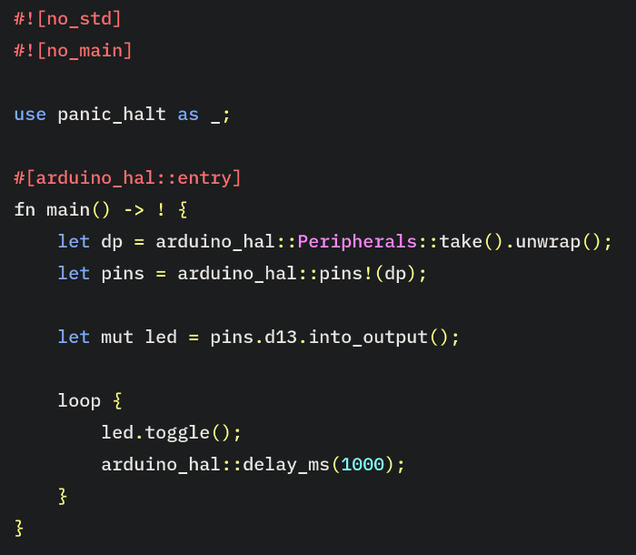
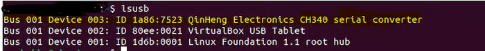

__________________________________________
# Rust ile Arduino Kodlama
  * Neden Rust?
  * Arduino Nedir?
  * Kurulum ve Ayarlar
  * Avrdude ile yeni bir Arduino projesi oluşturma
  * Mikrodenetleyiciyi yanıp sönme için yapılandırma
  * Diğer Arduino Projeleri

## Neden Rust?

Gömülü sistemler teknolojisi onlarca yıldır yenilikten yoksundu. Yıldırım hızında, gömülü cihazları programlamak için tercih edilen dil uzun zamandır C/C++ olmuştur, ancak Rust daha da hızlı geliştirme desteği sağlar. Rust gömülü sistem geliştirme için mükemmel bir seçimdir çünkü: 

* C kod tabanlarıyla yüksek oranda birlikte çalışabilir 
* Taşınabilir ve hafiftir 
* Güçlü bir eşzamanlılık modelidir 
* Farklı mikrodenetleyiciler için sağlam destek sunar 
* Bellek güvenlidir 

Arduino'ları zaten C++ ile programladıysanız, temelleri öğrendikten sonra bunu Rust ile yapmaya geçmek nispeten kolay olacaktır. Gömülü Rust hakkında daha fazla bilgiyi buradan edinebilirsiniz. Ayrıca mevcut mikrodenetleyici kasalarını da buradan görebilirsiniz.

## Arduino Nedir?
Arduino UNO, Atmel tarafından geliştirilen AVR mikrodenetleyici ailesi altındaki ATMega328P'yi temel alır. Arduino, Arduino IDE editörü kullanılarak C++'dan türetilen programlama dili ile programlanabilir, ancak aynı zamanda açık kaynaklı bir proje olduğu için Arduino'yu programlamak için diğer sistemlerle uyumlu programlama dilleri de kullanılabilir. 

Ayrıca Arduino Nano ve Mega alternatifleri de vardır. Arduino Nano, UNO'nun daha küçük, daha kompakt bir versiyonudur. Alanın kısıtlı olduğu durumlarda kullanışlıdır. 

Daha fazla I/O pini, bellek veya çoklu seri iletişim gerektiren projeler için UNO yerine Arduino Mega'ya ihtiyacınız olacaktır:

| Özellik | Arduino UNO | Arduino NANO | Arduino MEGA |
|---------|-------------|--------------|--------------|
| Mikrodenetleyici | ATMega328P | ATMega328P | ATMega2560 |
| Çalışma Voltajı | 5V | 5V | 5V |
| Giriş V (Önerilen) | 7-12V | 7-12V | 7-12V |
| Dijital G/Ç Pinleri | 14 (6 PWM) | 14 (6 PWM) | 54 (15 PWM) |
| Analog giriş pinleri | 6 | 8 | 16 |
| Flash Bellek | 32 KB | 32 KB | 256 KB |
| SRAM | 2 KB | 2 KB | 8 KB |
| EEPROM | 1 KB | 1 KB | 4 KB |
| Çalışma Hızı | 16 MHz | 16 MHz | 16 MHz |
| USB Bağlantısı | Standart USB-B | Mini USB-B | Standart USB-B |

Arduino ile gömülü sistem geliştirme için normal prosedür aşağıdaki adımları içerir:

 * Amaçlanan devrenin elektrik şemasının çizilmesi 
 * Elektrik bileşenlerinin şemaya uyacak şekilde bağlanması 
 * Devreyi istenildiği gibi kontrol etmek için program mantığının yazılması 
 * Mikrodenetleyicinin USB kablosuyla bilgisayara bağlanması 
 * Programın bilgisayardan kartın flash belleğine aktarılması(veya yüklenmesi) 

### Gerekli Araçlar:
Burada anlatılanları yapabilmek için bir Arduino kartına ve aşağıdaki yazılım önkoşullarına ihtiyacınız olacak:

 * Program yazma, derleme ve yazılan programı arduino karta aktarmak için bir bilgisayar
 * Cargo yazılımı
 * Rust gecelik derleyici sürümü

## Kurulum ve Ayarlar

### avrdude kullanmak
 
avrdude, avr-hal projeleri için kargo tarafından oluşturulan bir şablondur. Şu anda aşağıdaki donanımları desteklemektedir:

 * Arduino Leonardo
 * Arduino Mega 2560
 * Arduino Mega 1280
 * Arduino Nano
 * Arduino Nano New Bootloader (Ocak 2018'den sonra üretildi)
 * Arduino Uno
 * SparkFun ProMicro
 * SpartFun ProMini 3.3V
 * SpartFun ProMini 5v
 * Adafruit Trinket
 * Adafruit Trinket Pro

AVR mikrodenetleyicileri ve diğer yaygın kartlarda Rust çalıştırmak için bir Donanım Soyutlama Katmanı (HAL) gereklidir. Bunu elde etmek için, makinenizde Rust kodunu AVR'ye derleyen gecelik Rust derleyicisine ihtiyacınız vardır. Yüklemek için aşağıdaki komutu çalıştırın:

`rustup toolchain install nightly`

### Linux'ta 
Pardus gibi bir Linux dağıtımı kullanıyorsanız, komut şöyledir: 

`sudo apt install avr-libc gcc-avr pkg-config avrdude libudev-dev build-essential `

Yukarıdaki kılavuzu takip ederken bir engelle karşılaşırsanız, burada tüm işletim sistemleri için bir kurulum kılavuzu vardır. Bu adımlardan herhangi birinden sonra, bir sonraki adım, mikrodenetleyici kartını kargoya karşı flaşlamak için ravedude aracını yüklemektir: 

`cargo +stable install ravedude`

Bu araç, kartı bulmakta, yazılan kodu karta aktarma  ve bağlantıları dinleme işlerini yerine getirir. Tek yapmanız gereken **cargo run** komutunu çalıştırmak.

## Avrdude ile yeni bir Arduino projesi oluşturma
Yeni bir proje başlatmak cargo-generate sandığı ile daha basit hale getirilmiştir. Yeni bir proje oluşturmak için aşağıdaki komutları art arda çalıştırmanız yeterlidir:

`cargo install cargo-generate`

Şimdi, şablonu oluşturmak ve örneklemek için bu komutu çalıştırın. Şu anda bir proje oluşturmadınız, ancak araç bunu halledecektir:

`cargo generate --git https://github.com/Rahix/avr-hal-template.git`

Komutu çalıştırdıktan sonra, projeniz için bir ad belirtmek üzere bir giriş alanı görmelisiniz. Bu eğitimde proje adı olarak **"rust-x-arduino"** kullanılacaktır. 

Tercih ettiğiniz adı girdikten sonra Enter tuşuna tıklayın. Bir sonraki günlük, avrdude şablonu altında bulunan mikrodenetleyicilerin bir listesini gösterir. Bu makale, herkesin kolayca kullanabileceği bir varyant olan Arduino UNO'yu kullanmaktadır. 

Derlemeden sonra projeye gidin ve klasörü tercih ettiğiniz kod düzenleyicide bir proje olarak açın. Proje yapısı aşağıdaki resimdeki gibi görünmelidir:

Not: libudev-sys crate'i yüklerken bir hata oluşursa, bunu bağımlılıklar altındaki cargo.toml dosyanıza eklemeniz gerekecektir:

`[dependencies]`

`libudev-sys = "0.1"`

**libudev** Rust binding, libudev C kütüphanesi için bildirimler ve bağlantı sağlayan bir sandıktır. Linux'a özgüdür, bu nedenle Windows veya OSX işletim sistemleri için mevcut değildir. Alternatif olarak, libudev-sys crate'ini yüklemek için aşağıdaki komutu çalıştırabilirsiniz:

`sudo apt-get install libudev-dev`

**pkg-config**'den kaynaklanan başka sorunlar olması durumunda libudev-sys deposuna başvurun. Şimdi, build komutu ile projeyi derleyebilirsiniz:

`cargo build`

Bu işlem CPU yoğun bir görev olduğu için biraz zaman alabilir. Daha sonra, `target/avr-atmega328p/debug/` altında bir .elf dosyası bulacaksınız.

Kendi programınızı çalıştırmak için, temel bir LED Yanıp Sönme programı için örnek bir kod içeren main.rs dosyasını aşağıdaki gibi düzenleyebilirsiniz:

### Gömülü Rust Kodunu Anlamak
Kodun ilk iki satırından, işletim sistemi olmayan gömülü bir proje olduğu için standart bir kütüphane ve main olmadığı açıktır.
 
`#[arduino_hal::entry]` satırı programdaki giriş noktasını belirtir.  `panic_halt as_;` panikleri işlemek için kullanılır. 

**main** fonksiyonunda, Çevre Birimleri çözülür. Gömülü Rust'ta Çevre Birimleri, çevrelerini anlamlandıran ve insanlarla etkileşime giren bileşenleri ifade eder. Sensörler, aktüatörler ve motor kontrolörlerinin yanı sıra CPU, RAM veya flash bellek gibi mikrodenetleyicinin temel parçalarını da içerirler. Gömülü Rust kitabında Çevre Birimleri hakkında daha fazla bilgi edinebilirsiniz. 

Ardından, varsayılan pinin (_D13_) dijital çıkışını yükseğe ayarlamak için Arduino kartının pinlerine erişim sağlıyoruz. 

Döngüdeki **toggle** yöntemi LED'i açıp kapatmak için kullanılırken, **delay_ms** yöntemi döngüyü belirtilen milisaniye kadar geciktirmek için kullanılır.

## Kod yükleme için Mikrodenetleyiciyi yapılandırma
Resmi Arduino IDE'sinde Arduino mikrodenetleyicisi ile çalışırken, programı C++ tabanlı olan Arduino'da yazmanız ve program kaynak dosyasını USB portu üzerinden karta yüklemeniz yeterlidir. Rust ile daha uzun ama benzer bir prosedür izleyeceğiz. Linux komutu ile makinenizdeki açık USB portlarını listeleyerek başlayın: 

`lsusb`

Arduino kartınız USB üzerinden cihazınıza takılıysa, aşağıdaki görüntüdeki gibi Arduino kartına bağlı USB'nin adını görmelisiniz:

Daha sonra, bu betik ile ravedude için seri com portunu ayarlayacağız:

`export RAVEDUDE_PORT=/dev/ttyUSB0`

Bu, ravedude'a Arduino'nun hangi porta bağlı olduğunu söyler. Aşağıdaki komutu çalıştırmak, programı Arduino'ya yükleyecektir:

`cargo run`

## Mikro denetleyici üzerindeki çıktı

