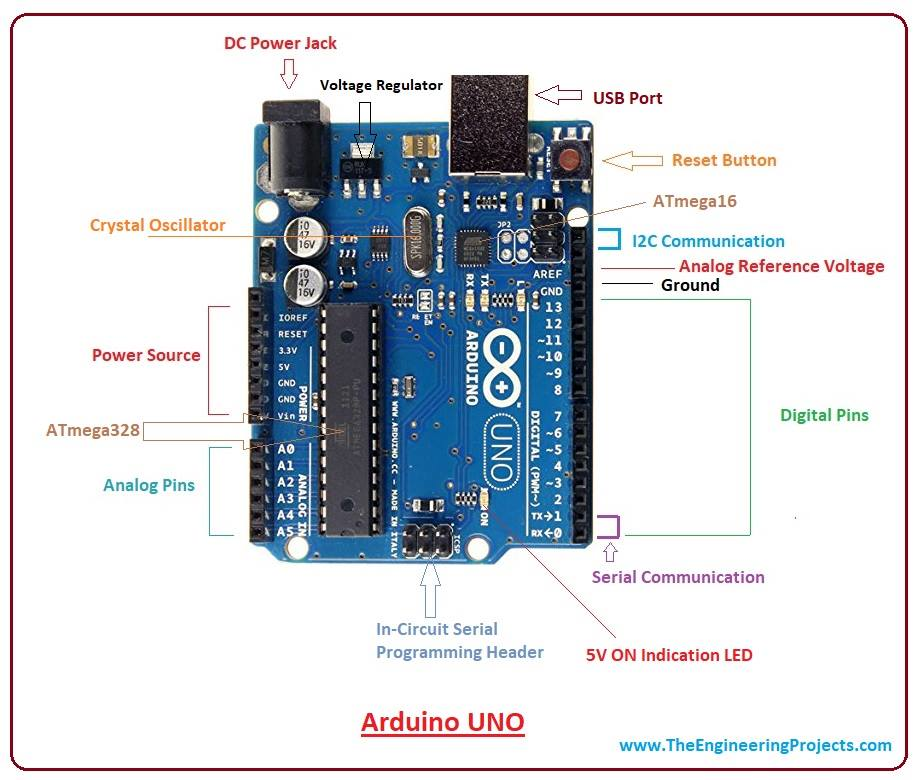

# ARDUINO

## 1. Arduino Nedir?

Arduino, elektronik projeler yapmaya yardımcı olan bir yazılım ve donanım platformudur. Açık kaynaklı bir
platformdur ve çeşitli denetleyicilere ve mikro işlemcilere sahiptir. Çeşitli amaçlar için kullanılan çeşitli
Arduino kartları vardır.

Arduino, farklı arayüzlerden veya parçalardan oluşan tek bir devre kartıdır. Kart, elektronik cihazların
çalışması için kullanmak istediğimiz çeşitli cihazları ve bileşenleri bağlamak için kullanılan dijital ve analog
pin setinden oluşur.

Arduino'nun çoğu 14 dijital I/O pininden oluşur.

Arduino'daki analog pinler çoğunlukla ince ayarlı kontrol için kullanışlıdır. Arduino kartındaki pinler belirli
bir düzende düzenlenmiştir. Arduino kartındaki diğer cihazlar USB portu, küçük bileşenler (voltaj regülatörü
veya osilatör), mikrodenetleyici , güç konektörü vb.

Arduino , aşağıdakiler gibi çeşitli amaçlar için kullanılır:
 * Parmak düğmesi (Finger button)
 * Motor aktivasyonu için düğme (Button for motor activation)
 * Sensör olarak ışık (Light as a sensors)
 * LED düğmesi (LED button)
 * Tasarlamak (Designing)
 * Elektronik cihazların inşası (The Building of electronic devices)

### 1.2.Özellikler

Arduino'nun özellikleri aşağıda listelenmiştir:

Arduino programlama, öğrenme sürecini kolaylaştıran basitleştirilmiş bir C++ sürümüdür. Arduino IDE,
kartların fonksiyonlarını kontrol etmek için kullanılır. Ayrıca, spesifikasyon setini mikrodenetleyiciye
gönderir. Arduino'nun yeni kod yüklemek için fazladan bir panoya veya parçaya ihtiyacı yoktur. Arduino,
analog ve dijital giriş sinyallerini okuyabilir. Donanım ve yazılım platformunun kullanımı ve uygulanması
kolaydır.

### 1.3.Tarih

Proje, İtalya'nın Ivrea kentindek Etkileşim Tasarımı Enstitüsünde başladı. Hernando Bar, Casey Reas ve
Massimo Banzi'nin gözetiminde 2003 yılında Wiring'i (bir geliştirme platformu) yarattı. IDII'de yüksek lisans
tez projesi olarak kabul edildi. Kablolama platformu PCB'yi (Baskı Devre Kartı) içerir. PCB, ATmega168
Mikrodenetleyici ile çalıştırılır.

ATmega168 Mikrodenetleyici bir IDE idi. Mikrodenetleyiciyi kolayca programlamak için kullanılan kütüphane
ve işleme işlevlerine dayanıyordu.

2005 yılında Massimo Banzi, David Cuartielles, David Mellis ve başka bir IDII öğrencisi ATmega168'i
Kablolama platformuna destekledi. Ayrıca projeye Arduino adını verdiler.

Arduino projesi 2005 yılında İtalya'nın Ivrea kentindeki öğrenciler için başlatıldı. Aktüatörleri ve sensörleri
kullanarak hobi ve profesyonellerin çevre ile etkileşim kurması için kolay ve düşük maliyetli bir yöntem
sağlamayı amaçladı. Başlangıç seviyesindek cihazlar basit hareket dedektörleri, robotlar ve termostatlardı.
2011 yılının ortalarında, Arduino'nun ticari olarak tahmini üretimi 300.000 idi. 2013 yılında, kullanımda olan
Arduino kartları yaklaşık 700.000 idi.

Nisan 2017 civarında Massimo Banzi, Arduino'nun kuruluşunu "Arduino için yeni bir başlangıç" olarak tanıttı.
Temmuz 2017'de Musto, Arduino'nun web sitelerinden birçok Açık Kaynak lisansı ve kod çekmeye devam
etti. Ekim 2017'de Arduino, ARM Holdings ile işbirliğini tanıttı. Arduino, mimariler ve teknoloj satıcılarıyla
çalışmaya devam ediyor.

### 1.4.Arduino Kartları

Farklı amaçlar için kullanılan çeşitli Arduino kartı vardır. Kart, G/Ç pinlerine, boyutuna vb. göre değişir.
Arduino kartlarında bulunan çeşitli bileşenler şunlardır: Mikrodenetleyici , Dijital
Giriş/Çıkış pinleri , USB Arabirimi ve Konektörü, Analog Pinler, Sıfırlama Düğmesi, Güç düğmesi, LED'ler,
Kristal Osilatör ve Voltaj regülatörü. Bazı bileşenler, kartın türüne bağlı olarak farklılık gösterebilir.
Popüler Arduino kartlarından bazıları şunlardır:

 * Arduino UNO
 * Arduino Nano
 * Arduino Mega
 * Arduino Due
 * Arduino Bluetooth
 
Daha fazla I/O pini, bellek veya çoklu seri iletişim gerektiren projeler için UNO yerine Arduino Mega'ya ihtiyacınız olacaktır:

| Özellik | Arduino UNO | Arduino NANO | Arduino MEGA |
|---------|-------------|--------------|--------------|
| Mikrodenetleyici | ATMega328P | ATMega328P | ATMega2560 |
| Çalışma Voltajı | 5V | 5V | 5V |
| Giriş V (Önerilen) | 7-12V | 7-12V | 7-12V |
| Dijital G/Ç Pinleri | 14 (6 PWM) | 14 (6 PWM) | 54 (15 PWM) |
| Analog giriş pinleri | 6 | 8 | 16 |
| Flash Bellek | 32 KB | 32 KB | 256 KB |
| SRAM | 2 KB | 2 KB | 8 KB |
| EEPROM | 1 KB | 1 KB | 4 KB |
| Çalışma Hızı | 16 MHz | 16 MHz | 16 MHz |
| USB Bağlantısı | Standart USB-B | Mini USB-B | Standart USB-B |

Görsel: Arduino UNO

### 1.5.Kalkanlar (shields)
Kalkanlar, projelerin yeteneklerini artırmak için kart üzerine monte edilebilen donanım aygıtı olarak
tanımlanır.
Kalkan aşağıda gösterilmiştir:

Görsel: Kalkan

Kalkan, Arduino ile birlikte projeler daha akıllı ve basit hale getirebilir. Örneğin, Arduino kartını internete
bağlamak için Ethernet kalkanları kullanılır.
Kalkanlar Arduino kartına kolayca takılıp çıkarılabilir. Herhang bir karmaşık kablolama gerektirmez.

## 2.1 Arduino Bileşenleri

Arduino temel bileşenleri, dijital veya elektronik cihazlar oluşturmak için kullanılan tüm bileşenlerden oluşur.
Arduino kartları ayrıca DIY kitler şeklinde de mevcuttur. Burada DIY, Kendin Yap'ı belirtir. Kendin Yap kitleri,
öğretim için ve öğrenciler için bir uygulama aracı olarak oluşturulmuştur. Mühendislik öğrencisi olmayan
öğrenciler de bu tür temel bileşenleri projeler için kullanabilirler.

### 2.1.1. Temel Bileşenler

Temel bileşenler, genellikle yeni başlayanlar için temel setlerdir.

***Temel bileşenler aşağıda listelenmiştir:***

 * Arduino UNO kartı
 * Breadboard
 * LED (Parlak Beyaz, Yeşil, Kırmızı, Sarı, Mavi ve RGB)
 * LCD Alfanümerik
 * Kolayca monte edilebilen ahşap taban
 * Katı çekirdekli atlama telleri
 * KIRMIZI ve SİYAH renkte çok telli atlama telleri
 * 9V Pil
 * 220 Ohm, 560 Ohm, 1kOhm, 4.7kOhm, 10kOhm, 1MOhm ve 10MOhm dirençler
 * 6/9V Küçük DC Motor
 * (40 x 1) Erkek Şerit pimler
 * Kırmızı, Mavi ve Yeşil Şeffaf Jeller
 * Diyotlar
 * 100 uF Kondansatörler
 * Küçük servometre
 * Piezo Kapsül
 * Basmalı Düğmeler
 * Eğim Sensörü
 * Potansiyometre
 * Fototransistör
 * Sıcaklık sensörü
 * MOSFET Transistörler
 * H köprüsü Motor Sürücüsü
 * USB kablosu

***Arduino UNO kartı***
Arduino UNO, Arduino'nun standart bir kartıdır. Arduino UNO, bir ATmega328P Mikrodenetleyiciye
dayanmaktadır . Arduino Mega board vb. diğer kartlara göre kullanımı kolaydır. Arduino kartı üzerindeki
bileşenler ATmega328P Mikrodenetleyici , ICSP pini, güç LED göstergesi, Dijital I/O pinleri, Analog pinler,
AREF pini, 16 MHz'dir. kristal osilatör, GND pinler , Vin pini , voltaj regülatörü, Tx ve Rx LED'i, USB ve reset
butonu.
Arduino kartı aşağıda gösterilmiştir:

Görsel: Arduino kartı

***Breadboard***
Breadboard, plastikten yapılmış dikdörtgen şeklinde bir tahta olarak tanımlanır. Üzerinde LED, direnç vb.
elektronik bileşenlerin tellerini sokmak için kullanılan küçük delikler vardır.

