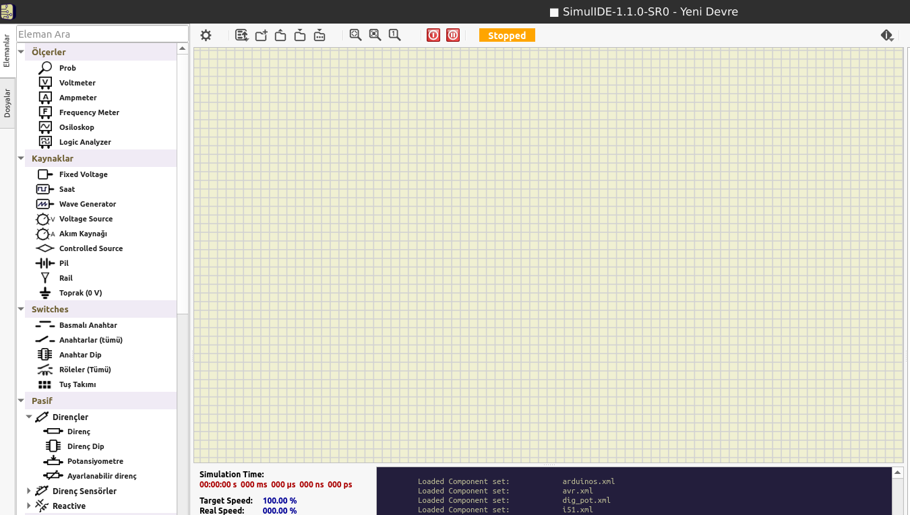

# SimulIDE

SimulIDE, amatörlerin veya öğrencilerin PIC, AVR ve Arduino'yu destekleyen basit elektronik devreler ve
mikrokontrolörleri öğrenmesi ve denemesi için tasarlanmış basit bir gerçek zamanlı elektronik devre
simülatörüdür.

## Uygulama Arayüzü

**Elamanlar:** Bu alanda aşağıdaki kategoriler yer almaktadır.
1.Ölçerler
2.Kaynaklar
3.Anahtarlar
4.Pasif Elemanlar
5.Çıktı Elemanları
6.Mikro Çip Elemanları
7.Mantık Elemanları
8.Konnektör Elemanları
9.Grafik Elemanları
10.Diğer Elemanlar

**Dosya Gezgini :** Bu alanda aşağıdaki kategoriler yer almaktadır.
1.File System (Dosya Sistemi)
2.Home (Ev Dizini)
3.Examples (Örnekler)
4.Data (Veri)
5.Settings (Ayarlar)
6.User Data (Kullanıcı Verisi)
